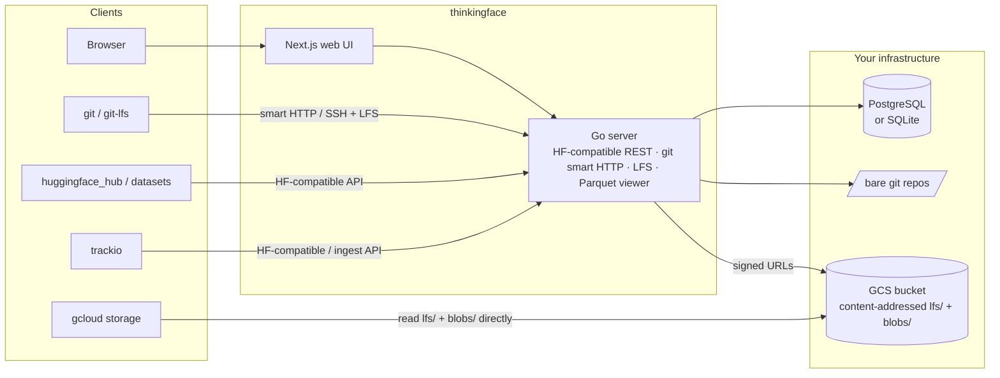

<h1 align="center">🤔 thinkingface</h1>

<p align="center">
  <strong>セルフホストできる Hugging Face Hub。</strong><br>
  データセット、モデルのチェックポイント、実験の run を、自分たちのインフラと自分たちで管理するストレージ上に。
  しかも、すでに使っている <code>huggingface_hub</code> / <code>datasets</code> / <code>git</code> のツールのままで。
</p>

<p align="center">
  <a href="https://github.com/dotneet/thinkingface/actions/workflows/ci.yml"></a>
  <a href="https://dotneet.github.io/thinkingface/ja/"></a>
  <a href="backend/go.mod"></a>
  <a href="LICENSE"></a>
</p>

<p align="center">
  <a href="README.md">English</a> · <strong>日本語</strong>
</p>

<p align="center">
  <a href="https://dotneet.github.io/thinkingface/ja/">ドキュメント</a> ·
  <a href="https://dotneet.github.io/thinkingface/ja/getting-started/">クイックスタート</a> ·
  <a href="https://dotneet.github.io/thinkingface/ja/reference/compatibility/">互換性</a> ·
  <a href="https://dotneet.github.io/thinkingface/ja/self-hosting/deployment/">デプロイ</a> ·
  <a href="CONTRIBUTING.md">コントリビュート</a>
</p>


## thinkingface とは

thinkingface は、チーム専用のプライベートな Hugging Face Hub を提供します。データセットもモデルも
すべて Git LFS 付きのただの git リポジトリで、実データは自分たちの Google Cloud Storage バケットに
置かれます。サーバーは Hub の API を話すので、`huggingface_hub`、`datasets`、`git`、`gcloud storage`
は `HF_ENDPOINT` を自分のインスタンスに向けるだけでそのまま動きます。学習の run は trackio 互換の
インターフェース経由でデータのすぐ隣に記録され、Web UI からは何もダウンロードすることなく、その
すべてを閲覧・確認・編集できます。

構成は単一の Go バイナリと Next.js の Web UI、データベースは PostgreSQL または SQLite。ローカルでは
`docker compose up`、本番では Cloud Run で動きます。

## 主な機能

- **Hub のクライアントをそのまま使える。** `create_repo`、`upload_file`、`hf_hub_download`、
  `list_repo_tree`、`load_dataset(...)` などが無変更で動作します。`HF_ENDPOINT` を設定すればそれだけです。
- **中身は徹頭徹尾 git。** すべてのリポジトリは Git LFS 付きの bare git リポジトリです。HTTP でも SSH でも
  `git clone` / `git push` ができ、ブランチ・タグ・リビジョンは期待どおりに振る舞います。
- **バケットもデータも自分のもの。** オブジェクトは GCS に内容アドレス方式で保存され、リポジトリをまたいで
  重複排除されます。生成される `gcloud storage cp` スクリプト 1 本で任意のリビジョンを元のレイアウトに
  復元でき、Parquet ファイルは DuckDB や BigQuery から `gs://` 経由で直接読めます。
- **ダウンロードせずに中身を見る。** ファイルツリー、ブラウザ内 SQL コンソール付きの Parquet テーブル
  ビューア、safetensors / PyTorch のヘッダーだけを読むチェックポイントインスペクタ、コミット履歴、
  そしてブラウザ上での編集とコミット。
- **実験管理を標準搭載。** trackio 互換のシムを通じて学習ループからメトリクスを記録し、UI 上で run と
  チャートを比較できます。信頼できる情報源は、自分が所有するデータセットリポジトリの中の Parquet です。
- **チームでの利用を想定。** `admin` / `write` / `read` ロールを持つ Organization、アクセストークン、
  SSH 鍵、リポジトリの移管、そして監査ログ。
- **運用が軽い。** ピュア Go のバックエンド（CGo なし）、`DATABASE_URL` で選択する PostgreSQL または
  SQLite、GCP 向けの Terraform モジュール、そしてディレクトリをコマンド 1 つで登録する `tf` CLI。

| Parquet ビューア | チェックポイントインスペクタ | 実験のチャート |
|:--:|:--:|:--:|
|  |  |  |

## クイックスタート

Compose プラグイン入りの Docker が必要です。

```bash
git clone https://github.com/dotneet/thinkingface.git
cd thinkingface
cp .env.example .env
docker compose up -d
```

| 対象 | 場所 |
|---|---|
| Web UI | <http://localhost:3000> |
| API エンドポイント | <http://localhost:8080> |
| 初期ログイン | `admin` / `admin` |

ログインしたら **Settings → Access tokens** でアクセストークンを作成します。あとは環境変数を設定する
だけで、Python から最初のデータセットをアップロードできます。

```bash
pip install huggingface_hub datasets
export HF_ENDPOINT=http://localhost:8080
export HF_TOKEN=tf_xxxxxxxxxxxx
export HF_HUB_DISABLE_XET=1   # thinkingface transfers over Git LFS, not Xet
```

```python
from huggingface_hub import HfApi
from datasets import load_dataset

api = HfApi()
api.create_repo("admin/imdb-ja", repo_type="dataset", exist_ok=True)
api.upload_file(
    path_or_fileobj="train.parquet",
    path_in_repo="data/train.parquet",
    repo_id="admin/imdb-ja",
    repo_type="dataset",
)

ds = load_dataset("admin/imdb-ja")
```

<http://localhost:3000/datasets/admin/imdb-ja> を開くと、ファイルツリーと Parquet ビューアを確認できます。
[クイックスタート](https://dotneet.github.io/thinkingface/ja/getting-started/) では、`tf` CLI や git 経由の
手順も含めて、同じ流れをより詳しく説明しています。

> **他の人がインスタンスにアクセスできるようにする前に**、`.env` の `TF_ADMIN_PASSWORD` と
> `TF_SESSION_SECRET` を変更してください。`https://` で公開する場合、どちらかが開発用のデフォルト値の
> ままだとサーバーは起動を拒否します。
> [設定](https://dotneet.github.io/thinkingface/ja/self-hosting/configuration/) を参照してください。

## すでに使っているツールとそのまま連携

| ツール | 方法 | ガイド |
|---|---|---|
| `huggingface_hub` / `datasets` / `hf` CLI | `HF_ENDPOINT`、`HF_TOKEN`、`HF_HUB_DISABLE_XET=1` を設定する（または同梱の Python パッケージから `thinkingface.login()` を呼ぶ） | [アップロード](https://dotneet.github.io/thinkingface/ja/guides/uploading/) · [ダウンロード](https://dotneet.github.io/thinkingface/ja/guides/downloading/) |
| `git` / Git LFS | HTTP なら `git clone http://localhost:8080/datasets/admin/imdb-ja.git`（パスワードにトークンを指定）、SSH なら `ssh://git@host:2222/...` | [Git を使う](https://dotneet.github.io/thinkingface/ja/guides/git/) |
| `tf` CLI | 最初に `tf login http://localhost:8080` を実行すれば、あとは `tf up ./my-dataset` でディレクトリを 1 コミットとして push できます | [tf CLI](https://dotneet.github.io/thinkingface/ja/reference/tf-cli/) |
| trackio | 学習スクリプトで `from thinkingface import trackio` と書くか、trackio 自身の Parquet 同期でデータセットリポジトリへ push させます | [実験を記録する](https://dotneet.github.io/thinkingface/ja/guides/experiments/) |
| `gcloud storage` / DuckDB / BigQuery | オブジェクトは内容アドレス方式の `gs://` キーです。UI と API がリビジョンごとに `gcloud storage cp` スクリプトと DuckDB のスニペットを生成します | [ダウンロード](https://dotneet.github.io/thinkingface/ja/guides/downloading/#restore-a-revision-straight-from-the-bucket) · [基本コンセプト](https://dotneet.github.io/thinkingface/ja/concepts/) |

`huggingface_hub` と `datasets` のどの呼び出しに対応しているか、および既知の制約は
[互換性](https://dotneet.github.io/thinkingface/ja/reference/compatibility/) にまとめてあります。
`e2e/` のテストスイートが、変更のたびにこのリストを検証しています。

## 仕組み



実際の GCS バケットを使う場合、大きなファイルがサーバーを経由することはありません。LFS batch API が
クライアントに署名付き URL を渡し、データは GCS へ直接送られます。push のあとは、sync worker が残りの
git blob を内容アドレス方式のキーで公開し、Parquet のスキーマ、チェックポイントのヘッダー、実験の
メトリクスをインデックス化します。設計の背景は
[`docs/dev/thinkingface-design.md`](docs/dev/thinkingface-design.md)（英語）にあります。

## デプロイ

- **ローカル / 評価用** — `docker compose up -d`（PostgreSQL）。データベースのコンテナ自体を無くしたい
  場合は `make up-sqlite`。
- **GCP での本番運用** — API と Web UI は Cloud Run、PostgreSQL は Cloud SQL（または SQLite +
  Litestream の単一インスタンス構成）、それに GCS バケット。[`infra/`](infra/README.md)（英語）の
  Terraform モジュールがこれらをプロビジョニングします。Compose との違いは環境変数だけです。

バックアップ、アップグレード、データベースのマイグレーション、環境変数の完全なリファレンスは
[デプロイ](https://dotneet.github.io/thinkingface/ja/self-hosting/deployment/) と
[設定](https://dotneet.github.io/thinkingface/ja/self-hosting/configuration/) にあります。

## ドキュメント

**ユーザーガイド** — <https://dotneet.github.io/thinkingface/ja/>（ソースは [`docs/users/`](docs/users/)）

| | |
|---|---|
| [クイックスタート](https://dotneet.github.io/thinkingface/ja/getting-started/) · [基本コンセプト](https://dotneet.github.io/thinkingface/ja/concepts/) | ゼロからデータセット 1 つを載せたインスタンスを動かすまで。リポジトリ、リビジョン、そしてファイルの保存のされ方 |
| [ガイド](https://dotneet.github.io/thinkingface/ja/guides/uploading/) | アップロード、ダウンロード、git、Web UI、データセットビューア、モデルのチェックポイント、実験、Organization |
| [リファレンス](https://dotneet.github.io/thinkingface/ja/reference/tf-cli/) | `tf` CLI、認証、Hugging Face Hub との互換性 |
| [セルフホスト](https://dotneet.github.io/thinkingface/ja/self-hosting/deployment/) | デプロイの選択肢と設定 |

**開発者向けドキュメント** — [`docs/dev/`](docs/dev/)（英語・非公開）

| | |
|---|---|
| [開発ガイド](docs/dev/development.md) | チェックアウトからスタックを動かす方法、開発サーバー、品質ゲート、テスト、規約 |
| [設計ドキュメント](docs/dev/thinkingface-design.md) | アーキテクチャ、ストレージのレイアウト、git/LFS サーバー、実験管理、データモデル |
| [API コントラクト](docs/dev/api-contract.md) | Web UI 向けの API 面（`backend/internal/apitypes` が信頼できる情報源） |
| [Python クライアント](clients/python/README.md) · [E2E スイート](e2e/README.md) · [Terraform](infra/README.md) | コンポーネントごとの README |

## コントリビュート

コントリビューションを歓迎します。詳しくは [CONTRIBUTING.md](CONTRIBUTING.md)（英語）を参照してください。
要点だけ言えば、スタックを動かすには `cp .env.example .env && make up`、PR の前には毎回 `make check`
（CI と同じ内容です）、HF 互換エンドポイントに手を入れたときは `make test-e2e` です。詳細は
[開発ガイド](docs/dev/development.md)（英語）にあります。

## ライセンス

[MIT](LICENSE)
