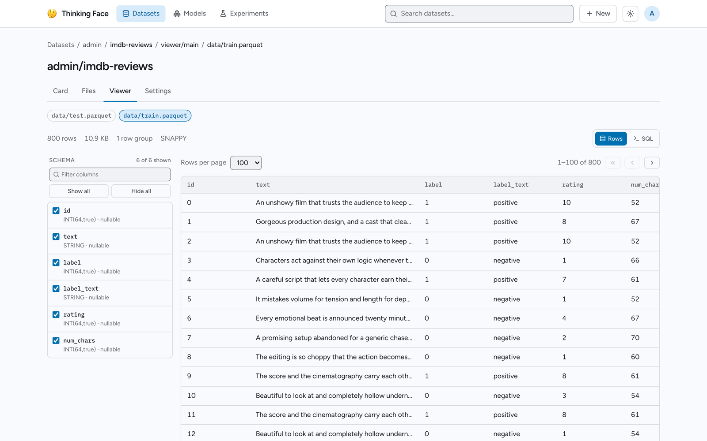
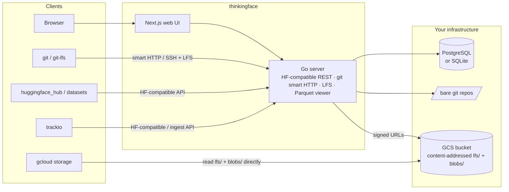

<h1 align="center">🤔 thinkingface</h1>

<p align="center">
  <strong>A self-hosted Hugging Face Hub.</strong><br>
  Datasets, model checkpoints, and experiment runs — on your own infrastructure, on storage you control,
  with the <code>huggingface_hub</code> / <code>datasets</code> / <code>git</code> tooling you already use.
</p>

<p align="center">
  <a href="https://github.com/dotneet/thinkingface/actions/workflows/ci.yml"></a>
  <a href="https://dotneet.github.io/thinkingface/"></a>
  <a href="backend/go.mod"></a>
  <a href="LICENSE"></a>
</p>

<p align="center">
  <strong>English</strong> · <a href="README.ja.md">日本語</a>
</p>

<p align="center">
  <a href="https://dotneet.github.io/thinkingface/">Documentation</a> ·
  <a href="https://dotneet.github.io/thinkingface/getting-started/">Quickstart</a> ·
  <a href="https://dotneet.github.io/thinkingface/reference/compatibility/">Compatibility</a> ·
  <a href="https://dotneet.github.io/thinkingface/self-hosting/deployment/">Deployment</a> ·
  <a href="CONTRIBUTING.md">Contributing</a>
</p>


## What is thinkingface?

thinkingface gives your team a private Hugging Face Hub. Every dataset and model is a plain
git repository with Git LFS, the bytes live in your own Google Cloud Storage bucket, and the
server speaks the Hub's API — so `huggingface_hub`, `datasets`, `git`, and `gcloud storage`
keep working with nothing more than `HF_ENDPOINT` pointed at your instance. Training runs land
next to the data through a trackio-compatible interface, and a web UI lets you browse, inspect,
and edit all of it without downloading anything.

It runs as a single Go binary plus a Next.js web UI, on PostgreSQL or SQLite, with
`docker compose up` locally and Cloud Run in production.

## Key features

- **Drop-in for the Hub clients.** `create_repo`, `upload_file`, `hf_hub_download`,
  `list_repo_tree`, `load_dataset(...)` and friends work unchanged — set `HF_ENDPOINT` and go.
- **Git all the way down.** Every repository is a bare git repo with Git LFS. `git clone` and
  `git push` over HTTP or SSH; branches, tags, and revisions behave exactly as you expect.
- **Your bucket, your bytes.** Objects are stored content-addressed in GCS and deduplicated
  across repositories. One generated `gcloud storage cp` script restores any revision to its
  original layout, and Parquet files can be read straight from `gs://` in DuckDB or BigQuery.
- **Browse without downloading.** A file tree, a Parquet table viewer with an in-browser SQL
  console, a checkpoint inspector that reads only the safetensors / PyTorch header, commit
  history, and in-browser editing with commits.
- **Experiment tracking built in.** Log metrics from your training loop through the
  trackio-compatible shim, compare runs and charts in the UI — the source of truth is Parquet
  inside a dataset repository you own.
- **Built for teams.** Organizations with `admin` / `write` / `read` roles, access tokens, SSH
  keys, repository transfer, and an audit log.
- **Small to operate.** Pure-Go backend (no CGo), PostgreSQL or SQLite selected by
  `DATABASE_URL`, a Terraform module for GCP, and a `tf` CLI that registers a directory in one
  command.

| Parquet viewer | Checkpoint inspector | Experiment charts |
|:--:|:--:|:--:|
|  |  |  |

## Quick start

You need Docker with the Compose plugin.

```bash
git clone https://github.com/dotneet/thinkingface.git
cd thinkingface
cp .env.example .env
docker compose up -d
```

| What | Where |
|---|---|
| Web UI | <http://localhost:3000> |
| API endpoint | <http://localhost:8080> |
| Default login | `admin` / `admin` |

Log in, create an access token under **Settings → Access tokens**, and upload your first
dataset from Python with nothing but environment variables:

```bash
pip install huggingface_hub datasets
export HF_ENDPOINT=http://localhost:8080
export HF_TOKEN=tf_xxxxxxxxxxxx
export HF_HUB_DISABLE_XET=1   # thinkingface transfers over Git LFS, not Xet
```

```python
from huggingface_hub import HfApi
from datasets import load_dataset

api = HfApi()
api.create_repo("admin/imdb-ja", repo_type="dataset", exist_ok=True)
api.upload_file(
    path_or_fileobj="train.parquet",
    path_in_repo="data/train.parquet",
    repo_id="admin/imdb-ja",
    repo_type="dataset",
)

ds = load_dataset("admin/imdb-ja")
```

Open <http://localhost:3000/datasets/admin/imdb-ja> to see the file tree and the Parquet
viewer. The [Quickstart](https://dotneet.github.io/thinkingface/getting-started/) walks through
the same steps in more detail, including the `tf` CLI and git routes.

> **Before anyone else can reach your instance**, change `TF_ADMIN_PASSWORD` and
> `TF_SESSION_SECRET` in `.env`. Over `https://`, the server refuses to start while either is at
> its development default. See
> [Configuration](https://dotneet.github.io/thinkingface/self-hosting/configuration/).

## Works with the tools you already use

| Tool | How | Guide |
|---|---|---|
| `huggingface_hub` / `datasets` / `hf` CLI | Set `HF_ENDPOINT`, `HF_TOKEN`, `HF_HUB_DISABLE_XET=1` (or call `thinkingface.login()` from the bundled Python package) | [Uploading](https://dotneet.github.io/thinkingface/guides/uploading/) · [Downloading](https://dotneet.github.io/thinkingface/guides/downloading/) |
| `git` / Git LFS | `git clone http://localhost:8080/datasets/admin/imdb-ja.git` over HTTP (token as password) or SSH (`ssh://git@host:2222/...`) | [Working with Git](https://dotneet.github.io/thinkingface/guides/git/) |
| `tf` CLI | `tf login http://localhost:8080` once, then `tf up ./my-dataset` pushes a directory as one commit | [tf CLI](https://dotneet.github.io/thinkingface/reference/tf-cli/) |
| trackio | `from thinkingface import trackio` in your training script, or let trackio's own Parquet sync push to a dataset repo | [Tracking Experiments](https://dotneet.github.io/thinkingface/guides/experiments/) |
| `gcloud storage` / DuckDB / BigQuery | Objects are content-addressed `gs://` keys; the UI and API generate a `gcloud storage cp` script and a DuckDB snippet per revision | [Downloading](https://dotneet.github.io/thinkingface/guides/downloading/#restore-a-revision-straight-from-the-bucket) · [Core Concepts](https://dotneet.github.io/thinkingface/concepts/) |

Exactly which `huggingface_hub` and `datasets` calls are supported, and the known gaps, are
listed in [Compatibility](https://dotneet.github.io/thinkingface/reference/compatibility/). The
`e2e/` suite verifies that list against every change.

## How it works



With a real GCS bucket, large files never pass through the server: the LFS batch API hands
clients signed URLs and the bytes go straight to GCS. After a push, a sync worker publishes the remaining git blobs under
content-addressed keys and indexes Parquet schemas, checkpoint headers, and experiment metrics.
The design rationale is in
[`docs/dev/thinkingface-design.md`](docs/dev/thinkingface-design.md).

## Deploying

- **Local / evaluation** — `docker compose up -d` (PostgreSQL), or `make up-sqlite` to drop the
  database container entirely.
- **Production on GCP** — Cloud Run for the API and web UI, Cloud SQL for PostgreSQL (or a
  single instance on SQLite + Litestream), and a GCS bucket. The Terraform module in
  [`infra/`](infra/README.md) provisions it; the only difference from Compose is environment
  variables.

Backups, upgrades, database migrations, and the full environment variable reference are in
[Deployment](https://dotneet.github.io/thinkingface/self-hosting/deployment/) and
[Configuration](https://dotneet.github.io/thinkingface/self-hosting/configuration/).

## Documentation

**User guide** — <https://dotneet.github.io/thinkingface/> (source in [`docs/users/`](docs/users/))

| | |
|---|---|
| [Quickstart](https://dotneet.github.io/thinkingface/getting-started/) · [Core Concepts](https://dotneet.github.io/thinkingface/concepts/) | From zero to a running instance with one dataset; repositories, revisions, and how files are stored |
| [Guides](https://dotneet.github.io/thinkingface/guides/uploading/) | Uploading, downloading, git, the web UI, the dataset viewer, model checkpoints, experiments, organizations |
| [Reference](https://dotneet.github.io/thinkingface/reference/tf-cli/) | `tf` CLI, authentication, compatibility with the Hugging Face Hub |
| [Self-hosting](https://dotneet.github.io/thinkingface/self-hosting/deployment/) | Deployment options and configuration |

**Developer docs** — [`docs/dev/`](docs/dev/) (not published)

| | |
|---|---|
| [Development guide](docs/dev/development.md) | Running the stack from a checkout, dev servers, quality gates, tests, conventions |
| [Design document](docs/dev/thinkingface-design.md) | Architecture, storage layout, git/LFS server, experiment tracking, data model |
| [API contract](docs/dev/api-contract.md) | The Web UI-facing API surface (`backend/internal/apitypes` is the source of truth) |
| [Python client](clients/python/README.md) · [E2E suite](e2e/README.md) · [Terraform](infra/README.md) | Per-component READMEs |

## Contributing

Contributions are welcome — see [CONTRIBUTING.md](CONTRIBUTING.md). The short version:
`cp .env.example .env && make up` to run the stack, `make check` before every PR (it mirrors
CI), and `make test-e2e` whenever you touch an HF-compatible endpoint. The
[development guide](docs/dev/development.md) has the details.

## License

[MIT](LICENSE)
