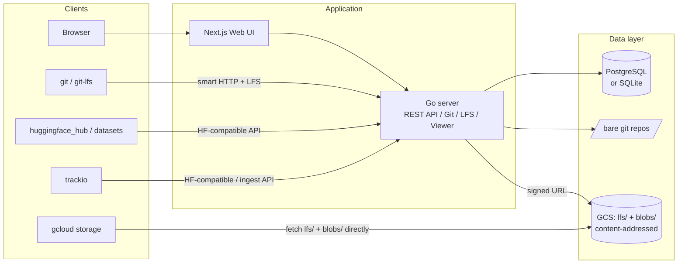

# 🤔 Thinking Face

thinkingface is a self-hosted clone of the HuggingFace Hub. Datasets and model checkpoints
are registered and version-controlled with git + Git LFS, and the actual data goes straight to
Google Cloud Storage. `huggingface_hub` / `datasets` work as-is just by swapping in
`HF_ENDPOINT`, and since the objects in GCS are laid out by content address, running the
`gcloud storage cp` script the web UI generates lays them out locally in their original file
structure. Experiment results can be recorded and visualized through a trackio-compatible
mechanism.

Key features:

- Create dataset / model repositories, `git clone`, `git push` (with Git LFS support)
- A `huggingface_hub`-compatible REST API (whoami / create_repo / preupload / commit / resolve / tree)
- File tree browsing and a Parquet table view in the web UI (pure-Go `parquet-go`, no CGo)
- A metadata viewer for model checkpoints (safetensors / PyTorch) in the web UI (reads only the header, never downloads the weights)
- Direct editing and committing of Markdown / text files from the web UI
- A content-addressed GCS layout (`lfs/` + `blobs/`), with automatic generation of a `gcloud storage cp` script that restores a revision to its original file structure
- A namespace page (`/{ns}`, shared by users and organizations, with Models/Datasets/Experiments tabs) and profile editing (`/settings/profile`)
- trackio-compatible experiment tracking (two paths: batch sync and real-time ingest)
- One-shot `docker compose` startup locally, GCP in production (Cloud Run + Cloud SQL, or SQLite/Litestream + GCS)
- The metadata DB can be switched between PostgreSQL / SQLite via the `DATABASE_URL` scheme

See [`docs/thinkingface-design.md`](docs/thinkingface-design.md) for design details, and
[`docs/api-contract.md`](docs/api-contract.md) for the finalized API spec.

### Verified paths

With `docker compose up -d` running, the following have been verified to work end-to-end
(the `e2e/` pytest suite automates the same coverage).

| Path | What's verified |
|---|---|
| `huggingface_hub` | `whoami` / `create_repo` / `upload_file` (both regular files and LFS) / `list_repo_files` / `list_repo_tree` / `hf_hub_download` / `repo_info` / `delete_repo` |
| `datasets` | `load_dataset("ns/name")` works, including automatic train/test split detection |
| git | `git clone` (LFS objects are expanded as real files) and `git push` (including LFS upload) |
| GCS | After a push, non-LFS blobs are published to `blobs/{sha}` (LFS objects go to `lfs/{oid}`); the same content can be fetched via `gcloud storage` / the plain GCS API |
| Parquet | A pushed parquet file is automatically indexed for schema and row count, and the viewer API returns rows |
| trackio | Extracts runs, configs, and metrics from `{project}/metrics.parquet` + `{project}/aux/configs.parquet` |
| Native ingest | Live metrics from the `thinkingface.trackio` shim show up in the run list and charts |

## Architecture



## Quick start

```bash
cp .env.example .env
docker compose up -d
```

Once it's up:

- Web UI: http://localhost:3000
- API: http://localhost:8080
- Default login: `admin` / `admin` (change via `TF_ADMIN_USERNAME` / `TF_ADMIN_PASSWORD` in `.env`)

To stop: `docker compose down` (to also wipe data, `make clean`).

### Running in SQLite mode

Just change the `DATABASE_URL` scheme to use SQLite (pure-Go `modernc.org/sqlite`, no CGo)
instead of PostgreSQL. With the full docker stack:

```bash
make up-sqlite   # docker-compose.yml + docker-compose.sqlite.yml. postgres is not started
```

Minimal setup to run the backend standalone without docker:

```bash
cd backend
DATABASE_URL=sqlite:///tmp/thinkingface.db \
STORAGE_DRIVER=gcs-emulator STORAGE_EMULATOR_HOST=http://localhost:4443 \
  go run ./cmd/thinkingface serve
```

**Known limitations** (details in `docs/thinkingface-design.md` §10):

- Assumes a single process / single writer connection. Cannot be used with multiple replicas
- HF-compatible `search=` partial matching is case-insensitive for ASCII only (not an exact match for PostgreSQL's ILIKE)
- The web UI's full-text search uses FTS5 (the unicode61 tokenizer), which can behave differently from PostgreSQL's tsvector
- For production use, this assumes a single Cloud Run instance + Litestream (replicating to GCS) setup (`docs/thinkingface-design.md` §14)

## Register with a single `tf` CLI command

If you just want to register a single dataset or model, there's no need to bounce between
the browser and the terminal. `tf` is a single static-binary command-line client: log in once,
and after that you just point it at a directory (if the repository doesn't exist it creates
one, infers the kind from the contents, and uses the directory name):

```bash
make tf                            # builds to backend/bin/tf
backend/bin/tf login http://localhost:8080
backend/bin/tf up ./imdb-ja        # pushes to datasets/<you>/imdb-ja in a single commit
```

Instead of logging in, you can pass `THINKINGFACE_API_KEY` (+ `THINKINGFACE_ENDPOINT`) as
environment variables to reach the same state; `tf status` shows your login state and account
info.

For details (each command, flags, credential resolution order, and how this relates to
`hf upload`), see [`docs/tf-cli.md`](docs/tf-cli.md).

## Using it from Python (`huggingface_hub` / `datasets`)

Just point `HF_ENDPOINT` at it, and `huggingface_hub` and `datasets` work with no code changes.

```bash
pip install -e clients/python  # thinkingface.login() helper (optional)
```

```python
import thinkingface
from huggingface_hub import HfApi, upload_file, hf_hub_download
from datasets import load_dataset

# A helper that just sets HF_ENDPOINT / HF_TOKEN / HF_HUB_DISABLE_XET
thinkingface.login("http://localhost:8080", token="tf_xxxxxxxxxxxx")

api = HfApi()
api.create_repo("me/imdb-ja", repo_type="dataset", exist_ok=True)

upload_file(
    path_or_fileobj="train.parquet",
    path_in_repo="data/train.parquet",
    repo_id="me/imdb-ja",
    repo_type="dataset",
)

path = hf_hub_download(repo_id="me/imdb-ja", repo_type="dataset", filename="data/train.parquet")
ds = load_dataset("parquet", data_files=path)
```

You can do the same thing with plain environment variables:

```bash
export HF_ENDPOINT=http://localhost:8080
export HF_TOKEN=tf_xxxxxxxxxxxx
export HF_HUB_DISABLE_XET=1
hf upload me/imdb-ja ./train.parquet data/train.parquet --repo-type dataset
```

Issue a token from the web UI's `Settings > Tokens` (`/settings/tokens`), or get one via the
`POST /api/v1/tokens` API.

### Organizations

Create a team namespace from `/orgs/new` and manage members with three roles: `admin` /
`write` / `read` (details in [`docs/organization-design.md`](docs/organization-design.md)).
From `huggingface_hub` it feels just like working with a user. Organizations and users share
the same "namespace" concept, and their profile (display name, bio, website) and resource
listings are consolidated on the common `/{ns}` page (`/orgs/{name}` redirects to `/{name}`
for compatibility; see [`docs/namespace-design.md`](docs/namespace-design.md) for details):

```python
api.create_repo("team/imdb-ja", repo_type="dataset", private=True)  # created directly under the org namespace
api.whoami()["orgs"]                                                 # orgs you belong to, and your role (roleInOrg)
api.list_organization_members("team")                                # member list
```

> **Why `HF_HUB_DISABLE_XET=1` is needed**
> Since `huggingface_hub` 1.0, if the `hf_xet` package is installed, it prefers the Xet
> protocol for transferring large files. thinkingface transfers over Git LFS and doesn't
> support Xet, so you need to disable it with this environment variable.
> `thinkingface.login()` sets it automatically. If you forget to set it, the server returns
> an error explaining why.

## Using it from git

Every repository is git (a bare repository + Git LFS).

```bash
git clone http://localhost:8080/datasets/me/imdb-ja.git
cd imdb-ja

git lfs track "*.parquet"   # the server usually already generated a default when the repo was created
git add .gitattributes data/train.parquet
git commit -m "Add training data"
git push origin main
```

Auth is HTTP Basic (`username:access-token`). Register it with `git credential` so you aren't
prompted every time:

```bash
git config --global credential.helper store
# on the first push, enter your username and token (tf_xxxxxxxxxxxx)
```

### Cloning / pushing over SSH

When `TF_SSH_ENABLED=true`, git over SSH is also available (default port 2222; enabled in the
`make up` docker compose setup). First, register your public key at `/settings/ssh-keys` in
the web UI:

```bash
ssh-keygen -t ed25519 -C "you@example.com"   # if you don't already have one
cat ~/.ssh/id_ed25519.pub                    # paste this into /settings/ssh-keys
```

Once registered, you can clone like this (the username is resolved from the key, so it can be
anything; `git` is conventional):

```bash
git clone ssh://git@localhost:2222/me/my-model.git
git clone ssh://git@localhost:2222/datasets/me/imdb-ja.git
```

Only `git-upload-pack` / `git-receive-pack` can be run over SSH — shell access, PTY, sftp, and
port forwarding are all rejected. Visibility and write-permission checks are the same as over
HTTP.

> **If you enable this in production**: put the host key (`TF_SSH_HOST_KEY_PATH`, default
> `/data/ssh/host_ed25519`) on persistent storage. On tmpfs, a new host key is generated on
> every restart, and clients get a host key mismatch warning.

## Fetching directly from GCS

Objects in GCS are laid out by **content address**, independent of namespace, repository
name, or path. Looking inside the bucket, there is no human-readable directory structure (see
the design rationale in [`docs/thinkingface-design.md`](docs/thinkingface-design.md) §4).

```
gs://{bucket}/
├── lfs/{oid[0:2]}/{oid[2:4]}/{oid}       # LFS object bodies. Content-addressed, immutable, deduplicated across repos
├── blobs/{sha[0:2]}/{sha[2:4]}/{sha}     # Non-LFS git blob bodies. Files from every pushed ref,
│                                         # published by the sync worker (also content-addressed, immutable)
├── wal/{storage_path}/                   # Source of truth for git history (refs and packs)
└── tmp/uploads/{oid}-{repoID}            # Scratch space for LFS uploads
```

The human-readable file layout is assembled on the "consumer" side. The repo page / file
tree's "GCS access" dialog, or `GET /api/v1/repos/{kind}/{ns}/{name}/gcs/{rev}`, generates a
`gcloud storage cp` script that lays out every file for that revision under `$DEST/{path}`.

```sh
#!/bin/sh
# thinkingface: datasets/me/imdb-ja @ main -- 3 files, 536871936 bytes
# Objects are content-addressed; this script lays them out under DEST.
# DEST may be a local directory or a gs:// prefix.
set -eu
DEST="${DEST:-./imdb-ja}"
cp_one() {
  case "$DEST" in gs://*) ;; *) mkdir -p "$(dirname "$2")" ;; esac
  gcloud storage cp "$1" "$2"
}
cp_one 'gs://my-proj-thinkingface/blobs/3f/2a/3f2a9c…' "$DEST"/'README.md'
cp_one 'gs://my-proj-thinkingface/lfs/9b/1d/9b1de4…' "$DEST"/'data/train-00000-of-00002.parquet'
cp_one 'gs://my-proj-thinkingface/lfs/c7/04/c704f1…' "$DEST"/'data/train-00001-of-00002.parquet'
```

If you pass a `gs://` prefix instead of a local directory as `DEST`, it becomes a
bucket-to-bucket copy instead of a download.

For a revision that includes `.parquet` files, the same response also includes a DuckDB
snippet (`duckdb_snippet`). The same `gs://` keys can be referenced directly from BigQuery
external tables or Vertex AI too.

```sql
-- DuckDB: INSTALL httpfs; LOAD httpfs; then CREATE SECRET for GCS (HMAC) before running.
SELECT * FROM read_parquet([
  'gs://my-proj-thinkingface/lfs/9b/1d/9b1de4…',
  'gs://my-proj-thinkingface/lfs/c7/04/c704f1…'
]);
```

From an individual file in the file tree, you can also copy a single-file
`gcloud storage cp` command.

### Hitting it locally (fake-gcs-server)

In the docker compose environment, the `gcs` service (`fsouza/fake-gcs-server`) listens on
port 4443.

```bash
# Point the gcloud CLI at the local emulator
gcloud config set api_endpoint_overrides/storage http://localhost:4443/storage/v1/

# Pull the script from the API and run it directly (add an Authorization header for a private repo)
curl -s http://localhost:8080/api/v1/repos/dataset/me/imdb-ja/gcs/main \
  | jq -r .gcloud_script | DEST=./imdb-ja sh

# Or list the bucket's contents (content-addressed) directly via REST
curl "http://localhost:4443/storage/v1/b/thinkingface/o?prefix=blobs/"
curl "http://localhost:4443/storage/v1/b/thinkingface/o?prefix=lfs/"
```

Client libraries (`google-cloud-storage` etc.) can likewise be pointed at the emulator with
`STORAGE_EMULATOR_HOST=http://localhost:4443`.

## trackio integration

Just point your training script's `HF_ENDPOINT` at thinkingface, and trackio's Dataset sync
(the batch path) works as-is. If you want real-time display, use the bundled compatibility
shim.

```python
import os
os.environ["THINKINGFACE_ENDPOINT"] = "http://localhost:8080"
os.environ["THINKINGFACE_TOKEN"] = "tf_xxxxxxxxxxxx"
os.environ["THINKINGFACE_REPO"] = "me/trackio-metrics"  # defaults to "{user}/trackio-metrics" if omitted

from thinkingface import trackio  # use this instead of `import trackio`

run = trackio.init(project="mnist", name="baseline", config={"lr": 1e-3})
for step in range(100):
    trackio.log({"loss": 1.0 / (step + 1)}, step=step)
trackio.finish()
```

Either way, the source of truth for experiment logs is the Parquet file inside the dataset
repository. See [`clients/python/README.md`](clients/python/README.md) for details.

## Directory layout

```
thinkingface/
├── backend/            # Single Go binary (API / git / LFS / viewer / worker)
├── frontend/            # Next.js + Bun web UI
├── clients/python/      # pip package `thinkingface` (login helper + trackio shim)
├── e2e/                 # Compatibility E2E tests using huggingface_hub (pytest)
├── infra/               # Terraform (GCP: GCS / Cloud SQL / Cloud Run)
├── docker-compose.yml   # Full local stack (postgres / gcs emulator / api / web)
├── docker-compose.sqlite.yml  # Override for SQLite mode (`make up-sqlite`)
└── docs/                # Design docs and API contract
```

## Development commands

Run `make help` for the list.

| Command | Description |
|---|---|
| `make up` | Start all services in the background (postgres / gcs / api / web) |
| `make up-sqlite` | Start in SQLite mode (no postgres; `docker-compose.sqlite.yml`) |
| `make down` / `make down-sqlite` | Stop all services (volumes are kept) |
| `make logs` | Follow logs from all services |
| `make rebuild` | Rebuild the api / web images with no cache and restart |
| `make psql` | Connect to the postgres service with psql |
| `make check` | Run all quality gates at once (backend / frontend / python / type sync). Always run after a code change |
| `make test` | backend's go test + frontend's unit tests |
| `make test-store-pg` | Also run `backend/internal/store`'s integration tests against PostgreSQL (assumes `make up` has run) |
| `make test-e2e` | Run `e2e/`'s compatibility tests (assumes `make up` has run) |
| `make gen-types` | Regenerate `frontend/types/api.gen.ts` from Go's wire types |
| `make fmt` | Format Go / TypeScript / Python / Terraform |
| `make lint` | Static checks for Go / Python / Terraform |
| `make clean` | Remove all services and named volumes |

For hot-reload development, copy `docker-compose.override.yml.example` to
`docker-compose.override.yml` (it bind-mounts the source and starts things with `go run` /
`bun run dev`).

## Production deployment (GCP)

Production runs on Cloud Run (both api and web are stateless; the source of truth for git is
the WAL in GCS, see `docs/continuity-design.md`) + Cloud SQL for PostgreSQL (private IP) +
GCS. It's designed so the only difference from compose is environment variables and
`STORAGE_DRIVER` (`gcs-emulator` -> `gcs`).

For the metadata DB, you can also choose SQLite + Litestream (a single Cloud Run instance)
instead of Cloud SQL for PostgreSQL. See `docs/thinkingface-design.md` §14 for details.

### Environment variables you must set before going public

If `TF_PUBLIC_URL` starts with `https://`, the server **refuses to start** when a development
default is still in place (`config.Load()` returns an error). A local http setup still starts
with just a warning, as before.

| Variable | Default | Handling in production |
|---|---|---|
| `TF_ADMIN_PASSWORD` | `admin` | Won't start in an https setup if left at the default. Change it even on an already-seeded instance |
| `TF_SESSION_SECRET` | `dev-insecure-session-secret` | Won't start in an https setup if left at the default or under 32 bytes. Signing key for the session cookie and LFS transfer URLs |
| `TF_ALLOWED_ORIGINS` | `TF_PUBLIC_URL`'s origin (plus `http://localhost:3000` when it's http) | Comma-separated list of browser origins allowed for credentialed CORS. **Must be set whenever the web UI lives on a different host than the API** (otherwise browser-side API calls get blocked). Origins outside the allowlist get no CORS headers, and state-changing calls via the cookie session get 403 |
| `TF_COOKIE_SECURE` | Unset (inferred from `TF_PUBLIC_URL`) | The inference is wrong when TLS is terminated at a load balancer and the internal traffic is plain HTTP. Set it to `true` explicitly |
| `TF_SESSION_TTL` | `168h` (7 days) | Lifetime of the session cookie. Also invalidated server-side on logout and password change |
| `TF_AUTH_RATE_LIMIT_PER_MIN` | `10` | Rate limit that counts failed password authentication attempts (per IP, per minute; the per-username limit is half of that). Applies to both login and HTTP Basic. `0` disables it. The counter is process-local, so with multiple replicas the limit applies per replica |
| `TF_TRUST_PROXY_IPS` | `false` | Use the first entry of `X-Forwarded-For` to identify the client for rate limiting. Only set this to `true` when a proxy you control is the one overwriting this header |

The full Terraform setup lives in [`infra/`](infra/README.md).

```bash
cd infra
terraform init
terraform apply -var="project_id=my-gcp-project"
```

For the post-apply steps (pushing images, `kubectl apply -f infra/k8s/`, deploying the
frontend to Cloud Run), see [`infra/README.md`](infra/README.md).
