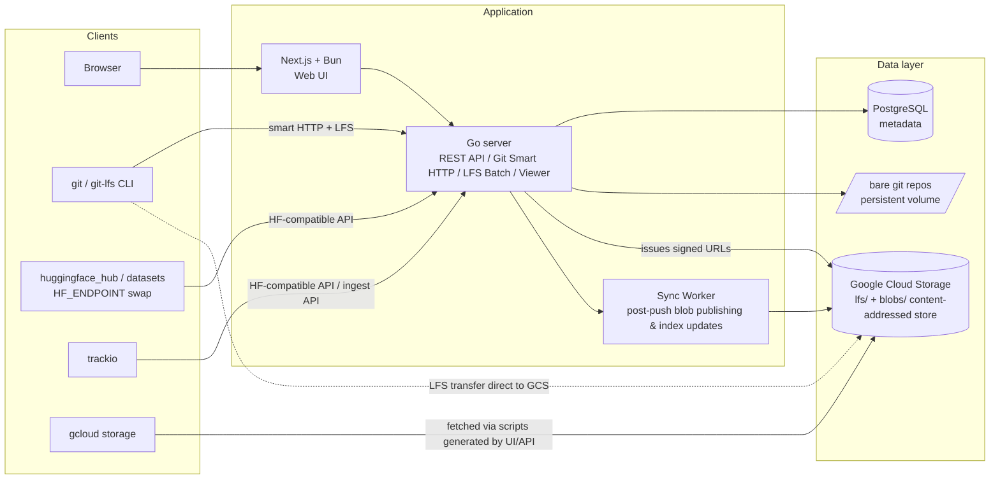
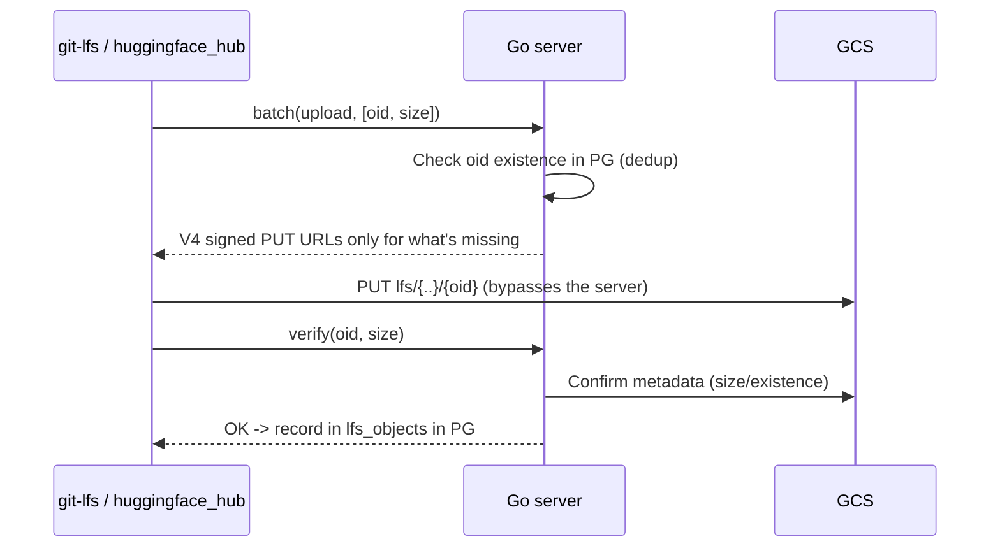
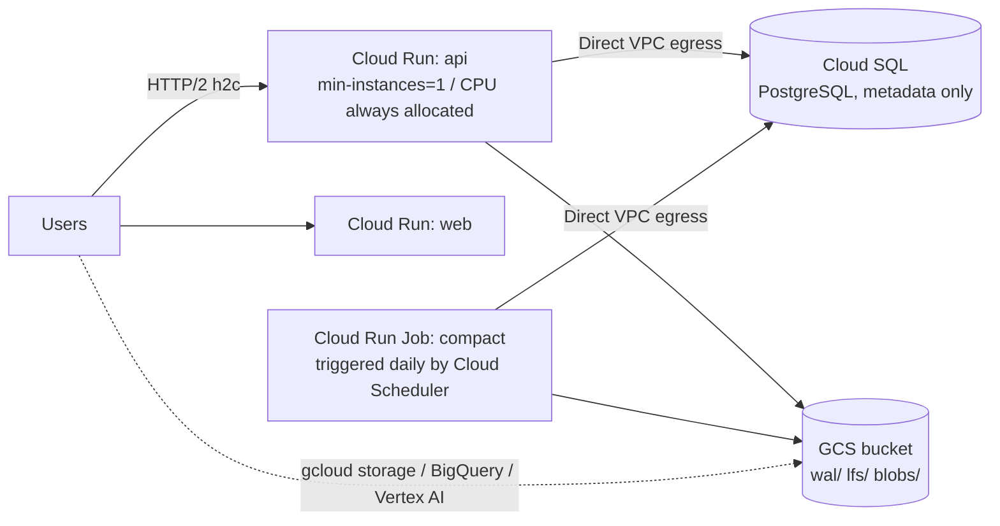

# thinkingface Design Document

A self-hosted clone of HuggingFace Hub. It provides dataset/model checkpoint registration and browsing, and experiment result visualization (trackio support), with Google Cloud as a first-class runtime environment.

| Item | Choice |
|---|---|
| Backend | Go (single binary: REST API / Git Smart HTTP / Git LFS / viewer) |
| Frontend | Next.js (App Router) + Bun |
| Metadata DB | PostgreSQL or SQLite (switched via `DATABASE_URL`. Production default is Cloud SQL; SQLite targets a single Cloud Run instance + Litestream setup) |
| Blob storage | Google Cloud Storage (local: fake-gcs-server) |
| Git repositories | Bare repositories on the server (persistent volume) |
| Parquet reading | parquet-go (pure Go, no CGo) |
| Local deployment | One-shot startup with docker compose |

## 1. Goals and Non-Goals

**Goals**

- Dataset registration. First-class Parquet support (schema display, row browsing, statistics). Other formats can also be stored and served as plain files
- Model (checkpoint) registration, versioning, and download
- Dataset browsing in the Web UI (file tree + Parquet table view)
- Experiment result display. Log collection from trackio clients and metric chart rendering
- Repository operations via `git clone` / `git push` (large files handled via LFS)
- Actual data (Parquet, etc.) lives in GCS with **a path structure that can be fetched directly with `gcloud storage cp`**
- A compatible API that lets the `huggingface_hub` / `datasets` Python clients work as-is by swapping `HF_ENDPOINT`

**Non-Goals (out of scope initially)**

- App hosting equivalent to Spaces (the trackio dashboard is instead built into the main UI)
- Inference API (equivalent to Inference Endpoints)
- HF Xet protocol compatibility (LFS is used instead)
- Multi-tenant operation for the public internet (intended for internal/team use)

## 2. Overall Architecture



The design rests on three pillars.

1. **Treat the HF Hub-compatible API as the source of truth.** `huggingface_hub` lets you swap its endpoint via the `HF_ENDPOINT` environment variable. Implementing the compatible subset (whoami / repo creation / commit / resolve / tree) makes `datasets.load_dataset()`, `hf upload`, and trackio's data sync work with **zero client-side changes**. This is the path to maximum ecosystem compatibility at minimum cost
2. **Register via Git + LFS, with blobs going straight to GCS.** The LFS Batch API returns GCS V4 signed URLs, so large files transfer directly to/from GCS without passing through the Go server. The server stays purely a control plane
3. **Keep GCS keys fully independent of namespace and repository name, using only two content-addressed layers (`lfs/` + `blobs/`).** A human-readable layout does not exist on GCS itself; it's expressed only on the **destination side** of the `gcloud storage cp` snippet generated by the UI/API (returned by `GET /api/v1/repos/{kind}/{ns}/{name}/gcs/{rev}`). See `docs/dev/content-addressed-storage-design.md` for details

## 3. Repository Model

As in HF, everything is unified under the principle that "everything is a git repository."

- Repository kind: `dataset` / `model` (experiment logs are also internally `dataset` repositories; see §8)
- Namespace: `{namespace}/{name}`. The namespace is a user or an organization
- Revision: branch, tag, or commit SHA. The default branch is `main`
- The YAML front matter of `README.md` is interpreted as the repository card (license, tags, language, etc.)
- The card's `lineage:` block declares **lineage**. Writing the training dataset, base model, and training run lets the Sync Worker index them into `repo_lineage`, so the UI can trace both directions (upstream provenance and downstream models produced from it). The convention is in `docs/dev/api-contract.md` §11
- `.gitattributes` controls which files go through LFS. The server generates defaults when a repository is created (`*.parquet`, `*.safetensors`, `*.bin`, `*.gguf`, `*.ckpt`, `*.pt`, `*.onnx`, etc., plus anything over 10MB is routed to LFS by the preupload API's decision)

Direct uploads from the Web UI (adding files from the browser) also internally call the HF-compatible commit API, creating a git commit server-side. **There is exactly one write path — git —** so history never diverges between the UI, the CLI, and Python.

## 4. Storage Design (GCS Layout)

A single bucket `{project}-thinkingface` is used with two content-addressed layers that are fully independent of namespace and repository name. A human-readable layout does not exist on GCS (see `docs/dev/content-addressed-storage-design.md` for the detailed design rationale).

```
gs://{bucket}/
├── lfs/{oid[0:2]}/{oid[2:4]}/{oid}          # Sole location for LFS payloads. Content-addressed,
│                                             # immutable, deduplicated across repos (storage.LFSKey)
├── blobs/{sha[0:2]}/{sha[2:4]}/{sha}        # Non-LFS git blob payloads. The Sync Worker publishes
│                                             # every file of every pushed ref (all branches/tags).
│                                             # Content-addressed, immutable (storage.BlobKey).
│                                             # The viewer cache is also unified under this key
├── wal/{storage_path}/                       # Source of truth for git history (docs/dev/continuity-design.md)
│   ├── index.json                            #   CAS target. Refs and pack ordering
│   ├── base/{ulid}.pack                      #   Compaction snapshot
│   └── entries/{seq}-{ulid}.pack             #   One push = one entry
└── tmp/uploads/{oid}-{repoID}                # Scratch space for LFS proxy uploads
```

- **LFS payloads live only in `lfs/`, and non-LFS blob payloads live only in `blobs/` — exactly one copy of each.**
  Both use content-addressed keys (`storage.LFSKey(oid)` / `storage.BlobKey(sha)`) that depend on
  neither the repository name nor the branch. Identical content is automatically deduplicated across repositories
- Transfers, renames, and deletions never move a single byte of GCS objects. Orphaned objects are
  reclaimed by `thinkingface gc` (using `repo_lfs_objects` as the reference count for `lfs/` and
  `repo_files.blob_sha` for `blobs/`)
- `wal/` is keyed by `repositories.storage_path` (an immutable physical location assigned when the
  repository is created; new repositories get `repos/{ulid}`, while repositories predating the
  introduction of `storage_path` keep their old-style location `{models|datasets}/{ns}/{name}` via
  backfill). Since this is independent of the logical name `(kind, namespace, name)`, `wal/` never
  moves even when a repository is renamed or transferred (`docs/dev/repo-transfer-design.md`)
- `blobs/` is published by the Sync Worker on every push. It targets every file of every pushed ref
  (any branch or tag), skips keys that already exist via Stat (otherwise Put with
  `Content-Type: application/octet-stream`), and relies on GCS's own deduplication. **LFS payloads
  (`lfs/`) stay in place from the moment they're accepted, regardless of reachability in git
  history**, so they're removed only when their references disappear and `gc` reclaims them

From the user's perspective: from the "Fetch via GCS" dialog on the file tree or repository page,
you get and run the `gcloud storage cp` script generated by `GET /api/v1/repos/{kind}/{ns}/{name}/gcs/{rev}`.

```sh
#!/bin/sh
# thinkingface: datasets/team/imdb-ja @ main -- 4 files, 123456789 bytes
# Objects are content-addressed; this script lays them out under DEST.
# DEST may be a local directory or a gs:// prefix.
set -eu
DEST="${DEST:-./imdb-ja}"
cp_one() {
  case "$DEST" in gs://*) ;; *) mkdir -p "$(dirname "$2")" ;; esac
  gcloud storage cp "$1" "$2"
}
cp_one 'gs://bucket/blobs/ab/cd/abcd…' "$DEST"/'README.md'
cp_one 'gs://bucket/lfs/ab/cd/abcd…' "$DEST"/'data/train-00000-of-00004.parquet'
```

Repositories containing `.parquet` get a DuckDB snippet in the same response:

```sql
-- DuckDB: INSTALL httpfs; LOAD httpfs; then CREATE SECRET for GCS (HMAC) before running.
SELECT * FROM read_parquet([
  'gs://bucket/lfs/ab/cd/…',
  'gs://bucket/lfs/ef/01/…'
]);
```

BigQuery external tables and Vertex AI can also reference the `gs://` content-addressed keys
directly — this layer is what delivers "Google Cloud affinity." The human-readable dest path is
generated locally when the script runs (or in a separate bucket via `DEST=gs://…`).

## 5. Git Server

- Serves the **Smart HTTP protocol** in Go. `/{ns}/{name}.git/info/refs`, `git-upload-pack`, and `git-receive-pack` are implemented by wrapping `--stateless-rpc` invocations of the `git` binary (more battle-tested and faster than a from-scratch implementation; `git` is bundled in the container)
- Authentication is HTTP Basic (username + access token). Reads are anonymous-allowed for public repositories
- Bare repositories are placed at `/data/git/{storage_path}.git` (`{storage_path}` is the same
  `repositories.storage_path` as in §4. Since it isn't the logical name `{ns}/{name}`, the
  directory never moves when a repository is renamed or transferred; see
  `docs/dev/repo-transfer-design.md`). **The source of truth is not the disk but the WAL on GCS**
  (`docs/dev/continuity-design.md`): a push is persisted as a WAL entry and only acknowledged after
  the index's CAS is committed. The on-disk repository is a cache materialized from the WAL and
  can be reconstructed if lost (a named volume in docker compose, tmpfs on Cloud Run)
- Recording into the WAL is done by receive-pack's pre-receive hook (a fixed script baked into
  the image, injected via `core.hooksPath` — there's no per-repository variable hook). Enqueuing
  the Sync job is still done, as before, by the server process itself detecting when
  receive-pack finishes
- **Git history stays small**: large files always go through LFS pointers, so the bare repository holds only text and pointers. Disk usage stays light

### Git over SSH

In addition to Smart HTTP, **git over SSH** (`internal/sshserver`, default `:2222`, toggled with
`TF_SSH_ENABLED`) is provided. It's a path that lets you clone private repositories without
passing a token every time — it does not replace the HTTP path.

- Implemented with `gliderlabs/ssh` (a thin wrapper over `golang.org/x/crypto/ssh`, pure Go). No additional CGo dependency
- **Public-key authentication only.** No password / keyboard-interactive callback is ever
  registered, so a connection cannot succeed unless the presented key is in `user_ssh_keys`. The
  SSH username is ignored; the user is resolved from the key (conventionally `git@`)
- Keys are registered via the Web UI at `/settings/ssh-keys` (API in `docs/dev/api-contract.md` §1).
  The fingerprint (`SHA256:...`) is unique instance-wide — since the user is determined from the
  key alone, the same key cannot be shared across multiple accounts. Authentication looks up by
  fingerprint and then **re-compares the raw key bytes**, so the digest alone is never the basis
  of trust
- The only commands that can execute are `git-upload-pack '<path>'` and
  `git-receive-pack '<path>'`. Shell access, PTY, subsystems (sftp), and port forwarding are all rejected
- `<path>` accepts `ns/name` / `models/ns/name` / `datasets/ns/name`, and each segment must match
  the same naming regex used by the REST API. **The client's raw string is never passed to a
  command line**: it's parsed down to (kind, ns, name), looked up in the DB, and only the real
  path built from `repositories.storage_path` is handed to git
- Authorization has no separate implementation of its own; it delegates to `internal/api`'s
  `ServeGit` (`api/gitssh.go`). Repository resolution, private-repo invisibility, write
  permission, archive checks, the WAL hook, and post-push sync job registration all go through
  exactly the same code as the HTTP path
- The host key is `TF_SSH_HOST_KEY_PATH` (default `/data/ssh/host_ed25519`). If absent, an
  ed25519 key is generated at startup and saved with mode 0600. **Put it on persistent
  storage**: on tmpfs the host key changes on every cold start, and every client warns about a
  host key mismatch. If you enable this on Cloud Run, mount it from Secret Manager or similar
  (this is why it's disabled by default)
- SSH cannot be exposed on an HTTP-only runtime such as Cloud Run. If you need it, place it
  behind something that can carry raw TCP, such as a load balancer or GKE

### Sync Worker (post-push processing)

1. Fetch the commit for the pushed ref and get the list of changed files via diff
2. Publish non-LFS blobs to `blobs/` (Stat→Put; existing keys are skipped)
3. Update the `repo_files` table (the file tree cache)
4. For Parquet files, read the footer to extract schema and row count and store it in `parquet_files`
5. Parse the README front matter and update the repository card
6. Extract `lineage:` from the same parse result and fully replace `repo_lineage` (§3; kept as a raw string even if the target doesn't exist)
7. For experiment repositories, update the run index (§8)

Jobs run through a lightweight worker that uses a PG table as a queue (initially a goroutine in
the same process; a PG-based job queue like River could also be adopted). Designed to be
idempotent, with retries on failure.

## 6. Git LFS Server

Implements the LFS Batch API (`POST /{ns}/{name}.git/info/lfs/objects/batch`), with transfers going directly between the client and GCS.



- Downloads similarly return a signed GET URL (TTL of roughly 1 hour)
- Signing on Cloud Run/GKE uses a service account + the IAM Credentials API's signBlob (no key file needed); locally it uses **proxy mode** (described below)
- A single basic-transfer PUT works up to 5TB on GCS, so no multipart transfer adapter is needed initially. Resumable support via `x-goog-resumable` can be added later if needed
- **Locally (fake-gcs-server), the API server proxies instead of using signed URLs.** The storage layer is abstracted behind a `Storage` interface (`SignedGetURL / SignedPutURL / Copy / Get / GetRange / Put / Stat / List`) with two drivers: `gcs` and `gcs-emulator(proxy)`
- Proxy URLs must be **self-authenticating**. Neither `git-lfs` nor `huggingface_hub` attaches
  the batch response's `header` to a single-PUT transfer request (they assume the href is
  already signed). So the proxy URL embeds an HMAC signature as `?op=&exp=&sig=`, giving it the
  same property as a real signed URL. Relying on an Authorization header here would make LFS
  uploads fail with 401

## 7. HF-Compatible REST API

Only the subset actually used by `huggingface_hub`, `datasets`, and trackio is implemented (full compatibility isn't the goal).

| Endpoint | Purpose |
|---|---|
| `GET /api/whoami-v2` | Token verification / user info |
| `POST /api/repos/create` / `DELETE /api/repos/delete` | Repository creation / deletion |
| `GET /api/models/{ns}/{name}` `GET /api/datasets/{ns}/{name}` | Repository info (sha, siblings, card) |
| `GET /api/datasets/{ns}/{name}/tree/{rev}/{path}` | File tree (paginated) |
| `POST /api/{type}s/{ns}/{name}/preupload/{rev}` | Determines regular vs. LFS per file |
| `POST /api/{type}s/{ns}/{name}/commit/{rev}` | NDJSON commit API (creates a git commit server-side) |
| `GET /{ns}/{name}/resolve/{rev}/{path}` `GET /datasets/{ns}/{name}/resolve/{rev}/{path}` | File retrieval. LFS files 302 to a signed URL; regular files are returned directly. Returns headers such as `ETag`/`X-Linked-Size` that hf_hub_download inspects |
| `GET /api/datasets?author=&search=` etc. | List / search |

In addition, thinkingface's own APIs:

| Endpoint | Purpose |
|---|---|
| `GET /api/v1/parquet/{kind}/{ns}/{name}/rows/{rev}/{path}?offset=&limit=&columns=` | Parquet row browsing |
| `GET /api/v1/parquet/{kind}/{ns}/{name}/schema/{rev}/{path}` | Schema, row count, column list |
| `POST /api/v1/experiments/{ns}/{repo}/{project}/log` | Real-time ingest (§8 path B) |
| `GET /api/v1/experiments/...` | Run listing / metrics retrieval (for the UI) |

The complete endpoint specification is in [api-contract.md](api-contract.md).

Verification approach: CI runs an E2E test using `huggingface_hub` (create_repo -> upload_file -> hf_hub_download -> load_dataset with `HF_ENDPOINT=http://api:8080`) so compatibility is guaranteed as a regression test.

## 8. Experiment Tracking (trackio Support)

trackio is a local-first tracker with a wandb-compatible API (`init/log/finish`); it stores logs in local SQLite and backs them up as Parquet to an HF Dataset repository via `huggingface_hub`. Since Spaces isn't provided, support comes through two paths:

**Path A (compatible, zero changes)**: simply point `HF_ENDPOINT` at thinkingface from the training script, and trackio's Dataset sync pushes Parquet straight into a thinkingface dataset repository (e.g. `{user}/trackio-metrics`) as-is. The Sync Worker detects this Parquet, indexes runs/metrics, and the UI draws charts. Batch sync at a few-minutes interval.

**Path B (real-time)**: a thin Python shim (`thinkingface.trackio` wrapper, with the same signature as trackio) POSTs directly to the custom ingest API (table above). The receiving side buffers and periodically flushes to Parquet, **writing to the same dataset repository as path A**. Only projects that want live display use this path.

#### Path B's Flush (`backend/internal/syncer/flush.go` + `backend/internal/experiments/flush.go`)

The ingest API first writes points into `exp_points` (for live charts). `exp_points` is
purely a buffer — the source of truth is always the Parquet inside the dataset repository:

- The Sync Worker polls every 10 seconds looking for projects with unflushed points. It flushes
  any project where `TF_EXP_FLUSH_INTERVAL` (default 1 minute) has elapsed since the last flush,
  and **flushes immediately when a run becomes `finished` / `failed`**.
- The write target is the same file as path A. If an existing `metrics.parquet` exists (the path
  `DetectLayouts` found for that project), it writes there; otherwise it creates
  `{project}/metrics.parquet`. Columns are `run_name` / `step` / `timestamp` plus metric columns,
  and if a file already exists, its column types are preserved as-is. The current implementation
  reads and rewrites the whole file, so flush cost rises as a single file grows (split/append is
  a future improvement).
- The commit is created server-side by `gitrepo.Repo.Commit` (there's a single write path: git).
  `*.parquet` is LFS-targeted by default, so the payload is placed in GCS and an LFS pointer is
  committed. Optimistic locking via `PathPrecondition` serializes concurrent pushes and flushes
  without dropping either. The commit message is `chore(trackio): flush {project} metrics`.
- After the commit, the same reindexing that happens on push (publishing to `blobs/`,
  `repo_files`, the parquet index, the run index) runs synchronously, and only then are the
  corresponding rows deleted from `exp_points`. The `repo.push` webhook does not fire.
- Idempotency: each row carries `_ingest_id` (`exp_points.id`). If the process crashes after the
  commit but before the delete, a retry recognizes points already written and doesn't
  double-write. The chart API (`experiments/series.go`) also uses this same id to dedupe between
  the Parquet side and the live side, so **the chart is never doubled or missing a point, no
  matter which moment during a flush you look at**.

So path B's data also rides on git history, is readable from `gcloud storage` / DuckDB / BigQuery
via the script returned by `GET .../gcs/{rev}`, and comes along automatically when you clone the
repository.

On either path, "the source of truth for experiment logs is the Parquet inside the dataset
repository," so the experiment data itself is version-controlled in git, retrievable via
`gcloud storage`, and analyzable directly with DuckDB. The UI is just a view on top of that.

#### System Metrics (the `system/` Namespace)

GPU / CPU / memory telemetry is namespaced under a `system/` prefix
(`experiments.SystemMetricPrefix`) so it never collides with metrics emitted by the training
script itself. Both paths converge here:

- **Path B**: the shim rides along on the existing flush timer, sampling roughly every 10 seconds
  and sending to the same ingest API as ordinary metrics, under keys like `system/gpu.0.util`
  (`clients/python/thinkingface/_system_metrics.py`; disable with
  `THINKINGFACE_SYSTEM_METRICS=off`). The shim adds the prefix, so the server just treats it as
  an ordinary metric.
- **Path A**: `DetectLayouts` picks up the `{project}_system.parquet` file trackio emits as
  `Layout.SystemMetricsPath` (it doesn't itself make something a project — without a metrics
  file it's still not a project), and both the indexer and the chart API prepend `system/` to
  each column when reading.

Because telemetry is sampled on a wall-clock timer, it is **never added** to the run table's
`num_points` / `last_step` / `started_at` (otherwise "how many points this run logged" would
depend on how many hours the machine happened to be up). Only `metric_keys` and `summary` are
touched. A run that appears only in the `_system` side is never created either — which runs
exist is decided by the metrics file.

#### Resuming a Run (Interruption and Restart)

Because interruption and restart are routine on spot/preemptible VMs, the behavior of calling
`init()` again on the same run name is pinned down as a spec. The decision is made on the shim
side (`clients/python/thinkingface/trackio/__init__.py`); the server-side API is unchanged
(the existing `GET .../runs` plus the ingest upsert are sufficient).

| `resume=` | Behavior |
| --- | --- |
| `"never"` (default / `False` / `None`) | Never writes to an existing run. If a same-named run exists, appends `-1` / `-2` ... to make a distinct run and warns. Never raises an error (prioritizes not crashing the training script) |
| `"allow"` (`True`) | Continues a same-named run if one exists; otherwise creates a new one |
| `"must"` | Continues a same-named run if one exists; raises `RuntimeError` if it doesn't (or can't be queried) |

When continuing:

- **step**: reads `last_step` from `GET .../runs` and resumes from `last_step + 1` (this becomes
  `run.step`, which the user can use as their loop's starting value). The server's `last_step`
  is updated via `GREATEST`/`MAX`, so it never goes backward.
- **status**: reverts to `running` on the first flush (allowing recovery from `finished` / `failed`).
- **config**: merged with the previous config. Keys that exist only in the previous config are
  kept; on conflict, the value from the currently running code wins, and the diff is recorded
  under the reserved key `_resume` (`count` / `resumed_at` / `from_step` / `config_changes`).
  `_meta` (the execution environment snapshot) reflects "this run's environment," so it's
  overwritten wholesale and never appears in the diff.

When `resume` is `"never"` and the name wasn't specified explicitly (an auto-generated name),
no lookup request is even issued, so the default path keeps working exactly as before even if
the server is unreachable.

#### Handling Duplicates of the Same (run, key, step)

The chart API (`experiments/series.go`) deals with **two kinds of duplication with different
natures**, resolved by separate mechanisms. Don't conflate them:

1. **The same measurement exists in two places** (a transient state during a flush). Between the
   commit and the deletion from `exp_points`, the same point exists in both git and the DB. This
   is removed by `_ingest_id`-based deduplication (described above). **There is only one value.**
2. **Distinct measurements exist at the same step** (from a resume, or simply logging the same
   step twice). Both are genuine measurements, and **both are kept in the Parquet** (Parquet is
   an auditable history that is never rewritten after the fact). **The chart uses last-write-wins**,
   drawing only whichever was logged later.

"Later" in last-write-wins is determined by collection order: Parquet is scanned first, then
`exp_points`; within Parquet, by the file's row order (a flush appends after existing rows), and
on the live side, by `exp_points.id` order. Since both are chronological, "later in collection
order" equals "logged later." The implementation sorts by x with a stable sort and then
collapses identical x values with `dedupeLastWins`.

This collapsing happens **only on the step axis**. On the time axis, two points sharing the
same x simply means "logged twice within the same millisecond" — that's not a contradiction,
just two samples, and neither is dropped.

#### Physical Layout of the Metrics Parquet and Chart Reads

At a scale of "50 runs x 100k steps x 10 metrics" (5 million rows), `GET .../metrics` used to
decode every row on every request even though the dashboard, by default, only draws 5 runs.
This is solved with two pieces: **write-side layout** and **read-side pruning**.

- **Write side (`experiments/parquetwrite.go`)**: the file a flush produces **groups rows by run**
  (ascending run name, via `groupRowsByRun`) and **splits into multiple row groups** targeting
  8192-65536 rows each, with splits generally falling on run boundaries. This keeps each row
  group's `run_name` column min/max narrow, letting the reader skip whole row groups per run
  (the "value-based skipping" described in §9).
- **Read side (`experiments/series.go`)**: when `runs=` is given, a `viewer.Predicate` (`AnyOf`)
  on the run column is passed to `viewer.Scan`; when `keys=` is given, a column projection is
  passed instead. On files where neither helps (below), it just falls back to a full read — the
  result is unchanged.

**The reordering never touches the order within a run.** This isn't cosmetic — the following
three readers all depend on "file order within a run," while nothing depends on the relative
order between different runs:

1. The "last-write-wins" behavior above — the Parquet side's collection order is exactly the file order
2. The fallback x (per-run appearance position) for files without a step column
3. `IndexRepo`'s run summary (the last value seen for that run)

So **sorting within a run by step is deliberately not done**. Doing so would change the meaning
of #3, for a resumed run, from "the value last logged" to "the value at the highest step" — and
row-group pruning only needs grouping at the run level anyway.

**Existing files still read fine.** Parquet emitted by path A's trackio, or Parquet written by
flushes before this feature existed, mixes all runs into a single row group, so pruning doesn't
help — but the statistics simply reveal that it "doesn't help," triggering a full read, and the
chart content is identical either way. The next time a flush rewrites the file, it automatically
migrates to the new layout.

UI: project -> run list (status, start time, hyperparameters) -> metric charts (step/time axis,
overlaid runs, smoothing). Charts use uPlot (lightweight even with large point counts).

## 9. Parquet Viewer

**The implementation adopted `parquet-go` (pure Go).** DuckDB was the original plan, but only
four operations are actually needed — "schema/row-count extraction," "offset-based row
retrieval," "column projection," and "full-row scan" — none of which requires a SQL engine.
Avoiding CGo keeps builds and cross-compilation simple. SQL filtering was ultimately never added
server-side. **DuckDB was instead placed "on the browser side"** (below), which sidesteps the
backend's pure-Go constraint entirely.

- Objects are LRU-cached to local disk (4GiB by default) before being opened. Concurrent access
  to the same file is collapsed into a single download via singleflight
- **There are two kinds of row-group skipping. Don't conflate them**:
  - **Row-count (positional) based** — `Reader.Rows(offset, limit)` looks only at the row count
    of each row group and skips anything entirely outside `[offset, offset+limit)`. Viewing the
    last page never requires decoding every row from the start. This is what the viewer's
    pagination uses
  - **Value (statistics) based** — `Reader.Scan` takes `ScanRequest.Predicates`
    (`viewer.Predicate`) and looks at each row group's column statistics (the column index's
    min/max) to skip any row group it can prove contains no matching rows. It supports set
    membership on string columns (`AnyOf`) and range checks on integer columns (`Min` / `Max`).
    Implemented in `backend/internal/viewer/prune.go`
- **Predicates are hints, not row filters.** Every row of a surviving row group is still passed
  to the callback, so callers must keep doing row-level filtering as before. Whenever statistics
  are absent (an old file with no column index), a column is missing, or the type doesn't
  match, it **simply falls back to a full read**, so pruning never drops a row
- When columns are specified, only the pages for those columns are read
- Schema, row count, and row-group count are extracted at push time and cached in PG. List views are served from the DB alone
- When serializing values to JSON, **NaN / ±Inf are coerced to null**. Skipping this makes
  `encoding/json` fail while generating the response, breaking the viewer entirely for Parquet
  produced from training logs
- Because the viewer API is stateless, the viewer alone can be scaled out horizontally under load

### 9.1 SQL Console (DuckDB-WASM, Browser Side)

The viewer's "SQL" tab **runs DuckDB-WASM in the browser**. The page fetches the actual
Parquet content from the resolve endpoint, loads it into memory with `registerFileBuffer`, and
queries it like `SELECT * FROM 'train.parquet'`. The server still just returns the file as
before; no SQL engine runs there.

- Implemented in `frontend/lib/duckdb.ts` (lazy DB creation, sessions, Arrow-to-plain-value
  conversion) and `frontend/components/parquet/sql-console.tsx` (the UI)
- **The wasm/worker are self-hosted.** `frontend/scripts/copy-duckdb-assets.mjs` copies them from
  node_modules to `frontend/public/duckdb/` (run automatically as a pre-step of `bun run dev` /
  `bun run build`; the output is gitignored). The jsdelivr bundle is not used: a self-hosted
  product must not depend on an external CDN, and `new Worker()` rejects cross-origin scripts anyway
- DuckDB initialization is deferred until the moment the SQL tab is opened (the wasm is about
  35MB). Leaving the tab closes the connection and drops the buffer
- File size cap of 500MB. Above that, the console is disabled with an explanation shown
- Results are materialized on the JS side up to 10,000 rows (a warning is shown beyond that). Results can be copied as CSV
- Known limitation: because apache-arrow returns DECIMAL without its scale, `DECIMAL(p,s)`
  columns are displayed as unscaled integers

### 9.2 Table Display for CSV / JSONL

`.csv` / `.tsv` / `.jsonl` remain `PreviewKindText` (plain text) on the backend, but **if the
file is 10MB or smaller, it's parsed in the browser and fed into the same virtualized table used
for Parquet.** The parser is `frontend/lib/tabular.ts` (quote-aware RFC 4180 parsing and JSON
Lines, tested with vitest).

- If the 512KB preview already contains the whole file, it's used as-is; the full file is
  fetched from resolve only when the preview was truncated
- Rows that don't match the header, or lines that don't parse as JSON, are counted. If there are
  few, the table is shown with a warning; if the ratio is high, it's judged "unreadable as a
  table" and falls back to the traditional text preview
- Exceeding the size cap, a parse failure, or switching to Raw all fall back to `TextPreview`

## 10. Data Model (PostgreSQL)

```sql
users            (id, username, email, password_hash, created_at)
access_tokens    (id, user_id, name, token_hash, scopes, expires_at)
user_ssh_keys    (id, user_id, title, public_key, fingerprint unique,
                  last_used_at, created_at)                    -- git-over-SSH authentication (§5)
namespaces       (id, name, kind: user|org, owner_user_id)
org_members      (namespace_id, user_id, role: admin|write|read)
repositories     (id, namespace_id, name, kind: dataset|model,
                  visibility: public|private, default_branch,
                  card jsonb, created_at, updated_at)
repo_files       (repo_id, ref, path, size, mode,
                  lfs_oid nullable, blob_sha, updated_at)      -- file tree cache
lfs_objects      (oid pk, size, created_at)
repo_lfs_objects (repo_id, oid)                                -- linkage for access control
parquet_files    (repo_id, ref, path, num_rows, num_row_groups,
                  schema jsonb, column_stats jsonb)
exp_projects     (id, repo_id, name)
exp_runs         (id, project_id, name, status, config jsonb,
                  started_at, finished_at, last_step)
repo_lineage     (repo_id, edge_kind: dataset|base_model|run, raw,
                  target_namespace, target_name, target_rev,
                  target_project, target_run, ordinal)            -- lineage derived from the card
sync_jobs        (id, repo_id, ref, payload jsonb, status, attempts, ...)
```

Raw metric data is never stored in PG (Parquet is the source of truth; UI-facing reads go
through DuckDB). PG serves purely as "an index for fast listings."

`namespaces.name` carries a case-insensitive unique constraint (`idx_namespaces_name_lower` — an
expression index on `LOWER(name)`; `migrations/postgres/0026_namespace_name_ci_unique.sql` /
`migrations/sqlite/0020_namespace_name_ci_unique.sql`). `name` is an identifier that appears
verbatim in the `/{ns}/{name}` route, the HF-compatible `/datasets/{ns}/{name}` route, the git
remote, and the LFS key layout, and since this project claims HF Hub compatibility, `Alice` and
`alice` must be prevented from becoming separate accounts/organizations (which would open the
door to impersonation and confusion). The spelling used for display and URLs is kept as
registered (the same behavior as GitHub) — it's never renormalized and re-stored via `lower()`.
Lookup sites (`GetNamespace` / `GetOrg` / `NamespaceRoleFor` / `CanWriteNamespace` / `GetRepo` /
`GetRepoAnyKind`, etc.) match with `LOWER(name) = LOWER($1)`. Because `namespaces.name` is always
ASCII-only, enforced by `backend/internal/api/repos.go`'s `nameRe`
(`^[A-Za-z0-9][A-Za-z0-9._-]{0,95}$`), a plain SQL `LOWER()` gives strict, locale/ICU-independent
folding. The column-level `UNIQUE(name)` constraint inherited from 0001_init.sql is left in place
(it's harmless since it's subsumed by the `LOWER(name)` uniqueness, and dropping a column-level
UNIQUE on SQLite would require recreating the table).

### SQLite Mode

Specifying `DATABASE_URL=sqlite://...` keeps the same table structure as above, backed by SQLite
(pure-Go `modernc.org/sqlite`). Migrations are managed separately from the PostgreSQL version, as
`backend/internal/store/migrations/sqlite/0001_init.sql`, and type/feature differences are
absorbed in the application layer (the store package).

Type mapping:

| PostgreSQL | SQLite |
|---|---|
| `BIGSERIAL` / `SERIAL` | `INTEGER PRIMARY KEY AUTOINCREMENT` |
| `TIMESTAMPTZ` | `DATETIME` (stored and compared as fixed UTC) |
| `JSONB` | `TEXT` (a JSON string; partial access via SQLite's `json_extract`, etc.) |
| `TEXT[]` | `TEXT` (a JSON array string) |
| `BOOLEAN` | `INTEGER` (0 / 1) |
| `tsvector` + GIN index | FTS5 virtual table `repositories_fts` (a regular table with `rowid = repositories.id`, `unicode61` tokenizer) +
  kept in sync via INSERT/UPDATE/DELETE triggers on `repositories` |
| Row locks (`SELECT ... FOR UPDATE`) / advisory locks | Not used. SQLite mode serializes onto a
  single writer connection, making application-side exclusion unnecessary (see below) |

Constraints:

- **A single process, a single writer connection, WAL mode, and `busy_timeout=10s`.** Concurrent
  writes from multiple replicas are not supported. Running an operational command (e.g. `gc`)
  against the same DB file as `serve` waits within the busy_timeout window
- The HF-compatible `search=` substring match (equivalent to PostgreSQL's `ILIKE`) becomes `LIKE`
  on SQLite, giving ASCII-only case-insensitive comparison (no Unicode case folding)
- The case-insensitive unique constraint on `namespaces.name` (above) is implemented by adding
  the identical SQL expression index `LOWER(name)` to both PostgreSQL and SQLite. Since `name` is
  ASCII-only, SQLite's `LOWER()` (ASCII-only) agrees with PostgreSQL's `LOWER()`, and — for the
  same reason as `search=`'s ASCII-only case insensitivity — it works correctly under either dialect
- Web UI full-text search uses FTS5 (`unicode61` tokenizer) and does not produce results
  identical to PostgreSQL's `tsvector` (language-specific stemming, etc.)
- If SQLite is used in production, there's a window during Cloud Run revision swaps where old
  and new instances coexist, and writes to the old instance during that window can be lost
  (Litestream assumes a single writer; see §14)

## 11. Authentication and Authorization

- Sign-in: username + password (Google OAuth / IAP integration can be added later for internal use)
- Access tokens: PATs with a `tf_` prefix. Scopes are `read` / `write`. Usable interchangeably as git Basic auth, the API's Bearer token, and `HF_TOKEN`
- SSH public keys: git over SSH is authenticated with keys registered in `user_ssh_keys` (§5
  "Git over SSH"). Adding or removing a key requires write scope (so a read-only token can't
  create write-capable credentials)
- Authorization: repository visibility (public/private) + namespace role (organizations use
  `admin` / `write` / `read`; the full permission matrix and organization features are in
  `docs/dev/organization-design.md`). Authorization is evaluated when signed URLs are issued (the
  URLs themselves are short-lived)
- Namespace profiles: `PATCH /api/v1/me/profile` (display name, bio, website, avatar URL) can
  only be edited by the account itself. The equivalent organization API
  (`PATCH /api/v1/orgs/{org}`) is restricted to members with the `admin` role. Neither the
  namespace name (username / organization ID) can be changed in either case (details in
  `docs/dev/namespace-design.md` §5.3-5.4)
- It's a deliberate design decision that **the path of reading the bucket (`lfs/` + `blobs/`)
  directly via `gcloud storage` is controlled by GCS IAM.** The script that the UI/API issues
  only returns a list of keys — it never goes through the object contents — so whether reads
  actually succeed is decided by the bucket's IAM. For deployments that need to strictly protect
  private data, either split the bucket and restrict IAM, or provide an option that limits
  script issuance to public repositories only

## 12. Frontend (Next.js + Bun)

App Router, Bun runtime. Data fetching uses Server Components + TanStack Query (for interactive parts like the viewer).

```
/                                   # Home (recent updates, search)
/datasets                           # Dataset listing / search
/datasets/{ns}/{name}               # Card (README) + metadata
/datasets/{ns}/{name}/tree/{rev}/*  # File tree
/datasets/{ns}/{name}/viewer        # Parquet table view (virtual scroll, column selection, schema panel)
/models/{ns}/{name}[...same shape]  # Models. safetensors get a tensor listing (header-only read)
/experiments/{ns}/{project}         # Run list
/experiments/{ns}/{project}/{run}   # Metric charts, config, logs
/{ns}                               # Namespace page (shared by users/orgs: profile, Models/Datasets/Experiments tabs, members for orgs)
/orgs                               # Organization directory
/orgs/{name}                        # -> permanent redirect to /{name} (legacy URL compatibility)
/orgs/{name}/settings/*             # Organization settings (profile / members / webhooks / storage / audit log / deletion)
/settings/profile                   # Your own profile (username is the namespace, so it's read-only and can't be changed)
/settings/organizations             # List of organizations you belong to
/settings/tokens etc.               # Profile / token management
```

See `docs/dev/organization-design.md` for organization feature details, and
`docs/dev/namespace-design.md` for namespaces (username = personal namespace, organization ID =
organization namespace, the `/{ns}` page, profiles, reserved names).

- Tables: TanStack Table + Virtual (stays snappy even at millions of rows when paired with the paginated API)
- Charts: uPlot
- Every file/dataset page has a "Fetch via GCS" dialog where you can copy the `gcloud storage cp`
  script generated by `GET /api/v1/repos/{kind}/{ns}/{name}/gcs/{rev}` (plus a DuckDB snippet
  when applicable), embedding the direct-GCS-fetch path right into the UI

## 13. Local Deployment (docker compose)

```yaml
services:
  api:        # Go single binary (API + git + LFS + viewer + worker)
    build: ./backend
    environment:
      DATABASE_URL: postgres://tf:tf@postgres:5432/thinkingface
      STORAGE_DRIVER: gcs-emulator          # proxy delivery instead of signed URLs
      STORAGE_EMULATOR_HOST: http://gcs:4443
      GCS_BUCKET: thinkingface
      GIT_ROOT: /data/git
    volumes: [ git-data:/data/git ]
  web:        # Bun + Next.js
    build: ./frontend
    environment: { API_URL: http://api:8080 }
    ports: [ "3000:3000" ]
  postgres:
    image: postgres:17
  gcs:
    image: fsouza/fake-gcs-server
    command: ["-scheme", "http", "-public-host", "localhost:4443"]
    ports: [ "4443:4443" ]
volumes: { git-data: {}, pg-data: {} }
```

- `docker compose up` -> `localhost:3000` (UI), `localhost:8080` (API/git). Seeds the bucket and an admin user on first startup
- You can try `gcloud storage` locally too: `gcloud config set api_endpoint_overrides/storage http://localhost:4443/storage/v1/` (client libraries use `STORAGE_EMULATOR_HOST` instead)
- Since fake-gcs-server doesn't validate signed URLs, locally we run the `gcs-emulator` driver (proxy delivery), keeping the difference in transfer path contained inside the driver

## 14. GCP Production Configuration



- **`api` runs on Cloud Run** (not GKE Autopilot + StatefulSet + PD). The earlier design was
  built on the premise that "bare git repositories require persistent disk, so Cloud Run isn't
  an option," but the Continuity migration (`docs/dev/continuity-design.md`) moved git's source of
  truth to a generation-based CAS WAL on GCS, demoting local disk to a warm cache. Because it can
  always be rebuilt via materialization even if lost from tmpfs (`GIT_ROOT=/tmp/git`), the GKE
  constraint went away. `web` was already stateless and stays on Cloud Run. See
  `docs/dev/continuity-design.md` §12 and `infra/README.md` for configuration details and rationale
- The execution environment is gen2, the container port uses `h2c` (to avoid HTTP/1's 32MiB
  request limit), CPU is always allocated (since the in-process syncer/webhook workers run
  outside the request lifecycle), and min-instances=1 (to keep the tmpfs cache warm)
- Service account: the `api` SA gets `roles/storage.objectAdmin` (scoped to the target bucket) +
  `roles/iam.serviceAccountTokenCreator` (signBlob on itself, for keyless signed URLs)
- Cloud SQL uses Private IP only, reached directly from the `api` / `compact` Job via Direct VPC
  egress (no Serverless VPC Connector or Cloud SQL Auth Proxy sidecar — see `infra/README.md`
  for the reasoning)
- WAL compaction (`docs/dev/continuity-design.md` §10) is implemented as a Cloud Run Job, triggered
  daily by Cloud Scheduler
- Backing up git data: the WAL's `index.json` keeps old generations around via the bucket's
  `versioning { enabled = true }`. Deletion of `lfs/` `blobs/` is entirely delegated to
  reference-count GC (`thinkingface gc`), with no age-based lifecycle rule
  (`docs/dev/content-addressed-storage-design.md`), so across the whole bucket the same property
  holds as for the WAL: "an old generation stays around unless explicitly deleted." Accident
  prevention is handled by `soft_delete_policy` (shared bucket-wide). PG relies on Cloud SQL
  automated backups + PITR
- IaC is Terraform (the `infra/` directory). The goal is for compose and production to differ only in environment variables and the Storage driver

### 14.1 Option: SQLite + Litestream (a Configuration Without Cloud SQL)

If you want to avoid Cloud SQL's operational cost, or a small-scale deployment is sufficient,
the metadata DB can be SQLite + Litestream instead of Cloud SQL. On the Terraform side this is
switched with the `database_backend` variable (`postgres` | `sqlite`); choosing `sqlite` skips
creating a Cloud SQL instance and instead produces the following configuration:

- The `api` Cloud Run service gets **`max_instances=1`** (SQLite assumes a single process/single
  writer and cannot scale horizontally)
- `TF_LITESTREAM_REPLICA_URL=gs://bucket/litestream/thinkingface.db` is set, and the container's
  entrypoint restores at startup, then launches the `serve` process via
  `litestream replicate -exec` (the DB file lives on local disk/tmpfs, with Litestream
  continuously replicating to GCS)
- The Cloud SQL SA permissions (`roles/cloudsql.client`, accessor on the `DATABASE_URL` secret)
  become unnecessary; instead, the `api` SA needs `roles/storage.objectAdmin` on the Litestream
  replica bucket (the existing LFS/blobs binding already covers the whole bucket, so it just works)
- **Note**: during a Cloud Run revision swap there's a window where old and new instances
  coexist, and writes that land on the old instance during that window can be lost without ever
  reaching the new instance's Litestream replica (Litestream's replication assumes a single
  writer and doesn't reconcile multiple writers). Choose the Cloud SQL configuration for
  deployments that need strict consistency
- Everything else (the HF-compatible API surface, git's consistency path = the WAL) is identical
  to the Postgres configuration. See also the type mapping and constraints in §10 "SQLite Mode"

## 15. Monorepo Layout

```
thinkingface/
├── backend/
│   ├── cmd/thinkingface/          # main (serve / migrate / seed subcommands)
│   ├── internal/
│   │   ├── api/                   # HF-compatible + custom REST
│   │   ├── gitserver/             # smart HTTP
│   │   ├── lfs/                   # batch API
│   │   ├── storage/               # gcs / gcs-emulator drivers
│   │   ├── viewer/                # DuckDB parquet
│   │   ├── sync/                  # export & index worker
│   │   ├── experiments/           # trackio ingest & queries
│   │   └── store/                 # PG repository layer (sqlc)
│   └── migrations/
├── frontend/                      # Next.js + Bun
├── clients/python/                # trackio shim for path B (optional)
├── infra/                         # Terraform
├── docker-compose.yml
└── docs/
```

## 16. Implementation Phases

| Phase | Content | What Works |
|---|---|---|
| **1. Core** | PG schema, auth/PAT, repository CRUD, HF-compatible commit/resolve/tree API, two GCS drivers, full compose setup | ✅ Done |
| **2. Direct git operations** | Smart HTTP, LFS Batch + signed URLs, Sync Worker, the two content-addressed layers (`lfs/` + `blobs/`) | ✅ Done |
| **3. Viewer** | Parquet schema/row API, table UI | ✅ Done (safetensors inspector not yet implemented) |
| **4. Experiments** | Indexing for trackio path A, ingest API (path B), chart UI | ✅ Done |
| **5. Operations** | Organizations/roles, search improvements, Terraform, backups, E2E compatibility test CI | Terraform and E2E tests are written but not yet applied. Organizations have only the DB/store skeleton — API and UI are not yet implemented (the full design is in `docs/dev/organization-design.md`) |
| **6. Namespace unification** | Unify username = personal namespace and organization ID = organization namespace into a single `/{ns}` (with `/orgs/{name}` redirecting), and give users a profile too (display name, bio, website, avatar URL). Includes making reserved names a single source of truth, plus the HF-compatible `users/{u}/overview` / `organizations/{o}/overview` | Design is in `docs/dev/namespace-design.md` (phase breakdown in the same doc's §13) |

The goal of this ordering was for the system to already be useful from the Python ecosystem as
of Phase 1 (since the commit API handles uploads even without git). In practice, verification of
all of the following has passed against the real system:

- `huggingface_hub`: `whoami` / `create_repo` / `upload_file` (both regular blobs and LFS) / `list_repo_files` / `list_repo_tree` / `hf_hub_download` / `repo_info(files_metadata=True)` / `delete_repo`
- `datasets.load_dataset("admin/imdb-splits")` works, including automatic train/test split detection
- `git clone` (LFS smudge pulls down the actual file contents) and `git push` (including LFS upload)
- push -> non-LFS blob publishing to `blobs/` -> automatic Parquet indexing
- Extracting runs/config/metrics from trackio-format Parquet (`{project}/metrics.parquet` + `{project}/aux/configs.parquet`)
- Live metrics via the native ingest API

## 17. Key Risks and Mitigations

- **HF API compatibility drift**: `huggingface_hub` version updates can change how internal APIs
  are used. -> Run E2E compatibility tests in CI, and explicitly document the supported client versions
- **Consistency between `blobs/` and git**: a Sync failure can cause them to drift apart. -> Make
  jobs idempotent, and provide a consistency check (a resync command) that cross-checks
  `repo_files` against `blobs/`
- **Build complexity from DuckDB (CGo)**: -> Make the viewer separable via a build tag, and, in
  the worst case, distribute it as a prebuilt image
- **Sync delay on huge pushes**: -> since publishing to `blobs/` only does Stat->Put and skips
  existing keys, bandwidth usage is limited to genuinely new objects. Job splitting and progress
  display protect the UX
