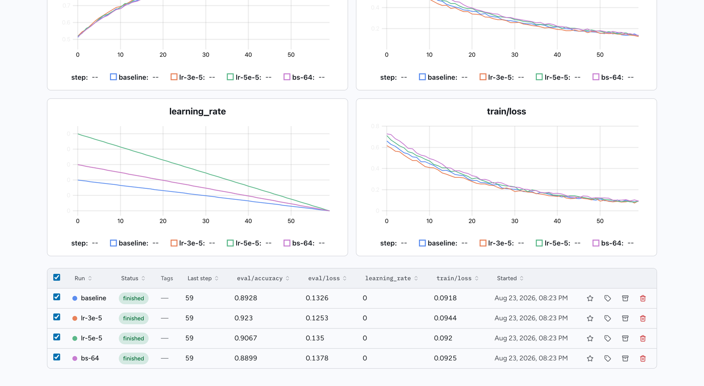
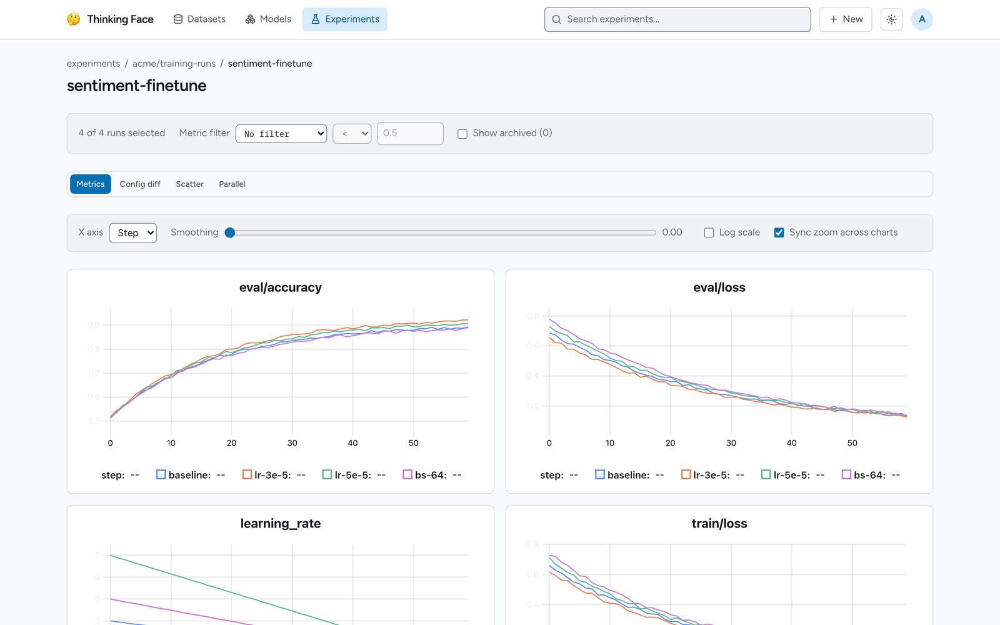

# 実験のトラッキング

thinkingface は、trackio や Weights & Biases、MLflow と同じように学習の run を記録します。
プロジェクト、run、ハイパーパラメータ、メトリクスの系列を保持し、Web UI 上でグラフにします。
このページでは、run がどうやって入ってくるのか、学習スクリプトに何を書くのか、そして UI から
何が得られるのかを説明します。

ホスト型のトラッカーとの重要な違いは、信頼しなければならない実験専用のデータベースが存在しない
ことです。すべての run は最終的に、ごく普通のデータセットリポジトリの中の Parquet ファイルに
なります。そのためデータは git でバージョン管理され、clone でき、thinkingface をまったく経由
せずに DuckDB や `gcloud storage` から読めます。

## データモデル { #the-data-model }

| 用語 | 内容 |
|---|---|
| 実験リポジトリ | 実験データが入る Parquet を保持するデータセットリポジトリ。慣例として `{you}/trackio-metrics`。 |
| プロジェクト | そのリポジトリの中の、ひとまとまりの作業単位。通常は 1 つのモデル、または 1 つのタスクに対応します。 |
| run | プロジェクト内の 1 回の学習の試行。名前・ステータス・config・メトリクスを持ちます。 |
| config | run のハイパーパラメータ。JSON オブジェクトで、run の開始時に一度だけ記録されます。 |
| メトリクス系列 | 1 つの run の 1 つのメトリクス名について記録された `(step, value)` の点の集まり。 |
| サマリー | 各メトリクスについて最後に観測された値。run 一覧と run ページに表示されます。 |

run のステータスは `running`、`finished`、`failed` のいずれかです。それ以外は保存されません。

データセットリポジトリは、次のいずれかに当てはまるとき実験リポジトリとして扱われます。

- `metrics.parquet` を含む（リポジトリのルート、または任意のディレクトリ内）
- README のリポジトリカードに `trackio` または `experiment` タグが付いている
- README のリポジトリカードで `thinkingface_experiment: true` が指定されている

該当したリポジトリには、リポジトリページに **Experiments** タブが追加され、トップナビゲーション
の **Experiments** セクションにも表示されるようになります。

## run を取り込む 2 つの方法 { #two-ways-to-get-runs-in }

どちらの経路も、書き込み先は同じ場所です。プロジェクトごとに選べばよく、インスタンス全体で
1 つに決める必要はありません。

| 観点 | バッチ同期（ルート A） | リアルタイム ingest（ルート B） |
|---|---|---|
| import するもの | `trackio` そのもの | `thinkingface.trackio` |
| コードの変更 | 不要 — `HF_ENDPOINT` を設定するだけ | import 行が 1 行 |
| データの届き方 | trackio 自身の Parquet 同期がデータセットリポジトリに push する | 点をサーバーへ POST し、バッファリングしてから同じ Parquet にフラッシュする |
| グラフの遅延 | trackio の同期間隔しだい | 数秒 |
| 正となるデータの置き場所 | データセットリポジトリ内の Parquet | データセットリポジトリ内の Parquet |

すでに trackio を使っていてスクリプトに手を入れたくない場合はルート A を、ジョブの実行中に
曲線を眺めたい場合はルート B を選んでください。

### ルート A — trackio の Parquet 同期 { #route-a-trackios-parquet-sync }

trackio の Hugging Face クライアントを自分のインスタンスに向けて、データセット同期をいつも
どおり動かします。

```bash
export HF_ENDPOINT=http://localhost:8080
export HF_TOKEN=tf_xxxxxxxxxxxx
export HF_HUB_DISABLE_XET=1
```

データセットリポジトリへの push はそのたびにインデックス処理を起動し、Parquet ファイルを走査
して run のインデックスを再構築します。認識されるレイアウトは次のとおりです。

```text
metrics.parquet              + aux/configs.parquet          -> リポジトリ名がそのままプロジェクト名になる
{project}/metrics.parquet    + {project}/aux/configs.parquet
{project}.parquet            + {project}_configs.parquet
```

`{project}_system.parquet` は、そのプロジェクトのマシンテレメトリとして取り込まれますが、それ
自体がプロジェクトを作ることはありません。メトリクスのファイルがないものはプロジェクトでは
ないからです。読み取り側は、run の列として `run_name` / `run` / `run_id`、step の列として
`step` / `_step` / `global_step`、タイムスタンプの列として `timestamp` / `_timestamp` /
`created_at` を探します。それ以外の列はすべてメトリクスとして扱われます。

### ルート B — `thinkingface.trackio` シム { #route-b-the-thinkingfacetrackio-shim }

`thinkingface` の Python パッケージには、trackio（ひいては wandb）と同じ `init` / `log` /
`finish` のインターフェースを持つシムが同梱されています。ローカルの SQLite にバッファリング
する代わりに、点をそのままサーバーへ POST します。

リポジトリのチェックアウトからインストールします。

```bash
pip install -e clients/python
```

設定は環境変数で行います。

| 変数 | 意味 |
|---|---|
| `THINKINGFACE_ENDPOINT` | サーバーのベース URL。デフォルトは `http://localhost:8080`。 |
| `THINKINGFACE_TOKEN` | アクセストークン（`tf_...`）。write スコープが必要です。 |
| `THINKINGFACE_REPO` | 書き込み先のデータセットリポジトリ（`namespace/name`）。デフォルトは `{your username}/trackio-metrics`。 |
| `THINKINGFACE_META` | `off` にすると、環境の自動スナップショットを行いません。 |
| `THINKINGFACE_SYSTEM_METRICS` | `off` にすると、GPU/CPU/メモリのテレメトリを行いません。 |

!!! warning

    書き込み先のデータセットリポジトリは、あらかじめ存在している必要があります。ingest が
    書き込むのは、あなたが書き込み権限を持つリポジトリであり、リポジトリを代わりに作っては
    くれません。`HfApi().create_repo("admin/trackio-metrics", repo_type="dataset", exist_ok=True)`
    か Web UI から、一度だけ作成してください。

## 学習ループからメトリクスを記録する { #log-metrics-from-a-training-loop }

そのまま動く完全なスクリプトは次のとおりです。

```python
import os

os.environ["THINKINGFACE_ENDPOINT"] = "http://localhost:8080"
os.environ["THINKINGFACE_TOKEN"] = "tf_xxxxxxxxxxxx"
os.environ["THINKINGFACE_REPO"] = "admin/trackio-metrics"

from thinkingface import trackio

run = trackio.init(
    project="sentiment-finetune",
    name="baseline",
    config={"lr": 3e-5, "batch_size": 32, "epochs": 3},
)

for step, batch in enumerate(loader):
    loss = train_step(batch)
    trackio.log({"train/loss": loss}, step=step)

    if step % 500 == 0:
        trackio.log({"eval/accuracy": evaluate(model)}, step=step)

trackio.finish()
```

`log()` は、メトリクス名から数値への dict と、任意の `step` を受け取ります。`step` を省略する
と、その run 自身のカウンタが 1 つ進みます。メトリクス名は制御文字を含まなければ何でもよく、
長さは 256 バイトまでです。グループ分けにスラッシュを使うのが慣例で（`train/loss`、
`eval/accuracy`）、そのまま問題なく使えます。

点はプロセス内でバッファリングされ、5 秒ごとまたは 100 点ごとの早いほうのタイミングで、そして
プロセスの終了時には必ずフラッシュされます。**ネットワーク障害が学習ループに例外として飛んで
くることはありません。** 警告として報告され、点は次の送信のために保持されます。唯一の例外は
後述の `resume="must"` で、これはサーバーに到達できなければ実現できません。

このシムが話しているサーバー側の ingest API にも独自の上限があります。特に大きい・種類の多いバッ
チを記録している場合に関係してきます。1 回の ingest リクエストが運べる点は最大 10,000 個、1 つの
run が生涯に持てる異なるメトリクス名は最大 1,000 個です（run がこれまでに記録したすべてのメトリク
ス名が保持されるため、これはバッチ単位ではなく生涯累計のカウントです）。上の通常の `log()` の使い
方では、どちらの上限にも近づくことはまずありません。

すでにスクリプトが `trackio` を import しているなら、リアルタイム経路への切り替えは 1 行です。

```python
import thinkingface.trackio as trackio  # `import trackio` の代わりに
```

### 中断した run を再開する { #resume-an-interrupted-run }

プリエンプティブル VM では、ジョブが強制終了されて再起動されるのは当たり前に起こります。
`resume=` は、渡した名前の run がプロジェクトにすでに存在する場合の挙動を決めます。

| `resume=` | 挙動 |
|---|---|
| `"never"`（デフォルト） | 既存の run に書き込むことは決してありません。名前が使われている場合は `-1` / `-2` のサフィックスが付いて警告が出るので、再起動したジョブは自分自身の曲線を記録します。 |
| `"allow"`（または `True`） | 既存の run があればそれを継続し、なければ新しく開始します。 |
| `"must"` | 既存の run を継続します。存在しない場合は `RuntimeError` を送出します。 |

```python
run = trackio.init(project="sentiment-finetune", name="baseline", resume="allow",
                   config={"lr": 3e-5})

for step in range(run.step, 100_000):
    trackio.log({"train/loss": train_step()}, step=step)
```

run を継続するとき、step のカウンタはサーバーが記録している `last_step + 1` から再開し（この値
は `run.step` として公開され、上のループもそこから始めています）、最初のフラッシュでステータス
は `running` に戻ります。2 つの config はマージされ、前回の試行だけが設定していたキーはそのまま
残り、値が衝突した場合は実行中のコード側が優先されます。その差分は予約済みの config キー
`_resume` に記録されるので、試行の間で変わった学習率なども見えるまま残ります。

再開に使ったチェックポイントが数ステップ前のものだった場合、そのステップでは再計算された値が、
グラフ上で死んだ試行の値を置き換えます。どちらの値も Parquet には残り、グラフは後から記録された
ほうを描画します。

### run をスイープにまとめる { #group-runs-into-a-sweep }

`group=` はその run が属するスイープの名前を、`job_type=` はその中での役割を指定します。名前の
付け方は wandb と同じです。

```python
trackio.init(project="sentiment-finetune", name=f"lr-{lr}", group="lr-sweep",
             job_type="train", config={"lr": lr})
```

同じグループの run は、run テーブル上で折りたためる 1 行にまとまり、平行座標ビューで軸ごとに
比較できます。グループを持たない run はそのままフラットに並びます。

`trackio.init()` は、これ以外のキーワード引数も受け取り、無視します。そのため wandb やアップスト
リームの trackio 向けに書かれた呼び出し（`tags=` など）が、このシムが対応していないというだけで
例外にはなりません — ただし無視した引数はそれぞれ、その名前を挙げた警告を出します。効くはずだと
思っていたオプションが黙って何もしない、ということが起きないようにするためです。

### run にアーティファクトを添付する { #attach-artifacts-to-a-run }

`trackio.log_artifact(path, name=None)` は、ファイル（あるいはディレクトリまるごと）を現在の
run に添付します。

```python
trackio.log_artifact("out/confusion_matrix.png")             # -> {project}/artifacts/{run}/confusion_matrix.png
trackio.log_artifact("out/eval.json", name="eval/raw.json")  # -> .../artifacts/{run}/eval/raw.json
trackio.log_artifact("out/samples/")                         # ディレクトリまるごと、構成はそのまま
```

専用のアーティファクトストアはありません。ファイルは `huggingface_hub` が使うのと同じアップ
ロード経路を通って、その run のデータセットリポジトリの `{project}/artifacts/{run}/` 以下に
コミットされます。したがって git でバージョン管理され、`git clone` で一緒に降りてきて、
リポジトリの `.gitattributes` に照らして十分大きくなれば自動的に LFS 経由になります。取り出し方
は [ファイルのダウンロード](downloading.md) を参照してください。

run の実行中は何もアップロードされません。すべては `finish()` の実行時にまとめてコミットされる
ので、20 枚のプロットを保存する run が作るコミットは 20 個ではなく 1 個です。存在しないパス、
`..` を含む名前、予約名 `metrics.parquet` は、例外ではなく警告になります。

この方法で添付するディレクトリには上限があり、そのどれかを超えると、その呼び出しのファイルは
**1 つも**アップロードされません。一部だけアップロードされる、ということはありません。

- **`log_artifact()` 1 回につきファイル 500 個まで。** これを超えると、その呼び出しは警告を出し
  てファイルを一切ステージしません — 一部だけアップロードするのではなく、全か無かの拒否です。
  必要なファイルは個別に記録するか、大きなチェックポイントディレクトリの添付にはモデルリポジトリ
  への push を使ってください。
- **ファイルを指す symlink は、通常のファイルと同様にたどられてアップロードされます。** ディレ
  クトリを指す symlink はたどられません。壊れた symlink はファイルにもディレクトリにもなりませ
  ん — どちらもスキップされ、対象を挙げた警告が出ます。
- **空のディレクトリはエラーになり、空のアップロードとして黙って成功することはありません** —
  ステージするものが何もないため、500 ファイル上限を超えた場合と同じ扱いで失敗します。

### run が生成したモデルを紐づける { #link-the-model-a-run-produced }

`trackio.log_model("ns/name", revision=None)` は、この run がそのモデルを作ったことを記録します。
`revision` を指定しない場合はモデルリポジトリの現在の HEAD が解決されます。push した直後で
あれば、これが望みどおりの挙動です。

```python
api.upload_folder(repo_id="acme/sentiment-base", folder_path="out/checkpoint")
trackio.log_model("acme/sentiment-base")
```

この紐づけは、config の値や README の編集ではなく run の注釈として保存されるため、プロジェクト
を再インデックスしても失われません。両側から見えます。run ページには **Models produced** の下
にモデルが並び、モデル側の系譜ビューからは run へのリンクが張られます。サーバー上に存在しない
モデルでも記録は行われ、破棄されるのではなく警告付きで表示されます。

### 環境の自動スナップショット { #automatic-environment-snapshot }

`trackio.init()` は、その run の実行環境のスナップショットをベストエフォートで収集し、予約キー
`_meta` の下で `config` にマージします。**これは `config` の他の値と同じように、あなたのサーバー
へ送信され、run とともに保存されます。**

- `_meta.git.commit` / `.branch` / `.dirty` — スクリプトが動いている git リポジトリの状態
- `_meta.cmdline` — `sys.argv`。秘密情報らしきフラグ（`--token`、`--password`、`--api-key`、
  `--secret`、`--auth`、`--credential` とその派生）の値は `***` に置き換えられます
- `_meta.python` / `_meta.platform` / `_meta.hostname`
- `_meta.gpu.name` / `.count` / `.cuda` — `torch` が入っていればそれ経由、なければ
  `nvidia-smi` から読み取ります
- `_meta.requirements_sha256` — インストール済みパッケージの名前とバージョンの組をソートした
  もののハッシュ。一覧全体を保存しなくても、2 つの run が「同じ環境かどうか」を比較できます

判定できなかったものは黙って落とされ、それが原因で `init()` が例外を送出することはありません。
run ページでは **Run environment** にこの内容が表示されます。収集そのものを止めるには
`THINKINGFACE_META=off` を設定します。`_meta` は予約済みの config キーなので、自分の値のために
使わないでください。

### システムメトリクス { #system-metrics }

実行中の run は、およそ 10 秒ごとに GPU・CPU・メモリの使用状況もサンプリングし、`system/`
プレフィックスの付いたキー（`system/gpu.0.util`、`system/cpu.percent` など）で記録します。
これらはグラフ領域の **System metrics** タブに分けて表示されるので、スクリプトが記録する
メトリクスを押しのけることはありません。

テレメトリはベストエフォートです。GPU も `psutil` もないマシンでは、単に何も記録されません。
無効にするには `THINKINGFACE_SYSTEM_METRICS=off` を設定します。

これが run の点の数・最終ステップにカウントされるかどうかは、どちらのルートで記録されたかに
よります（上の [run を取り込む 2 つの方法](#two-ways-to-get-runs-in) を参照）。

- **ルート A**（trackio が自分で Parquet を書き、サーバーがそれをインデックスする）では、シス
  テムテレメトリは `num_points`・`last_step`・run の開始時刻から完全に除外されます — 独自のウォー
  ルクロックタイマーでサンプリングされるため、これをカウントすると「この run はいくつの点を記録
  したのか」「今どのステップにいるのか」がマシンの稼働時間に左右されてしまうからです。
- **ルート B**（`thinkingface.trackio` シム）ではこの区別をしません。システムメトリクスのサンプル
  は、自分で記録した他のメトリクスとまったく同じバッファ・ingest リクエストを通るため、
  `num_points` には自分で記録したメトリクスと同じようにカウントされます（*現在の*ステップで記録
  され、ステップを進めないため、`last_step` を単独で動かすことはほとんどありません）。`system/`
  プレフィックスの各キーも、上で触れた「異なるメトリクス名 1,000 個まで」という上限に数えられます
  が、この集合は小さく固定されているため、それだけで上限に近づくことはありません。

### フレームワーク連携 { #framework-integrations }

`thinkingface.trackio.integrations` は、2 つの学習ループ向けに autolog フックを提供します。
自分で書いたわけではないコードに `trackio.log(...)` を撒いて回る必要はありません。土台となる
ライブラリはどちらもオプション依存で、両方とも未インストールでもモジュールの import は通り
ます。対応するライブラリが必要になるのは、クラスをインスタンス化するときだけです。

`transformers.Trainer` 向けの `ThinkingFaceCallback` は、`on_train_begin` で run を開始し、
`on_log` の呼び出しを `state.global_step` を使ってメトリクスとして転送し、`on_train_end` で
run を閉じ、`TrainingArguments` を `config["_args"]` に記録します。

```python
from thinkingface.trackio.integrations import ThinkingFaceCallback
from transformers import Trainer, TrainingArguments

trainer = Trainer(
    model=model,
    args=TrainingArguments(output_dir="out", report_to=[]),
    callbacks=[ThinkingFaceCallback(project="sentiment-finetune", config={"notes": "baseline"})],
)
trainer.train()
```

PyTorch Lightning 向けの `ThinkingFaceLightningLogger` は、Lightning の `Logger` インター
フェースを実装しています。run は最初の `log_hyperparams` / `log_metrics` の呼び出し時に遅延
生成されるため、学習開始前に渡されたハイパーパラメータは run の初期 config に取り込まれます。

```python
import lightning as pl
from thinkingface.trackio.integrations import ThinkingFaceLightningLogger

trainer = pl.Trainer(logger=ThinkingFaceLightningLogger(project="sentiment-finetune"))
trainer.fit(model)
```

extras は `pip install "thinkingface[transformers]"` または
`pip install "thinkingface[lightning]"` でインストールします。

## Web UI で run を見る { #explore-runs-in-the-web-ui }

トップナビゲーションの **Experiments** には、検索ボックスとプロジェクト数とともに、すべての
実験リポジトリが一覧表示されます。リポジトリを開くとプロジェクトの一覧が、プロジェクトを開くと
ダッシュボードが表示されます。



run テーブルには、各 run の名前、ステータス、タグ、最終ステップ、サマリーメトリクス（列として）、
開始した時刻、そして生成したチェックポイントが表示されます。列はソートでき、グループは 1 行に
折りたためます。メトリクスフィルタを使えば、しきい値に合致する run だけに絞り込めます（例:
`eval/accuracy > 0.9`）。ページを開いた時点では先頭 5 件の run が選択されており、下に並ぶビュー
が何を描画するかはこのチェックボックスで決まります。



テーブルの下には 4 つのビューがあります。

- **Metrics** — メトリクス名ごとに 1 つのグラフが並び、選択したすべての run が重ねて描画され
  ます。X 軸は step と実時間を切り替えられ、スムージングと対数スケールも使えます。ズームは
  すべてのグラフで同期できます。システムメトリクスは専用のタブに分かれます。
- **Config diff** — 選択した run のハイパーパラメータを並べた表。「差分のみ」の切り替えが
  あります。`_meta` と `_args` は、明示的に指定しない限り除外されます。
- **Scatter** — 任意の数値ハイパーパラメータまたはメトリクスを、別の任意のものに対して
  プロットします。
- **Parallel** — 選択した run の平行座標プロット。スイープを軸ごとに読むためのものです。
  文字列のハイパーパラメータは、軸上に等間隔で配置されます。

### run のページ { #the-run-page }

run をクリックすると専用のページが開き、上から順に、各メトリクスの最終値のサマリー、その run
のグラフ、アーティファクト、生成したモデル、自由記述の Markdown ノート、ハイパーパラメータ、
Trainer が記録していれば `TrainingArguments`、そして環境のスナップショットが並びます。

### run に注釈を付ける・整理する { #annotate-and-clean-up-runs }

以下の操作には、元になっているデータセットリポジトリへの書き込み権限が必要です。また、閲覧者
ごとの設定ではなく、共有される状態です。

- **Tags** — 自由に付けられるラベル。1 つの run につき 32 個までです。ダッシュボードはこれで
  絞り込めます。
- **Baseline** — 1 つの run を基準として印を付けます。グラフ上でもそのように表示されるので、
  複数の run を重ねても見分けられます。
- **Archive** — 何も削除せずに、テーブルから run を隠します。元に戻せますし、アーカイブした
  run はチェックボックスで再び表示できます。
- **Note** — その run が何のためのもので、何が分かったのかを Markdown で書き残せます。
- **Delete** — run と、そこに残っているすべてのメトリクスの点を削除します。取り消せません。

!!! warning

    run を削除しても、git の履歴が書き換わるわけではありません。Parquet のエクスポート由来の点
    を持つ run は、そのエクスポートが次にインデックスされたときに再び現れます。その経路では、
    エクスポートしたファイルこそが正だからです。それらを恒久的に消すには、リポジトリごと削除
    してください。

## データが実際に置かれている場所 { #where-the-data-actually-lives }

リアルタイム ingest API から来た点は、まずデータベースに入ります。グラフがライブで更新されるのは
このためです。ただしこのバッファは正のデータではありません。バックグラウンドのワーカーが 10 秒
ごとにポーリングし、`TF_EXP_FLUSH_INTERVAL`（デフォルトは 1 分）が経過したあとで、バッファを
データセットリポジトリの Parquet に書き出します。また、**run が `finished` または `failed` に
なったときは即座に**書き出します。

フラッシュの書き込み先は、ルート A と同じファイルです。そのプロジェクトについてすでに検出されて
いる `metrics.parquet`、まだなければ `{project}/metrics.parquet` になります。列は `run_name`、
`step`、`timestamp` と、メトリクスごとに 1 列です。コミットはサーバー側で行われ、`thinkingface`
の署名と `chore(trackio): flush {project} metrics` というメッセージが付くので、`git log` を見れ
ば誰かが手で打ったコミットでないことがすぐ分かります。`*.parquet` はデフォルトで LFS の追跡対象
なので、実データはオブジェクトストレージに送られ、コミットされるのは LFS ポインタです。

したがって、新しく作った実験リポジトリが Experiments の一覧に現れるのは、最初のフラッシュが
届いたときです。実行中の run なら 1 分以内、README のリポジトリカードに `trackio` タグを付けて
おけばすぐに表示されます。

実際上の意味はこうです。実験データは `git clone` で一緒に降りてきますし、リポジトリページが生成
する `gcloud storage cp` スクリプトを使えばバケットから直接読めますし、サーバーを介さずに DuckDB
でクエリすることもできます。どちらの経路についても [ファイルのダウンロード](downloading.md) を
参照してください。

グラフがそのファイルをどう読むかについて、知っておくとよい点が 2 つあります。

- フラッシュ中は、同じ点が git とデータベースの両方に一時的に存在します。内部の `_ingest_id`
  列で重複が除かれるため、いつ見てもグラフの点が二重になったり欠けたりすることはありません。
- 同じステップに記録された、本当に異なる 2 つの値（再開によるもの、または同じステップを 2 回
  記録したもの）は、どちらも Parquet に残ります。グラフは後から記録されたほうを描画します。

フラッシュは対象の `metrics.parquet` をメモリ上でまるごと再構築します(既存ファイルに行グループ
を追加する手段は今のところありません)。そのため、そのファイルがどこまで大きくなってもフラッシュ
可能かに上限があります: 既存の行数で 100 万行です。これはそのプロジェクトの `metrics.parquet` に
書き込むすべての run で共有される、プロジェクト単位の上限であって run 単位ではありません。単独の
学習 run がこれに到達することは現実的にはまずなく、非常に長い run 履歴が積み上がったプロジェクト
で問題になるという性質のものです。

この上限を超えても、**データは失われません。** そのプロジェクトのまだフラッシュされていない点は
データベース上にバッファされたままになり(ライブグラフもそこから読み続けるので、UI から何かが消
えることもありません)、切り詰められたファイルを書いたり書き込めなかった点を破棄したりする代わり
に、およそ 1 時間ごとに自動でフラッシュが再試行されます。この再試行は、根本の状況が変わるまで
——最もありそうなのは、この上限に寄与した run の一部を削除してファイルを上限未満に縮めることです
——失敗し続けるので、これは放っておけば直るものではなく、オペレータが気づいて対処すべきものです。
今のところ、それはサーバーログでプロジェクト名付きのエラー
`experiment project cannot be flushed; its buffered points are being kept` を監視することを意味
します。専用の CLI や UI はまだありません。

## 関連ページ { #related-pages }

- [ファイルのアップロード](uploading.md) — run が置かれるデータセットリポジトリへの push
- [ファイルのダウンロード](downloading.md) — Parquet の取り出しと、バケットからの読み取り
- [データセットの閲覧](dataset-viewer.md) — その Parquet をブラウザ上でテーブルとして見る
- [認証](../reference/authentication.md) — ingest に必要な write スコープのトークンの発行
- [Organization](organizations.md) — 実験リポジトリをチームで共有する
