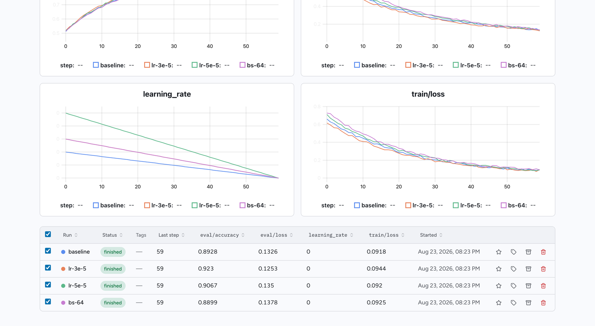
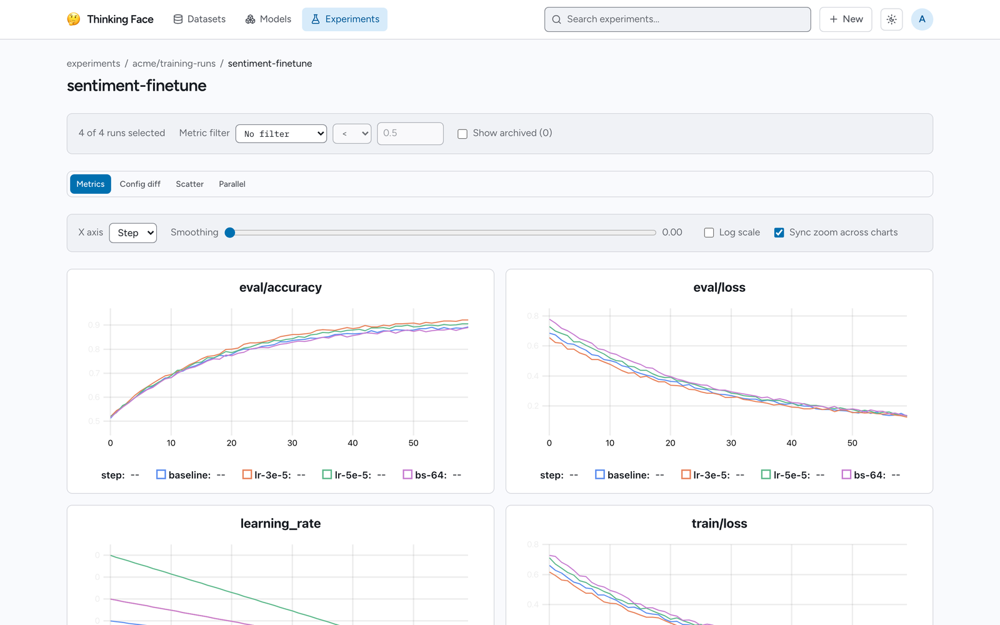

# 実験のトラッキング

thinkingface は、trackio や Weights & Biases、MLflow と同じように学習の run を記録します。
プロジェクト、run、ハイパーパラメータ、メトリクスの系列を保持し、Web UI 上でグラフにします。
このページでは、run がどうやって入ってくるのか、学習スクリプトに何を書くのか、そして UI から
何が得られるのかを説明します。

ホスト型のトラッカーとの重要な違いは、信頼しなければならない実験専用のデータベースが存在しない
ことです。すべての run は最終的に、ごく普通のデータセットリポジトリの中の Parquet ファイルに
なります。そのためデータは git でバージョン管理され、clone でき、thinkingface をまったく経由
せずに DuckDB や `gcloud storage` から読めます。

## データモデル { #the-data-model }

| 用語 | 内容 |
|---|---|
| 実験リポジトリ | 実験データが入る Parquet を保持するデータセットリポジトリ。慣例として `{you}/trackio-metrics`。 |
| プロジェクト | そのリポジトリの中の、ひとまとまりの作業単位。通常は 1 つのモデル、または 1 つのタスクに対応します。 |
| run | プロジェクト内の 1 回の学習の試行。名前・ステータス・config・メトリクスを持ちます。 |
| config | run のハイパーパラメータ。JSON オブジェクトで、run の開始時に一度だけ記録されます。 |
| メトリクス系列 | 1 つの run の 1 つのメトリクス名について記録された `(step, value)` の点の集まり。 |
| サマリー | 各メトリクスについて最後に観測された値と、run の間にそのメトリクスが取った最小値・最大値。run 一覧と run ページに表示されます。 |
| メトリクスのゴール | プロジェクトごとの設定で、あるメトリクスについて低いほうが良いのか高いほうが良いのかを表します。「ベストな run」のマーカーと `best:` によるソートの基準になります。 |
| ノート | プロジェクトごとの Markdown のノートブック。リポジトリに `{project}/NOTES.md` としてコミットされます。 |

保存される run のステータスは `running`、`finished`、`failed` のいずれかです。4 つ目のステータス
`stale` は、run を読み出すときに導出されます。`running` として記録されたままの run が、その
staleness ウィンドウ（[クラッシュした run を検出する](#detect-crashed-runs) を参照）より長く音沙汰
がない場合は `stale` として報告され、再び記録を始めればすぐに `running` に戻ります。

データセットリポジトリは、次のいずれかに当てはまるとき実験リポジトリとして扱われます。

- `metrics.parquet` を含む（リポジトリのルート、または任意のディレクトリ内）
- README のリポジトリカードに `trackio` または `experiment` タグが付いている
- README のリポジトリカードで `thinkingface_experiment: true` が指定されている

該当したリポジトリには、リポジトリページに **Experiments** タブが追加され、トップナビゲーション
の **Experiments** セクションにも表示されるようになります。

## run を取り込む 2 つの方法 { #two-ways-to-get-runs-in }

どちらの経路も、書き込み先は同じ場所です。プロジェクトごとに選べばよく、インスタンス全体で
1 つに決める必要はありません。

| 観点 | バッチ同期（ルート A） | リアルタイム ingest（ルート B） |
|---|---|---|
| import するもの | `trackio` そのもの | `thinkingface.trackio` |
| コードの変更 | 不要 — `HF_ENDPOINT` を設定するだけ | import 行が 1 行 |
| データの届き方 | trackio 自身の Parquet 同期がデータセットリポジトリに push する | 点をサーバーへ POST し、バッファリングしてから同じ Parquet にフラッシュする |
| グラフの遅延 | trackio の同期間隔しだい | 数秒 |
| 正となるデータの置き場所 | データセットリポジトリ内の Parquet | データセットリポジトリ内の Parquet |

すでに trackio を使っていてスクリプトに手を入れたくない場合はルート A を、ジョブの実行中に
曲線を眺めたい場合はルート B を選んでください。

### ルート A — trackio の Parquet 同期 { #route-a-trackios-parquet-sync }

trackio の Hugging Face クライアントを自分のインスタンスに向けて、データセット同期をいつも
どおり動かします。

```bash
export HF_ENDPOINT=http://localhost:8080
export HF_TOKEN=tf_xxxxxxxxxxxx
export HF_HUB_DISABLE_XET=1
```

データセットリポジトリへの push はそのたびにインデックス処理を起動し、Parquet ファイルを走査
して run のインデックスを再構築します。認識されるレイアウトは次のとおりです。

```text
metrics.parquet              + aux/configs.parquet          -> リポジトリ名がそのままプロジェクト名になる
{project}/metrics.parquet    + {project}/aux/configs.parquet
{project}.parquet            + {project}_configs.parquet
```

`{project}_system.parquet` は、そのプロジェクトのマシンテレメトリとして取り込まれますが、それ
自体がプロジェクトを作ることはありません。メトリクスのファイルがないものはプロジェクトでは
ないからです。読み取り側は、run の列として `run_name` / `run` / `run_id`、step の列として
`step` / `_step` / `global_step`、タイムスタンプの列として `timestamp` / `_timestamp` /
`created_at` を探します。それ以外の列はすべてメトリクスとして扱われます。

### ルート B — `thinkingface.trackio` シム { #route-b-the-thinkingfacetrackio-shim }

`thinkingface` の Python パッケージには、trackio（ひいては wandb）と同じ `init` / `log` /
`finish` のインターフェースを持つシムが同梱されています。ローカルの SQLite にバッファリング
する代わりに、点をそのままサーバーへ POST します。

リポジトリのチェックアウトからインストールします。

```bash
pip install -e clients/python
```

設定は環境変数で行います。

| 変数 | 意味 |
|---|---|
| `THINKINGFACE_ENDPOINT` | サーバーのベース URL。デフォルトは `http://localhost:8080`。 |
| `THINKINGFACE_TOKEN` | アクセストークン（`tf_...`）。write スコープが必要です。 |
| `THINKINGFACE_REPO` | 書き込み先のデータセットリポジトリ（`namespace/name`）。デフォルトは `{your username}/trackio-metrics`。 |
| `THINKINGFACE_META` | `off` にすると、環境の自動スナップショットを行いません。 |
| `THINKINGFACE_SYSTEM_METRICS` | `off` にすると、GPU/CPU/メモリのテレメトリを行いません。 |
| `THINKINGFACE_MODE` | `online`（デフォルト）または `offline`。`offline` では run をネットワークではなくディスクに書き出します。[オフラインの run と `tf experiments sync`](#offline-runs-and-tf-experiments-sync) を参照してください。 |
| `THINKINGFACE_OFFLINE_DIR` | オフラインの run と、オンラインモードで届けられなかった点の書き出し先。デフォルトは `./thinkingface-offline`。 |
| `THINKINGFACE_HEARTBEAT_SECS` | run が生存を知らせると約束する間隔（秒）。デフォルトは `30`、最大 `3600` で、`0` にするとハートビートを無効にします。[クラッシュした run を検出する](#detect-crashed-runs) を参照してください。 |
| `THINKINGFACE_ARTIFACT_INTERVAL` | ステージされたアーティファクト・画像・テーブルをバックグラウンドでコミットする間隔（秒）。デフォルトは `60` で、`0` にすると `save()` / `finish()` まで保持します。 |

!!! warning

    書き込み先のデータセットリポジトリは、あらかじめ存在している必要があります。ingest が
    書き込むのは、あなたが書き込み権限を持つリポジトリであり、リポジトリを代わりに作っては
    くれません。`HfApi().create_repo("admin/trackio-metrics", repo_type="dataset", exist_ok=True)`
    か Web UI から、一度だけ作成してください。

## 学習ループからメトリクスを記録する { #log-metrics-from-a-training-loop }

そのまま動く完全なスクリプトは次のとおりです。

```python
import os

os.environ["THINKINGFACE_ENDPOINT"] = "http://localhost:8080"
os.environ["THINKINGFACE_TOKEN"] = "tf_xxxxxxxxxxxx"
os.environ["THINKINGFACE_REPO"] = "admin/trackio-metrics"

from thinkingface import trackio

run = trackio.init(
    project="sentiment-finetune",
    name="baseline",
    config={"lr": 3e-5, "batch_size": 32, "epochs": 3},
)

for step, batch in enumerate(loader):
    loss = train_step(batch)
    trackio.log({"train/loss": loss}, step=step)

    if step % 500 == 0:
        trackio.log({"eval/accuracy": evaluate(model)}, step=step)

trackio.finish()
```

`log()` は、メトリクス名から数値への dict と、任意の `step` を受け取ります。`step` を省略する
と、その run 自身のカウンタが 1 つ進みます。メトリクス名は制御文字を含まなければ何でもよく、
長さは 256 バイトまでです。グループ分けにスラッシュを使うのが慣例で（`train/loss`、
`eval/accuracy`）、そのまま問題なく使えます。

点はプロセス内でバッファリングされ、5 秒ごとまたは 100 点ごとの早いほうのタイミングで、そして
プロセスの終了時には必ずフラッシュされます。**ネットワーク障害が学習ループに例外として飛んで
くることはありません。** 警告として報告され、点は次の送信のために保持されます。唯一の例外は
後述の `resume="must"` で、これはサーバーに到達できなければ実現できません。

このシムが話しているサーバー側の ingest API にも独自の上限があります。特に大きい・種類の多いバッ
チを記録している場合に関係してきます。1 回の ingest リクエストが運べる点は最大 10,000 個、1 つの
run が生涯に持てる異なるメトリクス名は最大 1,000 個です（run がこれまでに記録したすべてのメトリク
ス名が保持されるため、これはバッチ単位ではなく生涯累計のカウントです）。上の通常の `log()` の使い
方では、どちらの上限にも近づくことはまずありません。

すでにスクリプトが `trackio` を import しているなら、リアルタイム経路への切り替えは 1 行です。

```python
import thinkingface.trackio as trackio  # `import trackio` の代わりに
```

### `config` に渡せるもの { #what-config-accepts }

`config` には dict、`argparse.Namespace`、dataclass のインスタンスのいずれでも渡せるので、
`trackio.init(project="mnist", config=parser.parse_args())` はそのまま動きます。JSON に表現の
ない値は、config 全体を失う原因になる代わりに、送信時に変換されます。

| 値 | 保存される形 |
|---|---|
| `pathlib.Path` | その文字列 |
| `enum.Enum` | その `.value`（値自体をエンコードできない場合は名前） |
| dataclass / `argparse.Namespace` | フィールドを持つ入れ子のオブジェクト |
| numpy のスカラー / 配列 | 数値 / リスト（要素数が 1,000 を超える配列は、短い `ndarray(shape=..., dtype=...)` という文字列になります） |
| `datetime` / `date` | ISO 8601 |
| `set` / `tuple` | リスト |
| 文字列でない dict のキー | その `str()` |
| `NaN` / `inf` / `-inf` | 文字列 `"nan"` / `"inf"` / `"-inf"` |
| それ以外 | `str(value)`。run ごとに 1 回、該当するキーを挙げた警告が出ます |

`run.config` 自体には元のオブジェクトがそのまま残り、変換されるのは送信される内容だけです。
この変換のためにクライアントが numpy を import することはありません。

一方、*メトリクス*の値は数値でなければなりません。値が `NaN` や `±inf` のメトリクスはその点から
取り除かれ（run ごとに 1 回警告が出ます）、点の残りはいつもどおり送信されます。そのため発散した
loss は、run の記録を止めてしまうのではなく、グラフ上の途切れとして現れます。

### クラッシュした run を検出する { #detect-crashed-runs }

OOM killer に殺された学習ジョブや、ホストごと失われたジョブは `finish()` を呼ぶ機会がないので、
何の手当てもなければその run は一覧に `running` のまま永遠に居座ります。そこでシムはハートビート
を宣言します。各バッチで、その run からの便りをどのくらいの間隔で期待すればよいかをサーバーに伝え
（`THINKINGFACE_HEARTBEAT_SECS`、デフォルトは 30 秒）、その時間何も送っていない run — 時間のかかる
評価や、長いチェックポイントの書き込みの最中など — は、生存確認のためだけの空のバッチを送ります。

サーバーは、`running` の run が **ハートビート 4 回分か 2 分のどちらか長いほう** 沈黙した時点で、
それを `stale` として報告します。デフォルトのハートビートでは、クラッシュした run は最後の便りから
約 2 分で `stale` になります。単に静かなだけの run は ping を送り続けるので、`stale` になることは
ありません。ハートビートなしで記録された run（古いクライアントや、ルート A で入ってくる run）には、
30 分のウィンドウが適用されます。

ping はシムのバックグラウンドのフラッシュスレッドから送られるので、学習ステップが長いというだけで
run が stale になることはありません。`stale` も保存はされず、再び記録を始めた run は再び `running`
になります。宣言と ping の両方を無効にするには `THINKINGFACE_HEARTBEAT_SECS=0` を設定します。

### 中断した run を再開する { #resume-an-interrupted-run }

プリエンプティブル VM では、ジョブが強制終了されて再起動されるのは当たり前に起こります。
`resume=` は、渡した名前の run がプロジェクトにすでに存在する場合の挙動を決めます。

| `resume=` | 挙動 |
|---|---|
| `"never"`（デフォルト） | 既存の run に書き込むことは決してありません。名前が使われている場合は `-1` / `-2` のサフィックスが付いて警告が出るので、再起動したジョブは自分自身の曲線を記録します。 |
| `"allow"`（または `True`） | 既存の run があればそれを継続し、なければ新しく開始します。 |
| `"must"` | 既存の run を継続します。存在しない場合は `RuntimeError` を送出します。 |

```python
run = trackio.init(project="sentiment-finetune", name="baseline", resume="allow",
                   config={"lr": 3e-5})

for step in range(run.step, 100_000):
    trackio.log({"train/loss": train_step()}, step=step)
```

run を継続するとき、step のカウンタはサーバーが記録している `last_step + 1` から再開し（この値
は `run.step` として公開され、上のループもそこから始めています）、最初のフラッシュでステータス
は `running` に戻ります。2 つの config はマージされ、前回の試行だけが設定していたキーはそのまま
残り、値が衝突した場合は実行中のコード側が優先されます。その差分は予約済みの config キー
`_resume` に記録されるので、試行の間で変わった学習率なども見えるまま残ります。

再開に使ったチェックポイントが数ステップ前のものだった場合、そのステップでは再計算された値が、
グラフ上で死んだ試行の値を置き換えます。どちらの値も Parquet には残り、グラフは後から記録された
ほうを描画します。

### run をスイープにまとめる { #group-runs-into-a-sweep }

`group=` はその run が属するスイープの名前を、`job_type=` はその中での役割を指定します。名前の
付け方は wandb と同じです。

```python
trackio.init(project="sentiment-finetune", name=f"lr-{lr}", group="lr-sweep",
             job_type="train", config={"lr": lr})
```

同じグループの run は、run テーブル上で折りたためる 1 行にまとまり、平行座標ビューで軸ごとに
比較できます。グループを持たない run はそのままフラットに並びます。

`trackio.init()` は、これ以外のキーワード引数も受け取り、無視します。そのため wandb やアップスト
リームの trackio 向けに書かれた呼び出し（`tags=` など）が、このシムが対応していないというだけで
例外にはなりません — ただし無視した引数はそれぞれ、その名前を挙げた警告を出します。効くはずだと
思っていたオプションが黙って何もしない、ということが起きないようにするためです。

### run にアーティファクトを添付する { #attach-artifacts-to-a-run }

`trackio.log_artifact(path, name=None)` は、ファイル（あるいはディレクトリまるごと）を現在の
run に添付します。

```python
trackio.log_artifact("out/confusion_matrix.png")             # -> {project}/artifacts/{run}/confusion_matrix.png
trackio.log_artifact("out/eval.json", name="eval/raw.json")  # -> .../artifacts/{run}/eval/raw.json
trackio.log_artifact("out/samples/")                         # ディレクトリまるごと、構成はそのまま
```

専用のアーティファクトストアはありません。ファイルは `huggingface_hub` が使うのと同じアップ
ロード経路を通って、その run のデータセットリポジトリの `{project}/artifacts/{run}/` 以下に
コミットされます。したがって git でバージョン管理され、`git clone` で一緒に降りてきて、
リポジトリの `.gitattributes` に照らして十分大きくなれば自動的に LFS 経由になります。取り出し方
は [ファイルのダウンロード](downloading.md) を参照してください。

アーティファクトは、run の実行中にまとめてコミットされます。保留中のものがあれば、ステージされた
すべてが `THINKINGFACE_ARTIFACT_INTERVAL` 秒（デフォルトは 60）ごとにバックグラウンドでまとめて
コミットされ、`trackio.save()` はその場でコミットし、`finish()` が残りをコミットします。したがって、
1 分に 20 枚のプロットを保存する run が作るコミットは 1 分に 1 個で、クラッシュした run でも、落ちる
前にコミットされたアーティファクトはすべて残ります。存在しないパス、`..` を含む名前、予約名
`metrics.parquet` は、例外ではなく警告になります。

この方法で添付するディレクトリには上限があり、そのどれかを超えると、その呼び出しのファイルは
**1 つも**アップロードされません。一部だけアップロードされる、ということはありません。

- **`log_artifact()` 1 回につきファイル 500 個まで。** これを超えると、その呼び出しは警告を出し
  てファイルを一切ステージしません — 一部だけアップロードするのではなく、全か無かの拒否です。
  必要なファイルは個別に記録するか、大きなチェックポイントディレクトリの添付にはモデルリポジトリ
  への push を使ってください。
- **ファイルを指す symlink は、通常のファイルと同様にたどられてアップロードされます。** ディレ
  クトリを指す symlink はたどられません。壊れた symlink はファイルにもディレクトリにもなりませ
  ん — どちらもスキップされ、対象を挙げた警告が出ます。
- **空のディレクトリはエラーになり、空のアップロードとして黙って成功することはありません** —
  ステージするものが何もないため、500 ファイル上限を超えた場合と同じ扱いで失敗します。

### 画像とテーブルを記録する { #log-images-and-tables }

`trackio.Image` と `trackio.Table` は、ほかのメトリクスの値と同じように記録できます — 生成した
サンプル、混同行列、あるチェックポイント時点での予測のテーブルなどです。これらはメトリクスでは
ありません。それぞれファイルに書き出され、キーとステップにちなんだ名前で run のアーティファクト
としてコミットされ、点そのものはそのキーの値を持ちません。

```python
trackio.log({"samples": trackio.Image("out/grid.png"), "train/loss": 0.4}, step=100)
# -> {project}/artifacts/{run}/media/samples/step_00000100.png

trackio.log({"preds": trackio.Table(columns=["text", "label"], data=rows)}, step=100)
# -> {project}/artifacts/{run}/tables/preds/step_00000100.parquet

trackio.save()  # 任意: 次の間隔を待たずに、ステージ済みのものを今コミットする
```

- `Image(value, caption=None)` は、画像ファイルへのパス、PIL の画像、または HxW / HxWxC の numpy
  配列（uint8、または `[0, 1]` の範囲の浮動小数点数）を受け取ります。PNG ファイルはそのままコミット
  され、それ以外は Pillow でエンコードされます。Pillow はオプションで、入っていなければ配列と PIL
  の画像は警告を 1 回出してスキップされ、PNG 以外のファイルは元の形式のままコミットされます。
- `Table(dataframe=None, columns=None, data=None)` は、pandas の DataFrame、`pyarrow.Table`、
  または行（`columns` に対応するリスト、または dict）を受け取ります。pyarrow（または pandas）で
  Parquet として書き出され、どちらも入っていなければテーブルは警告とともにスキップされます。

どちらも `log_artifact()` と同じ、まとめて行われるバックグラウンドのコミットを通るので、1 分ほどで
run ページの **Artifacts** の下に現れます。記録したテーブルはリポジトリ内のごく普通の Parquet
ファイルです。アーティファクト一覧やファイルツリーから開けば [データセットビューア](dataset-viewer.md)
がテーブルとして表示し、SQL コンソールでクエリすることもできます。

### run が生成したモデルを紐づける { #link-the-model-a-run-produced }

`trackio.log_model("ns/name", revision=None)` は、この run がそのモデルを作ったことを記録します。
`revision` を指定しない場合はモデルリポジトリの現在の HEAD が解決されます。push した直後で
あれば、これが望みどおりの挙動です。

```python
api.upload_folder(repo_id="acme/sentiment-base", folder_path="out/checkpoint")
trackio.log_model("acme/sentiment-base")
```

この紐づけは、config の値や README の編集ではなく run の注釈として保存されるため、プロジェクト
を再インデックスしても失われません。両側から見えます。run ページには **Models produced** の下
にモデルが並び、モデル側の系譜ビューからは run へのリンクが張られます。サーバー上に存在しない
モデルでも記録は行われ、破棄されるのではなく警告付きで表示されます。

### 環境の自動スナップショット { #automatic-environment-snapshot }

`trackio.init()` は、その run の実行環境のスナップショットをベストエフォートで収集し、予約キー
`_meta` の下で `config` にマージします。**これは `config` の他の値と同じように、あなたのサーバー
へ送信され、run とともに保存されます。**

- `_meta.git.commit` / `.branch` / `.dirty` — スクリプトが動いている git リポジトリの状態
- `_meta.cmdline` — `sys.argv`。秘密情報らしきフラグ（`--token`、`--password`、`--api-key`、
  `--secret`、`--auth`、`--credential` とその派生）の値は `***` に置き換えられます
- `_meta.python` / `_meta.platform` / `_meta.hostname`
- `_meta.gpu.name` / `.count` / `.cuda` — `torch` が入っていればそれ経由、なければ
  `nvidia-smi` から読み取ります
- `_meta.requirements_sha256` — インストール済みパッケージの名前とバージョンの組をソートした
  もののハッシュ。一覧全体を保存しなくても、2 つの run が「同じ環境かどうか」を比較できます

判定できなかったものは黙って落とされ、それが原因で `init()` が例外を送出することはありません。
run ページでは **Run environment** にこの内容が表示されます。収集そのものを止めるには
`THINKINGFACE_META=off` を設定します。`_meta` は予約済みの config キーなので、自分の値のために
使わないでください。

### システムメトリクス { #system-metrics }

実行中の run は、およそ 10 秒ごとに GPU・CPU・メモリの使用状況もサンプリングし、`system/`
プレフィックスの付いたキー（`system/gpu.0.util`、`system/cpu.percent` など）で記録します。
これらはグラフ領域の **System metrics** タブに分けて表示されるので、スクリプトが記録する
メトリクスを押しのけることはありません。

テレメトリはベストエフォートです。GPU も `psutil` もないマシンでは、単に何も記録されません。
無効にするには `THINKINGFACE_SYSTEM_METRICS=off` を設定します。

これが run の点の数・最終ステップにカウントされるかどうかは、どちらのルートで記録されたかに
よります（上の [run を取り込む 2 つの方法](#two-ways-to-get-runs-in) を参照）。

- **ルート A**（trackio が自分で Parquet を書き、サーバーがそれをインデックスする）では、シス
  テムテレメトリは `num_points`・`last_step`・run の開始時刻から完全に除外されます — 独自のウォー
  ルクロックタイマーでサンプリングされるため、これをカウントすると「この run はいくつの点を記録
  したのか」「今どのステップにいるのか」がマシンの稼働時間に左右されてしまうからです。
- **ルート B**（`thinkingface.trackio` シム）ではこの区別をしません。システムメトリクスのサンプル
  は、自分で記録した他のメトリクスとまったく同じバッファ・ingest リクエストを通るため、
  `num_points` には自分で記録したメトリクスと同じようにカウントされます（*現在の*ステップで記録
  され、ステップを進めないため、`last_step` を単独で動かすことはほとんどありません）。`system/`
  プレフィックスの各キーも、上で触れた「異なるメトリクス名 1,000 個まで」という上限に数えられます
  が、この集合は小さく固定されているため、それだけで上限に近づくことはありません。

### フレームワーク連携 { #framework-integrations }

`thinkingface.trackio.integrations` は、2 つの学習ループ向けに autolog フックを提供します。
自分で書いたわけではないコードに `trackio.log(...)` を撒いて回る必要はありません。土台となる
ライブラリはどちらもオプション依存で、両方とも未インストールでもモジュールの import は通り
ます。対応するライブラリが必要になるのは、クラスをインスタンス化するときだけです。

`transformers.Trainer` 向けの `ThinkingFaceCallback` は、`on_train_begin` で run を開始し、
`on_log` の呼び出しを `state.global_step` を使ってメトリクスとして転送し、`on_train_end` で
run を閉じ、`TrainingArguments` を `config["_args"]` に記録します。

```python
from thinkingface.trackio.integrations import ThinkingFaceCallback
from transformers import Trainer, TrainingArguments

trainer = Trainer(
    model=model,
    args=TrainingArguments(output_dir="out", report_to=[]),
    callbacks=[ThinkingFaceCallback(project="sentiment-finetune", config={"notes": "baseline"})],
)
trainer.train()
```

PyTorch Lightning 向けの `ThinkingFaceLightningLogger` は、Lightning の `Logger` インター
フェースを実装しています。run は最初の `log_hyperparams` / `log_metrics` の呼び出し時に遅延
生成されるため、学習開始前に渡されたハイパーパラメータは run の初期 config に取り込まれます。

```python
import lightning as pl
from thinkingface.trackio.integrations import ThinkingFaceLightningLogger

trainer = pl.Trainer(logger=ThinkingFaceLightningLogger(project="sentiment-finetune"))
trainer.fit(model)
```

extras は `pip install "thinkingface[transformers]"` または
`pip install "thinkingface[lightning]"` でインストールします。

## オフラインの run と `tf experiments sync` { #offline-runs-and-tf-experiments-sync }

学習中にサーバーへ到達できないマシンもあります。NAT の内側にある vast.ai や RunPod のレンタル
GPU マシン、オフィスのネットワークへの経路がないクラスタのノード、機内のラップトップなどです。
シムはそうした場所で run をディスクに記録し、あとからそのマシン、あるいは別のどこかから `tf`
CLI でアップロードさせることができます。

`THINKINGFACE_MODE=offline` を設定する（または `trackio.init()` に `mode="offline"` を渡す）と、
シムはネットワークリクエストを一切行わず — ユーザー名の問い合わせすら行いません — 代わりに run
をディレクトリに書き出します。

```text
thinkingface-offline/20260927T101500-mnist-baseline-1a2b3c4d/
    run.jsonl         # init / log / artifact / model / finish のレコード、1 行に 1 つ
    artifacts/        # log_artifact のファイル、画像、テーブルのコピー
    sync-state.json   # tf experiments sync が書き込む。シムが書くことはない
```

それ以外はオンラインのときと同じように動きます。点（システムメトリクスを含む）は 5 秒ごとまたは
100 点ごとに書き出され、`log_artifact()` はファイルをその場でコピーし、`log_model()` は渡した
revision を記録し、`finish()` は最終ステータスを記録します。ディレクトリと、それをアップロードする
コマンドは、run の開始時に stderr に表示されます。親ディレクトリは `THINKINGFACE_OFFLINE_DIR`
（デフォルトは `./thinkingface-offline`）です。

アップロードには `tf experiments sync` を使います。

```bash
tf experiments sync                                  # ./thinkingface-offline 以下のすべての run
tf experiments sync thinkingface-offline/20260927T101500-mnist-baseline-1a2b3c4d  # 1 つの run だけ
tf experiments sync --watch                          # まだ書き込み中の run を追いかけ続ける
```

- **リポジトリ** は、run の開始時に `THINKINGFACE_REPO` が設定されていればそれ、そうでなければ
  sync を実行した人の `{you}/trackio-metrics` です。存在しなければ作成されます。
- **run 名** は、最初の sync のときに、オンラインと同じ `resume=` のルールで決まります。デフォルト
  の `resume="never"` では、サーバー上ですでに使われている名前は `name-1`、`name-2` のようになり
  ます。
- **進捗は保存されます。** 各 run ディレクトリの `sync-state.json` に残るので、sync は中断して
  再実行できます。最後に届けたバッチの続きから再開します。`finish()` がまだ記録されていない run は、その
  時点の末尾まで sync されて開いたまま残ります。終了した run は、アーティファクトがコミットされ、
  ステータスが設定され、生成したモデルが記録され、以後はスキップされます。
- `--watch` は、Ctrl-C を押すまで `--interval`（デフォルトは `60s`）ごとにこの処理を繰り返し、
  新しい run ディレクトリと新しい行を拾います。そのため、ディレクトリが見えるマシンならどこからでも、
  オフラインの run の曲線をライブで眺められます。

ディレクトリは自己完結しているので、**書き出したマシンから sync する必要はありません**。SSH
トンネル経由でサーバーに到達できる GPU マシンなら、その場で sync を実行します。まったく到達でき
ないマシンなら、ディレクトリを — `rsync`、`scp`、バケットなどで — 外にコピーし、到達できるマシン
から sync します。

```bash
# 手元のワークステーションで、tf はサーバーにログイン済み
rsync -a gpu-box:work/thinkingface-offline/ ./thinkingface-offline/
tf experiments sync ./thinkingface-offline
```

`sync-state.json` がディレクトリと一緒に移動するので、あとで再コピーして再度 sync しても、送られる
のは新しい分だけです。配送はリクエスト単位で at-least-once です。バッチを送ってからそれを記録する
までの間に sync が kill されると、そのバッチは再送されますが、グラフが描画するのは 1 回だけです
（2 回記録されたステップは、後の値が表示されます）。

**オンラインモードも、同じディレクトリをセーフティネットとして使います。** 本来なら捨てるしか
なかった点 — 長い障害の間にメモリ上の再試行バッファがあふれたときの最も古い点と、`finish()` が
再試行を使い果たした時点でまだ送れていないもの — は、代わりに `THINKINGFACE_OFFLINE_DIR` 以下の
run ディレクトリに書き出され、`finish()` がコミットできなかったアーティファクトも一緒に書き出され
ます。警告には、そのディレクトリと、それらを同じ run に届ける `tf experiments sync` コマンドが示され
ます。サーバーに *拒否された* 点（不正なトークン、存在しないリポジトリ、不正な形式のデータ）は
これまでどおり破棄されます。それらは遅れて届いたデータではなく、不正なデータだからです。

## 過去の run をインポートする { #import-past-runs }

thinkingface を使う前に記録した run — 別のトラッカーからエクスポートした CSV や、以前の学習スク
リプトが書き出した JSONL — は、`tf experiments import` でインポートできます。1 行が 1 つの点です。

```text
run,step,timestamp,train/loss,eval/accuracy
lr-0.01,0,2026-09-01T10:00:00Z,2.31,
lr-0.01,100,2026-09-01T10:05:00Z,1.12,0.61
lr-0.03,0,2026-09-01T11:00:00Z,2.29,
```

```json
{"run": "lr-0.01", "step": 200, "train/loss": 0.87, "eval/accuracy": 0.72}
```

`run` と `step`（整数）は必須で、`timestamp`（RFC 3339 または unix 秒）は任意、それ以外の列や
キーはすべてメトリクスです。インポートされるのは数値だけで、空・数値でない・`NaN`・無限大のセルは
スキップされ、件数が数えられます。形式は拡張子（`.csv`、`.jsonl`、`.ndjson`）または `--format` で
決まり、複数のファイルを一度に指定できます — 同じ run の行はファイルをまたいでマージされます。

```bash
tf experiments import alice/trackio-metrics ocr old-runs.csv --configs old-configs.jsonl --dry-run
tf experiments import alice/trackio-metrics ocr old-runs.csv --configs old-configs.jsonl
```

`--configs` は任意の JSONL ファイルで、run ごとに 1 行、その run と一緒に送る config と、任意で
最終ステータスとスイープのグループ分けを指定します。

```json
{"run": "lr-0.01", "config": {"lr": 0.01, "batch_size": 32}, "status": "finished", "group": "lr-sweep", "job_type": "train"}
```

エントリのない run（または `status` のない run）は、`--status`（デフォルトは `finished`、または
`failed`）で終了します。リポジトリが存在しなければ作成されます。**プロジェクトにすでに存在する run
があると、何も送信する前にインポート全体が拒否されます。** 2 回インポートすると点が重複してしまう
からです。`--replace` は、そうした run をそれぞれ先に削除してからインポートし直します。`--dry-run`
は、何も送信せずに、パース・検証・既存 run の確認を行います。

## Web UI で run を見る { #explore-runs-in-the-web-ui }

トップナビゲーションの **Experiments** には、検索ボックスとプロジェクト数とともに、すべての
実験リポジトリが一覧表示されます。リポジトリを開くとプロジェクトの一覧が、プロジェクトを開くと
ダッシュボードが表示されます。



run テーブルには、各 run の名前、ステータス、タグ、最終ステップ、サマリーメトリクス（列として）、
開始した時刻、そして生成したチェックポイントが表示されます。テーブルの上にある **Values** の切り
替えで、ダッシュボードが各メトリクスのどのサマリーを使うかを選べます。各 run の **Last** の値、
run の間の **Min** または **Max**、あるいは **Best** — 最小値と最大値のうち、そのメトリクスの
ゴールがより良いとするほう（ゴールを設定すると使えるようになります）— です。この切り替えは、
メトリクスの列、そのソート、メトリクスフィルタ、そして下にある Scatter と Parallel のビューに
適用されます。列はソートでき、グループは 1 行に折りたためます。メトリクスフィルタを使えば、
しきい値に合致する run だけに絞り込めます（例: `eval/accuracy > 0.9`）。ページを開いた時点では
先頭 5 件の run が選択されており、下に並ぶビューが何を描画するかはこのチェックボックスで決まり
ます。**Export table CSV** ボタンはテーブルをそのままダウンロードします — 折りたたんだグループも
見出しの行だけでなくメンバー全員が出力されるので、ファイルは常に、たまたま見えているものではなく
現在のフィルタが選んだものと一致します。各メトリクスは 3 回出力されます。最後の値がそのメトリクス
自身の名前で、続いて `min:<metric>` と `max:<metric>` です。下の Metrics ビューには、プロジェクト
のダッシュボードと個々の run のページの両方に、専用の **Export metrics CSV** ボタンがあります。

各メトリクスの列見出しにはゴールのマーカーが付きます — 「低いほうが良い」なら下向き、「高いほうが
良い」なら上向きの矢印です。書き込み権限があれば、これ（まだゴールのないメトリクスでは薄いターゲット
のアイコン）をクリックして、そのメトリクスのゴールを **Lower is better**、**Higher is better**、
**No goal** のいずれかに設定できます。この設定はプロジェクトを見るすべての人に適用されます。
メトリクスにゴールが設定されると、アーカイブされていない run のうち最も良い値を持つ run にトロフィー
の印が付きます。同じことをコマンドラインから行う方法は
[メトリクスのゴールとベストな run](#metric-goals-and-the-best-run) を参照してください。

プロジェクトページの **Notes** セクションには、プロジェクトのノートブック（後述）が Markdown と
してレンダリングされて表示されます。書き込み権限があれば、その場で書いたり編集したりできます。
その間に誰かが保存していた場合、あなたの保存は相手の内容を上書きせずに拒否され、下書きはコピー
できるように残されます。



テーブルの下には 4 つのビューがあります。

- **Metrics** — メトリクス名ごとに 1 つのグラフが並び、選択したすべての run が重ねて描画され
  ます。X 軸は step と実時間を切り替えられ、スムージングと対数スケールも使えます。ズームは
  すべてのグラフで同期できます。システムメトリクスは専用のタブに分かれます。
- **Config diff** — 選択した run のハイパーパラメータを並べた表。「差分のみ」の切り替えが
  あります。`_meta` と `_args` は、明示的に指定しない限り除外されます。
- **Scatter** — 任意の数値ハイパーパラメータまたはメトリクスを、別の任意のものに対して
  プロットします。
- **Parallel** — 選択した run の平行座標プロット。スイープを軸ごとに読むためのものです。
  文字列のハイパーパラメータは、軸上に等間隔で配置されます。

### run のページ { #the-run-page }

run をクリックすると専用のページが開き、上から順に、各メトリクスのサマリー（最終値と、それまでに
取った最小値・最大値）、その run のグラフ、アーティファクト、生成したモデル、自由記述の Markdown
ノート、ハイパーパラメータ、Trainer が記録していれば `TrainingArguments`、そして環境のスナップ
ショットが並びます。`running` または `stale` の run では、ヘッダーに、その run が最後に確認
された時刻（**last seen**）も表示され、その run が stale とみなされるまでどのくらい沈黙していてよいかを説明する
ヒントが付きます。

### run に注釈を付ける・整理する { #annotate-and-clean-up-runs }

以下の操作には、元になっているデータセットリポジトリへの書き込み権限が必要です。また、閲覧者
ごとの設定ではなく、共有される状態です。

- **Tags** — 自由に付けられるラベル。1 つの run につき 32 個までです。ダッシュボードはこれで
  絞り込めます。
- **Baseline** — 1 つの run を基準として印を付けます。グラフ上でもそのように表示されるので、
  複数の run を重ねても見分けられます。
- **Archive** — 何も削除せずに、テーブルから run を隠します。元に戻せますし、アーカイブした
  run はチェックボックスで再び表示できます。
- **Note** — その run が何のためのもので、何が分かったのかを Markdown で書き残せます。
- **Delete** — run と、そこに残っているすべてのメトリクスの点を削除します。取り消せません。

!!! warning

    run を削除しても、git の履歴が書き換わるわけではありません。Parquet のエクスポート由来の点
    を持つ run は、そのエクスポートが次にインデックスされたときに再び現れます。その経路では、
    エクスポートしたファイルこそが正だからです。それらを恒久的に消すには、リポジトリごと削除
    してください。

## コマンドラインから run を扱う { #work-with-runs-from-the-command-line }

ダッシュボードに表示されるものはすべて `tf` CLI からも取得できます。スクリプトや、学習の run を
動かす AI エージェント（[AI エージェントから thinkingface を使う](agents.md) を参照）は、これを
使ってブラウザなしで結果を読みます。`REPO` は `ns/name` 形式の実験リポジトリで、`tf exp` は
`tf experiments` の別名です。どのコマンドも `--json` で機械可読な出力（API のレスポンスそのまま）
を返します。匿名での読み取りを許可しているインスタンスでは、読み取りにトークンは不要です。何かを
変更するコマンドには write トークンが必要です。フラグの一覧は
[tf CLI リファレンス](../reference/tf-cli.md#tf-experiments) にあります。

### メトリクスのゴールとベストな run { #metric-goals-and-the-best-run }

メトリクスのゴールは、そのメトリクスでどちらの方向が良いのかを表します。ゴールはプロジェクトごと
に一度設定します — 望むなら最初の run より前でも構いません。

```bash
tf experiments goals alice/trackio-metrics ocr val/CER=min eval/accuracy=max
tf experiments goals alice/trackio-metrics ocr            # 現在のゴールを表示
tf experiments goals alice/trackio-metrics ocr old_metric=none   # 1 つ削除
```

指定しなかったゴールはそのまま残ります。ゴールを設定すると、run テーブルとダッシュボードが、アーカ
イブされていない run のうちそのメトリクスのベストな run — `min` なら最小値が最も低いもの、`max`
なら最大値が最も高いもの — に印を付け、`best:<metric>` がソートキーとして使えるようになります。

### run を一覧・ソートする { #list-and-sort-runs }

```bash
tf experiments runs alice/trackio-metrics ocr --sort best:val/CER --limit 5
tf experiments runs alice/trackio-metrics ocr --status running --status stale
tf experiments runs alice/trackio-metrics ocr --group lr-sweep --sort config:optimizer.lr \
    --columns config:optimizer.lr,min:val/CER,last:train/loss
tf experiments runs alice/trackio-metrics ocr --sort min:val/CER --json
```

絞り込みとソートはサーバー側で行われます。

| フラグ | 意味 |
|---|---|
| `--group G` | スイープグループ `G` の run（複数指定可: いずれか） |
| `--status S` | `running`、`finished`、`failed`、`stale`（複数指定可: いずれか） |
| `--tag T` | タグ `T` を持つ run（複数指定可: すべて） |
| `--archived true\|false` | アーカイブ済みのみ / 未アーカイブのみ（デフォルト: 両方） |
| `--sort SPEC` | `name`、`started_at`、`updated_at`、`last_step`、`last:<metric>`、`min:<metric>`、`max:<metric>`、`best:<metric>`（ゴールが必要）、`config:<dotted.key>` |
| `--order asc\|desc` | デフォルトは `asc`。`best:` では常にベストな run が先頭 |
| `--limit N` | 最大 `N` 件の run（1–1000） |
| `--columns LIST` | 追加の列: `config:<key>`、`last:<metric>`、`min:<metric>`、`max:<metric>`、`best:<metric>`、`group`、`job_type`、`tags`、`points`、`note` |

ソートの値を持たない run は常に最後に並びます。`--columns` を指定しない場合、テーブルにはゴールを
持つすべてのメトリクスがそのゴールの方向で表示され、続いてそれ以外の最大 3 つのメトリクスの最終値
が表示されます。ゴールを持つ各メトリクスのベストな run には `*` が付きます。
`tf experiments run REPO PROJECT RUN` は 1 つの run をすべて表示します。ステータス、ステップと点
の数、タイムスタンプ、タグ、ノート、平坦化した config、そして各メトリクスの最終値 / 最小値 / 最大値
です。

### config を比較する { #compare-configs }

```bash
tf experiments diff alice/trackio-metrics ocr                 # アーカイブされていないすべての run
tf experiments diff alice/trackio-metrics ocr lr-0.01 lr-0.03 # これらだけ
```

config はドット区切りのパスに平坦化され、値が異なるキー（または run が持っていないキー。`-` と
表示されます）だけが一覧されます。`_meta` の環境スナップショットと `_resume` の記録用キーは、
`--include-meta` を渡さない限り除外されます。

### run を待つ { #wait-for-a-run }

`tf experiments wait` は、run が条件を満たすまでブロックします。これにより「学習を開始し、その
結果に応じて動く」ことをスクリプトにできます。

```bash
tf experiments wait alice/trackio-metrics ocr lr-0.03                       # running でなくなるまで
tf experiments wait alice/trackio-metrics ocr lr-0.03 --until 'step>=12000'
tf experiments wait alice/trackio-metrics ocr lr-0.03 \
    --until 'min:val/CER < 0.05 and step >= 1000' --timeout 6h --json
```

条件（`--until`、デフォルトは `status!=running`）は、1 つ以上の比較を `and` / `or` でつないだ
ものです（`and` のほうが強く結合し、括弧でグループ化できます）。

| フィールド | 比較対象 |
|---|---|
| `step` | 最後に記録されたステップ |
| `points` | 記録された点の数 |
| `status` | `running`、`finished`、`failed`、`stale`。`==` / `!=` のみ |
| `metric:<name>`（または `last:<name>`） | そのメトリクスの最終値 |
| `min:<name>` / `max:<name>` | それまでに取った最小値 / 最大値 |

演算子は `==`、`!=`、`>=`、`<=`、`>`、`<` です。空白、括弧、引用符、`= ! < >` を含むメトリクス名
は、コロンの直後で引用符で囲みます: `metric:"val loss" < 0.2`。run がまだ記録していないメトリクス
に対する比較は偽になります。パースできない条件は使い方のエラーになり、問題の桁の下にキャレットが
表示されます。

| 終了コード | 意味 |
|---|---|
| `0` | 条件が成り立った |
| `1` | タイムアウトした（`--timeout`、デフォルトは `24h`、`0` で無期限）、または条件を満たさないまま run が止まった |
| `2` | 使い方のエラー（パースできない `--until` を含む） |

使い方のエラー以外のすべての場合で、run の最後の状態が表示されます。`--json` では
`{"run": {...}, "met": true|false, "reason": "met"|"timeout"|"stopped", "until": "..."}` です。

- **run はまだ存在していなくても構いません。** 見つからない run は 5 秒ごとに再試行されるので、
  ジョブを起動した直後、まだ何も記録していないうちから待ち始められます。
- **run が止まると待機も終わります。** run が `running` でなくなったとき — 終了した、失敗した、
  あるいはジョブがクラッシュして stale になった — に条件が成り立っておらず、条件が `status` にも
  触れていなければ、その条件が真になることはもうありません。そのため、タイムアウトまでぶら下がる
  のではなく、理由 `stopped` で終了コード 1 を返します。ステップ 5000 で死んだジョブに対して
  `step>=12000` を待つと、ハートビートが止まってから、つまりクラッシュから約 2 分後に戻ります。
  `--ignore-stale` を指定すると待ち続けます（stale な run は戻ってくることがあり、終了した run
  も再開されることがあるからです）。
- 待機にはサーバーのロングポーリングを使うので、サーバーに負荷をかけることなく、新しいバッチから
  1〜2 秒以内に反応します。

### プロジェクトのノートを残す { #keep-project-notes }

各プロジェクトにはノートブックがあります。リポジトリのデフォルトブランチにある `{project}/NOTES.md`
なので、メトリクスと一緒にバージョン管理され、`git clone` で一緒に降りてきます。プロジェクトページ
に表示され、CLI から読み書きできます。

```bash
tf experiments notes alice/trackio-metrics ocr > NOTES.md     # 表示（まだなければ何も出力しない）
$EDITOR NOTES.md
tf experiments notes alice/trackio-metrics ocr --set NOTES.md -m "notes: lr sweep results"
```

`[text](run:<run name>)` の形で書いたリンク — たとえば `[best so far](run:lr-0.03)` — は、
Web UI ではその run へのリンクになります。

`--set` が闇雲に上書きすることはありません。まず現在のバージョンを読み、その間にノートが変更されて
いればサーバーは書き込みを拒否します（終了コード 1）。読み取り・編集・書き込みを 2 回の実行に分けて
行う場合は、`--json` で読み取り、その `blob_sha` を `--base-sha` で渡し返します（`--base-sha ""` は
「ノートがまだ存在してはならない」という意味です）。`--force` は、そこに何があっても上書きします。

### run に注釈を付ける { #annotate-runs }

`tf experiments annotate` は、run の手で管理するメタデータ — run ページで編集するのと同じノート、
タグ、アーカイブのフラグ — を変更します。変更されるのはフラグで指定したものだけです。

```bash
tf experiments annotate alice/trackio-metrics ocr lr-0.03 --note "Best CER so far; diverges after 20k steps."
tf experiments annotate alice/trackio-metrics ocr lr-0.03 --add-tag keep --remove-tag wip
tf experiments annotate alice/trackio-metrics ocr lr-0.10 --archive
```

`--note-file FILE`（標準入力なら `-`）はファイルからノートを設定し、`--tag T`（複数指定可）は
タグの集合全体を置き換え、`--clear-tags` はすべてのタグを削除し、`--unarchive` はアーカイブした
run を再び表示します。

## データが実際に置かれている場所 { #where-the-data-actually-lives }

リアルタイム ingest API から来た点は、まずデータベースに入ります。グラフがライブで更新されるのは
このためです。ただしこのバッファは正のデータではありません。バックグラウンドのワーカーが 10 秒
ごとにポーリングし、`TF_EXP_FLUSH_INTERVAL`（デフォルトは 1 分）が経過したあとで、バッファを
データセットリポジトリの Parquet に書き出します。また、**run が `finished` または `failed` に
なったときは即座に**書き出します。

フラッシュの書き込み先は、ルート A と同じファイルです。そのプロジェクトについてすでに検出されて
いる `metrics.parquet`、まだなければ `{project}/metrics.parquet` になります。列は `run_name`、
`step`、`timestamp` と、メトリクスごとに 1 列です。コミットはサーバー側で行われ、`thinkingface`
の署名と `chore(trackio): flush {project} metrics` というメッセージが付くので、`git log` を見れ
ば誰かが手で打ったコミットでないことがすぐ分かります。`*.parquet` はデフォルトで LFS の追跡対象
なので、実データはオブジェクトストレージに送られ、コミットされるのは LFS ポインタです。

したがって、新しく作った実験リポジトリが Experiments の一覧に現れるのは、最初のフラッシュが
届いたときです。実行中の run なら 1 分以内、README のリポジトリカードに `trackio` タグを付けて
おけばすぐに表示されます。

実際上の意味はこうです。実験データは `git clone` で一緒に降りてきますし、リポジトリページが生成
する `gcloud storage cp` スクリプトを使えばバケットから直接読めますし、サーバーを介さずに DuckDB
でクエリすることもできます。どちらの経路についても [ファイルのダウンロード](downloading.md) を
参照してください。

グラフがそのファイルをどう読むかについて、知っておくとよい点が 2 つあります。

- フラッシュ中は、同じ点が git とデータベースの両方に一時的に存在します。内部の `_ingest_id`
  列で重複が除かれるため、いつ見てもグラフの点が二重になったり欠けたりすることはありません。
- 同じステップに記録された、本当に異なる 2 つの値（再開によるもの、または同じステップを 2 回
  記録したもの）は、どちらも Parquet に残ります。グラフは後から記録されたほうを描画します。

フラッシュは対象の `metrics.parquet` をメモリ上でまるごと再構築します(既存ファイルに行グループ
を追加する手段は今のところありません)。そのため、そのファイルがどこまで大きくなってもフラッシュ
可能かに上限があります: 既存の行数で 100 万行です。これはそのプロジェクトの `metrics.parquet` に
書き込むすべての run で共有される、プロジェクト単位の上限であって run 単位ではありません。単独の
学習 run がこれに到達することは現実的にはまずなく、非常に長い run 履歴が積み上がったプロジェクト
で問題になるという性質のものです。

この上限を超えても、**データは失われません。** そのプロジェクトのまだフラッシュされていない点は
データベース上にバッファされたままになり(ライブグラフもそこから読み続けるので、UI から何かが消
えることもありません)、切り詰められたファイルを書いたり書き込めなかった点を破棄したりする代わり
に、およそ 1 時間ごとに自動でフラッシュが再試行されます。この再試行は、根本の状況が変わるまで
——最もありそうなのは、この上限に寄与した run の一部を削除してファイルを上限未満に縮めることです
——失敗し続けるので、これは放っておけば直るものではなく、オペレータが気づいて対処すべきものです。
今のところ、それはサーバーログでプロジェクト名付きのエラー
`experiment project cannot be flushed; its buffered points are being kept` を監視することを意味
します。専用の CLI や UI はまだありません。

## 関連ページ { #related-pages }

- [ファイルのアップロード](uploading.md) — run が置かれるデータセットリポジトリへの push
- [ファイルのダウンロード](downloading.md) — Parquet の取り出しと、バケットからの読み取り
- [データセットの閲覧](dataset-viewer.md) — その Parquet をブラウザ上でテーブルとして見る
- [認証](../reference/authentication.md) — ingest に必要な write スコープのトークンの発行
- [AI エージェントから thinkingface を使う](agents.md) — MCP サーバーと、上のコマンドの上に組み立てたエージェントのループ
- [tf CLI](../reference/tf-cli.md#tf-experiments) — `tf experiments` のすべてのフラグ
- [Organization](organizations.md) — 実験リポジトリをチームで共有する
