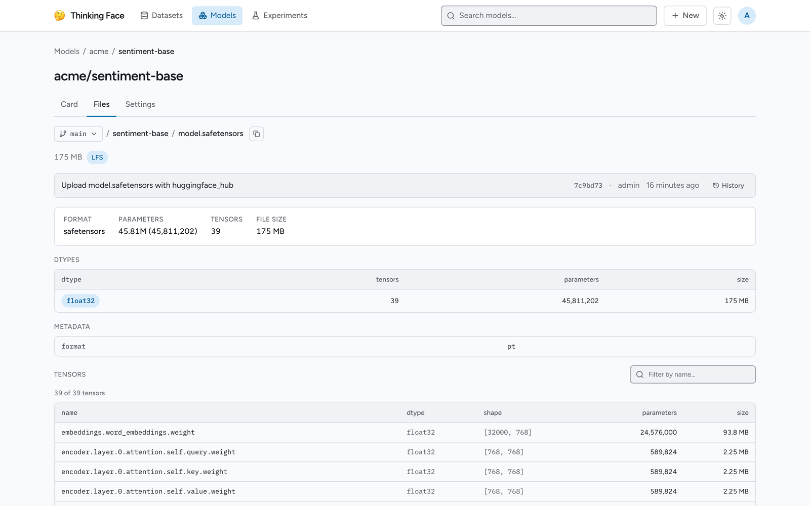

# モデルの確認

thinkingface は、重み本体をダウンロードすることなく、モデルのチェックポイントファイルの中身 —
テンソル、shape、dtype — を表示できます。このページでは、どの形式に対応しているか、インスペクタが
何を読み取るか、そして Web UI 上で何が表示されるかを説明します。

## 対応している形式 { #which-formats-are-understood }

インスペクタは、ファイル拡張子でチェックポイントを識別します。

| Extension | Format |
|---|---|
| `.safetensors` | safetensors |
| `.bin`, `.pt`, `.pth`, `.ckpt` | PyTorch (`torch.save`) |

それ以外の拡張子は、通常のファイルプレビューになります。インスペクタは中身から形式を推測しようと
はしません。モデルリポジトリ・データセットリポジトリのどちらにあるチェックポイントファイルにも動作
し、`/models` 配下のファイルに限定されません。

## 重み本体はダウンロードされない { #the-weights-are-never-downloaded }

どちらの形式も、既知の位置にある小さなヘッダーに構造情報を保持しています。safetensors ファイルは
すべてのテンソル名を記した JSON ヘッダーで始まり、PyTorch のチェックポイントは、pickle 化された
オブジェクトグラフを保持する `data.pkl` メンバーを含む zip アーカイブです。どちらを読む場合も、
ファイルへのレンジ読み込みを数回行うだけで済みます — ファイルが数メガバイトでも数百ギガバイトでも
変わりません。そのため、チェックポイントの検査コストは小さなファイルを開く程度で済みます。テンソル
データ自体が取得されることはありません。

結果はコンテンツハッシュでキャッシュされるため、同じファイルを再度開いた場合（バイト列が同一であれ
ば、リビジョンやパスが異なっていても）は即座に応答が返ります。

## インスペクタを開く { #open-the-inspector }

チェックポイントファイルの blob ページ（ファイルツリーから、あるいは `/blob/{revision}/{path}`
から）を開くと、テキストプレビューの代わりにインスペクタが読み込まれます。

## 表示される内容 { #what-you-see }

サマリー行には **Format**（safetensors または PyTorch）、合計 **Parameters**、合計
**Tensors**、そしてファイルの **File size** が表示されます。

その下には、チェックポイントが複数の dtype を含む場合に限り **Dtypes** テーブルが表示され、
テンソル数・パラメータ数・その dtype が占める合計サイズの列で、dtype ごとの内訳を示します（寄与が
大きい順）。

ファイル自体が独自のメタデータを持つ場合 — safetensors の `__metadata__` ブロックや、PyTorch
のチェックポイントに重みと一緒に保存されたスカラー値のエントリ（`epoch` や `global_step` のような
もの）— は、**Metadata** テーブルにそれらのキーと値の組が一覧表示されます。

**Tensors** テーブルには、すべてのテンソルが名前、dtype、shape（`[dim1, dim2, ...]` の形式）、
パラメータ数、サイズとともに一覧表示され、その上に名前によるフィルタがあります。テンソル数が非常に
多いチェックポイントでは、一覧に上限が設けられており（現在は 4096 件）、その旨の注記が表示されます
が、サマリー行の合計値は表示・非表示にかかわらずすべてのテンソルをカバーしています — 省略されるの
は一覧表示のみです。

パーサーが失敗せずに復旧できた問題 — 部分的にしか理解できなかった構造など — は、検査結果全体を
隠してしまう代わりに、テンソルテーブルの下に警告として表示されます。

検査リクエスト自体が失敗した場合（例えば、拡張子が主張する形式と実際のファイルが異なる場合）は、
インスペクタの代わりに、フォールバックのダウンロードリンク付きのエラーがパネルに表示されます。

## Lineage とモデルのバージョン管理 { #lineage-and-model-versioning }

モデルリポジトリのカードには、チェックポイントファイル自体から読み取られるメタデータとは独立に、
その重みがどこから来て、何によって置き換えられるのかを記述できます。リポジトリページの Card タブ
にある **Lineage** セクションには、以下が一覧表示されます。

- **Base model** — このモデルの派生元となったモデルと、その関係（fine-tune、adapter、
  quantization、merge のいずれか）。
- **Trained on** / **Evaluated on** — 学習と評価に使われたデータセットリポジトリ。
- **Training run** — このチェックポイントを生成した実験の run（ログが記録されている場合）。

カードに `new_version` が宣言されている場合、リポジトリページの上部にあるバナーが、その継承チェー
ンの最新リポジトリへのリンクを表示します。これにより、古いバージョンにたどり着いても、置き換えら
れたバージョンに留まるのではなく、先へと進めるようになっています。サーバーが解決できない参照 —
typo や、まだ push されていないリポジトリ — は、壊れたリンクにする代わりに、注記付きのプレーン
テキストとして表示されます。

これらのフィールドはチェックポイント自体のヘッダーではなく `README.md` の YAML フロントマターに
由来するため、上記のインスペクタの中ではなく、Card タブのファイル一覧の隣に表示されます。
