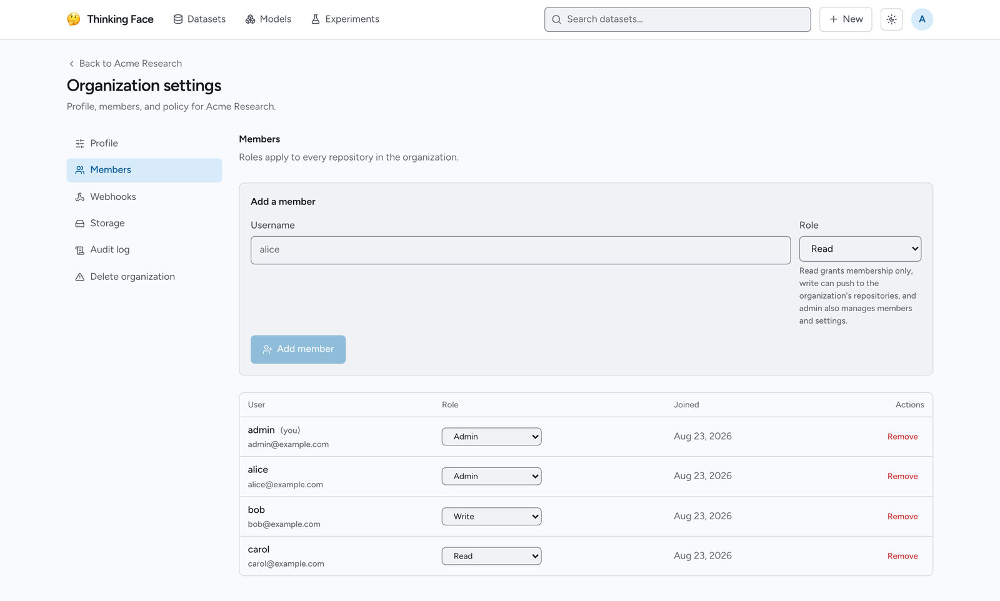

# Organizations

An organization is a shared namespace for a team: repositories, members, roles and policy in one
place. This page covers creating one, what each role can do, managing members, and how
organization repositories behave from `huggingface_hub`.

## Users and organizations share one namespace

There is a single namespace space. `admin` (a user) and `acme` (an organization) are names of the
same kind, and both answer at `/{name}` in the web UI. A repository owned by an organization is
just `{org}/{name}`:

```text
admin/imdb-reviews        a repository in a user namespace
acme/sentiment-base    a repository in an organization namespace
```

Because of that, nothing on the client side has to know the difference. `huggingface_hub` treats
`acme/sentiment-base` exactly like any other repository id — the same `create_repo`, the same
`upload_file`, the same `hf_hub_download`, the same `git clone`.

One consequence worth knowing up front: a name can only be claimed once. If `acme` is already a
user account, it cannot also be an organization.

## Create an organization

From the web UI, open the account menu and choose **New organization**
(<http://localhost:3000/orgs/new>). You provide:

- **Organization ID** — the namespace. It appears in every URL and repository name, and **it can
  never be changed**. Same rules as a repository name: 1–96 characters of letters, digits, dot,
  dash or underscore, starting with a letter or digit, not ending in `.git`.
- **Display name** — optional, shown instead of the ID on the organization page, editable at any
  time.
- **Description** — optional.

You become the organization's first member and its admin.

!!! note

    Who may create organizations is an instance-wide setting: `TF_ORG_CREATION` is `anyone` by
    default, and `admin` restricts creation to site administrators. See
    [Configuration](../self-hosting/configuration.md).

## Roles

Every member holds exactly one of three roles in the organization. They are ordered, so each one
includes everything below it.

| Operation | Non-member | `read` | `write` | `admin` |
|---|---|---|---|---|
| View the organization page and its repository list | Yes | Yes | Yes | Yes |
| Read, clone, download, browse experiments | Yes | Yes | Yes | Yes |
| View the member list | Only if the policy is public | Yes | Yes | Yes |
| View the organization's storage usage | No | Yes | Yes | Yes |
| Create a repository in the namespace | No | No | Yes | Yes |
| Push, commit, edit in the browser, ingest experiment metrics | No | No | Yes | Yes |
| Accept a repository transfer into the organization | No | No | Yes | Yes |
| Delete a repository | No | No | No | Yes |
| Archive or unarchive a repository | No | No | No | Yes |
| Transfer a repository out of the organization | No | No | No | Yes |
| Manage webhooks | No | No | No | Yes |
| Add or remove members, change roles | No | No | No | Yes |
| Edit the profile and policy | No | No | No | Yes |
| View the audit log | No | No | No | Yes |
| Delete the organization | No | No | No | Yes |
| Leave the organization | — | Yes | Yes | Yes, unless last admin |

Site administrators hold `admin` over every namespace without being members: they never appear in
a member list, and the organization never shows up in their `whoami()["orgs"]`.

!!! warning "There is no repository visibility"

    thinkingface deliberately has no public/private distinction for repositories. Every
    repository on the instance is readable by everyone who can reach the instance, including
    signed-out visitors. Roles govern **writing**, and membership itself — not read access. If
    you need to keep data from being read, keep it off the instance or restrict access to the
    instance as a whole.

    `huggingface_hub` still accepts `private=True` / `visibility="private"` on `create_repo` so
    existing code does not break; the value is decoded and ignored.

What `read` actually grants, then, is membership: the member list, the organization's storage
usage, and being listed as part of the team. `write` adds creating and pushing. `admin` adds
everything destructive or administrative.

Two things `write` deliberately does **not** include: deleting a repository, and managing
webhooks. A webhook carries the namespace's secrets to an external URL, and deleting is not
reversible — both are administrative acts rather than content changes.

## Manage members

Members are managed at **Settings → Members** on the organization
(`/orgs/acme/settings/members`).



- **Add a member** by username. They must already have an account on the instance — there are no
  email invitations. The default role is `read` if you do not choose one.
- **Change a role** from the row's role control.
- **Remove a member** from the row.
- **Leave** an organization by removing yourself; it is the same operation.

An organization always keeps at least one admin. Removing the last admin, or demoting them, is
refused with a message telling you to appoint another admin first.

### Who can see the member list

The organization's **Policy** setting controls this:

| `members_visibility` | Who may list members |
|---|---|
| `members` (default) | Members of the organization only |
| `public` | Anyone, including signed-out visitors |

Non-members reading a public roster see the usernames without email addresses.

## Work with organization repositories from Python

Nothing changes except the namespace segment. Set your endpoint and token as usual, then:

```python
import os
from huggingface_hub import HfApi

os.environ["HF_ENDPOINT"] = "http://localhost:8080"
os.environ["HF_TOKEN"] = "tf_xxxxxxxxxxxx"
os.environ["HF_HUB_DISABLE_XET"] = "1"

api = HfApi()

# Create under the organization: the namespace is just the first segment.
api.create_repo("acme/sentiment-base", repo_type="model", exist_ok=True)

api.upload_file(
    path_or_fileobj="config.json",
    path_in_repo="config.json",
    repo_id="acme/sentiment-base",
    repo_type="model",
)
```

Your organizations and your role in each come back from `whoami()`:

```python
for org in api.whoami()["orgs"]:
    print(org["name"], org["roleInOrg"])
```

```text
acme admin
```

And the roster:

```python
for member in api.list_organization_members("acme"):
    print(member.username)
```

`list_organization_members` follows the same visibility rule as the web UI: members always see it,
everyone else only when the policy is `public`.

A `read` member pushing to an organization repository gets an HTTP 403. Promote them to `write`
and the same push succeeds — nothing else needs to change on their side, and their token stays the
same.

## Organization settings

The settings screens live at `/orgs/{org}/settings` and are **admin-only** — a member without the
admin role gets an explicit "admins only" message rather than a 404, because the organization's
existence is public information.

| Screen | What it does |
|---|---|
| **Profile** | Display name, description, website and avatar URL (a link to an image hosted elsewhere; there are no uploads). The namespace name is fixed. |
| **Policy** | `members_visibility`, described above. |
| **Members** | Add, promote, demote and remove, as described above. |
| **Webhooks** | HTTP endpoints notified about events in the organization's repositories. Subscribable events are `repo.push`, `repo.created`, `repo.deleted`, `run.finished` and `run.failed`. |
| **Storage** | The LFS bytes the organization's repositories hold in object storage, broken down by repository. |
| **Audit log** | Administrative changes and repository lifecycle events, newest first. |
| **Delete organization** | The danger zone, described below. |

Members without the admin role can still see the organization's storage usage: their own
**Storage usage** page (`/settings/storage`) lists every namespace they belong to.

### The audit log

Each entry records when it happened, who did it, what was done and to what. The recorded actions
are:

```text
org.created            org.updated
member.added           member.role_changed      member.removed      member.left
repo.created           repo.deleted
repo.transferred_in    repo.transferred_out
webhook.created        webhook.updated          webhook.deleted
```

Deleting the organization is not recorded in its own log — the log is scoped to the namespace and
is removed with it. That event goes to the server's process log instead.

### Deleting an organization

Deleting removes the organization's members, webhooks and audit log, and frees the name for
reuse. It **never deletes repositories**, and for that reason it is refused while any repository
still belongs to the organization. Delete or transfer them first.

## Transfer a repository between namespaces

Repositories move between namespaces — from your personal namespace into an organization, between
two organizations, or back out. Open the repository's **Settings** tab and use **Transfer
ownership**. You can also rename within the same namespace from the same form.

Git history, LFS objects and download counts carry over unchanged, and no bytes move in object
storage — object keys are derived from content, not from the repository name.

Who may do it:

- **From the source** you need admin over the source namespace. In an organization this means the
  `admin` role, so a `write` member cannot carry a repository out from under the team. In a
  personal namespace the owner is the only admin, so nothing changes there.
- **At the destination**, if you could already create a repository there (`write` or above), the
  move completes immediately. Otherwise a transfer request is filed and waits for the destination
  to accept it.

Pending transfers, incoming and outgoing, are listed at **Repository transfers**
(`/settings/transfers`), where the destination accepts or rejects and the originator can cancel.
A request that nobody answers expires after 7 days.

From Python the same operation is `move_repo`:

```python
api.move_repo(from_id="admin/sentiment-base", to_id="acme/sentiment-base", repo_type="model")
```

!!! tip

    The old repository id keeps working after a move — reads and writes alike are redirected, and
    `git clone` / `git pull` follow the redirect. You do not have to update every script the day
    you transfer something.

An archived repository cannot be transferred; unarchive it first.

## Related pages

- [Core Concepts](../concepts.md) — namespaces, repositories and revisions
- [Uploading Files](uploading.md) — pushing to a repository once you have `write`
- [Authentication](../reference/authentication.md) — tokens and their read/write scope
- [Tracking Experiments](experiments.md) — sharing an experiment repository across a team
- [Configuration](../self-hosting/configuration.md) — `TF_ORG_CREATION` and the other instance settings
