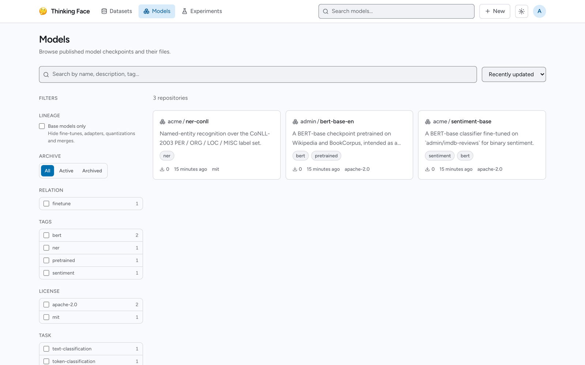
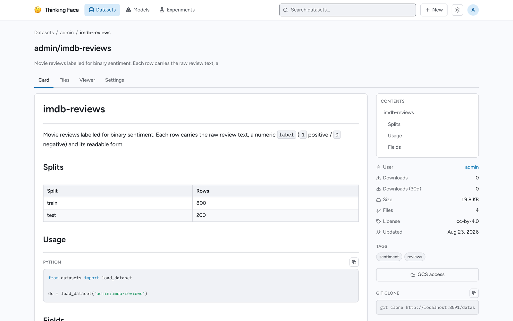
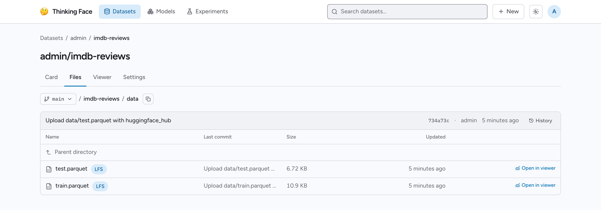
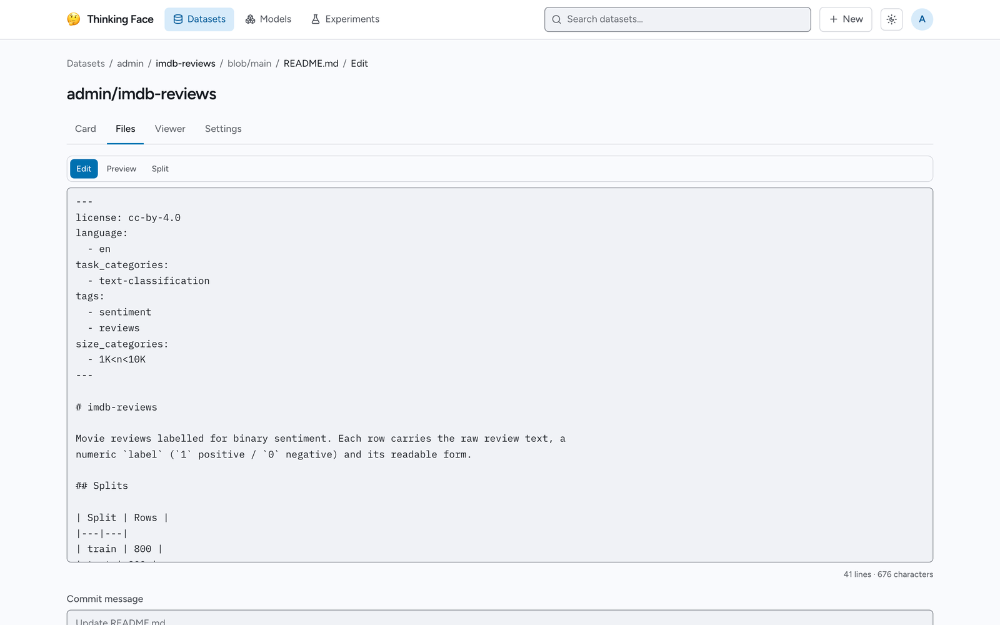
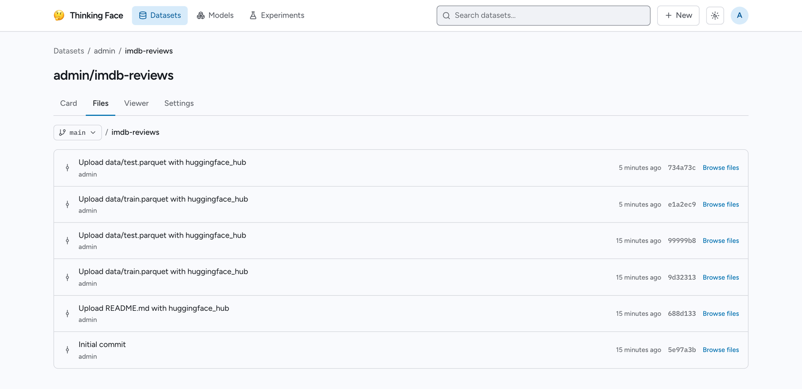

# Web UI を使う

このページでは、`http://localhost:3000` の Web UI を、実際に触れる順番に沿ってひととおり案内します。ホームページ、一覧、リポジトリページ、そのファイル、そして自分のプロフィールという順です。API に対してスクリプトを書くよりもクリックして操作したい人向けの内容です — CLI と API のガイドでは、同じ内容をコマンドラインの視点から扱っています。

## ホームページ { #the-home-page }

ホームページ（`http://localhost:3000`）には、インスタンス全体のデータセット数、モデル数、実験数、合計ストレージ量が表示され、続けて最近更新されたデータセット 6 件と最近更新されたモデル 6 件が並びます。各項目はそのままリポジトリページへのリンクになっています。

バックエンドの API に到達できない場合、件数や最近の一覧はゼロではなくエラー状態として表示されます — リクエストの失敗が「まだ何もありません」として表示されることはありません。

## Models と Datasets の一覧をブラウズする { #browse-the-models-and-datasets-listings }

**Models**（`/models`）と **Datasets**（`/datasets`）は、それぞれの種類のリポジトリをすべて、名前・説明・タグを記したカードとして一覧表示します。一覧の上にある検索ボックスは名前・説明・タグに一致するものを検索し、並び替えのドロップダウンでは Recently updated（最近更新）、Recently created（最近作成）、Most downloads（ダウンロード数順）、Name（名前順）を選べます。

結果の横にあるサイドバーで、一覧をさらに絞り込めます:

- **Tags**、**License**、**Task** — 各リポジトリのカードから読み取られるファセットです。
- **Relation** と **Lineage** — 特定のベースモデルから派生したリポジトリ（ファインチューン、アダプタ、量子化、マージ）に絞り込むフィルタと、派生モデルをすべて非表示にする「base models only」トグルです。
- **Archive** — All、Active、Archived のいずれかです。アーカイブ済みリポジトリはデフォルトで表示されたままになり、バッジによって削除済みリポジトリと区別されます。トグルを使えば非表示にできます。

有効なフィルタは、結果の上に削除可能なチップとして表示され、一致件数の総数も合わせて表示されます。「Clear filters」リンクを 1 つクリックするとすべてリセットされます。

## リポジトリを開く { #open-a-repository }

リポジトリページ（`/models/{ns}/{name}` または `/datasets/{ns}/{name}`）には最大 5 つのタブがあり、該当する場合にのみ表示されます:

- **Card** — レンダリングされた `README.md`（リポジトリのモデルカードまたはデータセットカード）です。
- **Files** — ファイルツリーです。
- **Viewer** — Parquet テーブルビューアです。リポジトリにインデックス済みの `.parquet` ファイルが 1 つ以上ある場合にのみ表示されます。[データセットの閲覧](dataset-viewer.md) を参照してください。
- **Experiments** — 実験の run を追跡するために使われているリポジトリにのみ表示されます。[実験のトラッキング](experiments.md) を参照してください。
- **Settings** — リポジトリを管理できる権限がある場合にのみ表示されます。

Card タブは README をレンダリングし、長いページには目次が付きます。サイドバーには、ダウンロード数、合計サイズ、ファイル数、ライセンス、最終更新日、タグ、`git clone` コマンド、ブランチの一覧が表示されます:

オーナーによってアーカイブされたリポジトリは、名前の横にバッジが表示されます。アーカイブすると読み取り専用になり — プッシュ、ブラウザ内でのコミット、譲渡はすべて拒否されます — 一方で、閲覧とダウンロードは引き続き可能です。

### リビジョンセレクタ { #the-revision-selector }

files / blob / commits のどのビューも、先頭に現在のリビジョン（ブランチ、タグ、またはコミット）をドロップダウンとして示す行があり、続けてパスがクリック可能なパンくずセグメントとして表示されます。リビジョンのチップをクリックするとブランチとタグを切り替えられます（ブランチやタグがある程度の数を超えると、絞り込み用のフィルタボックスが表示されます）。切り替えると、新しいリビジョンについて同じ種類のページ — ツリー、特定のファイル、または履歴 — が引き続き表示されます。パスセグメントの末尾にあるコピーアイコンをクリックすると、現在のパスをコピーできます。

## ファイルツリー { #the-file-tree }

Files タブには、ディレクトリのエントリがサブディレクトリを先に、続いてファイルの順で一覧表示され、それぞれに最後にそのエントリを変更したコミット、サイズ、更新からの経過時間が表示されます。Git LFS オブジェクトとして保存されているファイルには、名前の横に小さな **LFS** バッジが付きます。thinkingface が Parquet としてインデックスしたファイルには、行の右側に「Open in viewer」リンクが表示されます。

テーブルの上のバーには、そのディレクトリ全体に対する最新のコミットが表示され、完全な履歴へのリンクも付いています。ディレクトリ自身に `README.md` がある場合、トップレベルのカードと同じ方法でテーブルの下にレンダリングされます。

## ファイルを表示する { #view-a-file }

ファイルを開くと（`/blob/{revision}/{path}`）、そのサイズ、LFS オブジェクトであれば LFS バッジ、最後のコミットが表示され、続いてファイルに応じたプレビューが表示されます:

- テキストファイルと Markdown ファイルはインラインでレンダリングされます（Markdown はレンダリングされた HTML として表示され、生ソースへの切り替えも可能です）。
- Parquet ファイルは、生のコンテンツの代わりに「Open in viewer」リンク付きのサマリーカードを表示します。
- チェックポイントファイル（safetensors、`.bin`、`.pt`、`.pth`、`.ckpt`）はモデルインスペクタを開きます — [モデルの確認](model-checkpoints.md) を参照してください。
- それ以外のファイルはダウンロードリンクにフォールバックします。プレビューが 512 KB を超える場合は途中で打ち切られ、全文へのリンクが表示されます。

## ブラウザからファイルを編集してコミットする { #edit-and-commit-a-file-from-the-browser }

LFS オブジェクトで **ない** テキストファイルや Markdown ファイルには、サイズの横に **Edit** リンクが表示されます。これは、リポジトリへの書き込み権限があり、かつブランチを表示している場合にのみ表示されます（タグや単独のコミットでは表示されません — 編集は常にブランチ上に新しいコミットを書き込みます）。

エディタは、ほとんどのファイルではプレーンなテキストエリアですが、`.md` / `.markdown` ファイルではライブの Markdown プレビューペインになります。その下には、コミットメッセージの入力欄（「Update {file}」という提案がプレースホルダーとして入力済み）と、任意の拡張説明欄があり、**Commit changes** ボタンが続きます。未保存の変更があるままページを離れようとすると、別ページへの移動でもタブを閉じる場合でも確認が求められます。

編集中に別の人が同じファイルにコミットした場合、保存はその変更を上書きするのではなく、競合メッセージとともに失敗します。あなたの編集内容は入力欄に残るので、リロードしてから再度適用できます。

## コミット履歴 { #commit-history }

Commits ビュー（`/commits/{revision}`、またはディレクトリやファイルの履歴リンクから到達可能）では、コミットが 1 行に 1 件ずつ一覧表示され、メッセージ、作者、相対時間、短縮コミット SHA、そしてそのコミット時点のツリーを開く「Browse files」リンクが並びます。特定のファイルやディレクトリから開いた場合、一覧はそのパスに変更を加えたコミットのみに絞り込まれ、「Clear filter」リンクで絞り込みなしの履歴に戻れます。

## ネームスペースページ { #the-namespace-page }

`/{namespace}`（例えば `/admin` や `/acme`）は、ユーザーまたは Organization が所有するすべてのもの、つまりモデル、データセット、実験リポジトリを、それぞれ個別のタブにまとめて表示します。Organization の場合は Members タブも並びます。models タブと datasets タブは、グローバルな `/models` ページ・`/datasets` ページと同じ一覧・検索・フィルタ UI を、そのネームスペースに限定して使ったものです。あるタブの下にまだ何もないネームスペースは空の状態を表示し、そこに公開する権限があれば「Create the first repository」というショートカットが表示されます。

## 自分のプロフィール { #your-profile }

サインインして **Settings → Profile**（`/settings/profile`）に移動すると、表示名、自己紹介、Web サイト、アバター URL を編集できます。ユーザー名は固定です — これはあなたのネームスペースでもあり — 読み取り専用で表示されます。変更するにはネームスペースの譲渡が必要です（Settings 配下の Transfers ページを参照してください）。「View profile」リンクをクリックすると、自分の `/{namespace}` ページが開きます。

## 表示言語を切り替える { #switch-the-display-language }

Web UI は英語と日本語に対応しています。**Settings → Language**（`/settings/language`）では、Auto（ブラウザの言語に従う）、English、Japanese の 3 択から選べます。選択内容は cookie に保存され、次回のページ読み込みから適用されます。Auto を選んだ場合、ブラウザの `Accept-Language` ヘッダーに基づいてどの言語に解決されたかが表示されます。
