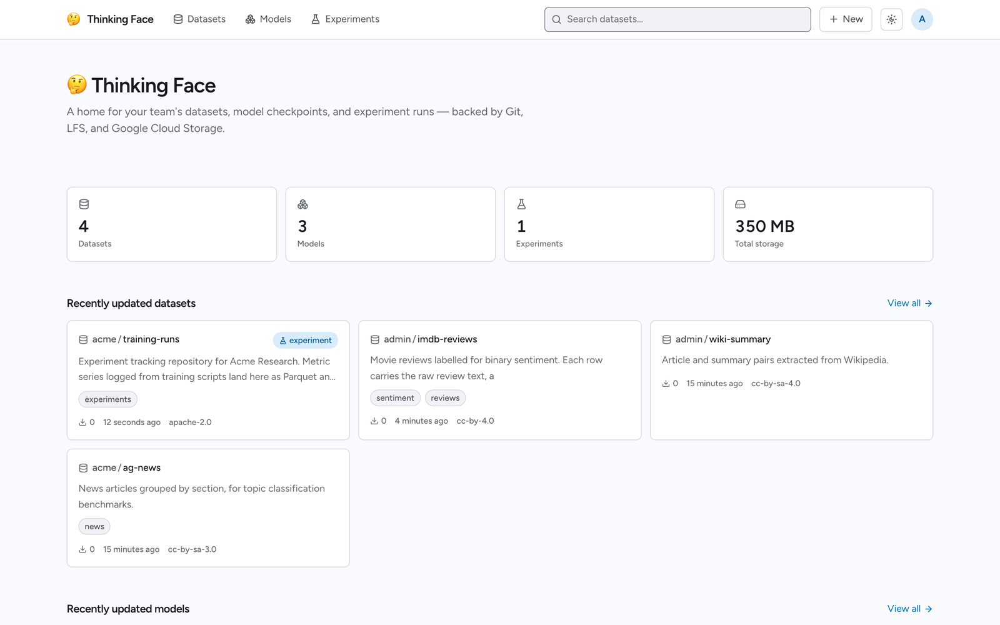

# thinkingface

thinkingface is a self-hosted clone of the Hugging Face Hub. It hosts dataset and model
repositories, versions them with git + Git LFS, keeps the actual bytes in your own Google Cloud
Storage bucket, and tracks training runs — all behind an API that `huggingface_hub` and
`datasets` already know how to talk to.

## Who it is for

You already work with the Hugging Face Hub, and you need the same workflow somewhere else: on
your own infrastructure, inside your own network, on storage you control. Point `HF_ENDPOINT` at
a thinkingface instance and your existing Python code keeps working — no code changes, no
vendored fork, no separate SDK.

## What you get

- **Dataset and model repositories** — create them from the web UI, the API, or the `tf` CLI,
  then `git clone` and `git push` over HTTP or SSH, with Git LFS for the large files.
- **A Hugging Face-compatible API** — `whoami`, `create_repo`, `upload_file`, `hf_hub_download`,
  `list_repo_files`, `load_dataset` and friends work against your instance unchanged.
- **Browsing without downloading** — a file tree, a Parquet table viewer, and a checkpoint
  metadata panel that reads only the header of a safetensors or PyTorch file.
- **Experiment tracking** — a trackio-compatible interface records projects, runs, configs and
  metrics, and charts them in the web UI.
- **Organizations** — shared team namespaces with `admin` / `write` / `read` roles.
- **Storage you can read directly** — objects live in your bucket under content-addressed keys,
  and the web UI generates a `gcloud storage cp` script that restores any revision to its
  original file structure, locally or into another bucket.

## Where to start

| If you want to | Go to |
|---|---|
| Get an instance running and upload a dataset | [Quickstart](getting-started.md) |
| Understand repositories, revisions and storage first | [Core Concepts](concepts.md) |
| Push files from Python, the CLI, or git | [Uploading Files](guides/uploading.md) |
| Pull files back out, or read them straight from the bucket | [Downloading Files](guides/downloading.md) |
| Explore datasets and checkpoints in the browser | [Browsing the Web UI](guides/web-ui.md) |
| Log training runs and compare them | [Tracking Experiments](guides/experiments.md) |
| Set up a shared team namespace | [Organizations](guides/organizations.md) |
| Trigger something of your own when a push or a run lands | [Webhooks](guides/webhooks.md) |
| Know exactly what is and is not compatible with the Hub | [Compatibility](reference/compatibility.md) |
| Deploy this for real | [Deployment](self-hosting/deployment.md) |

If you are evaluating rather than installing, [Core Concepts](concepts.md) is the shortest way to
understand what thinkingface actually does with your data.
